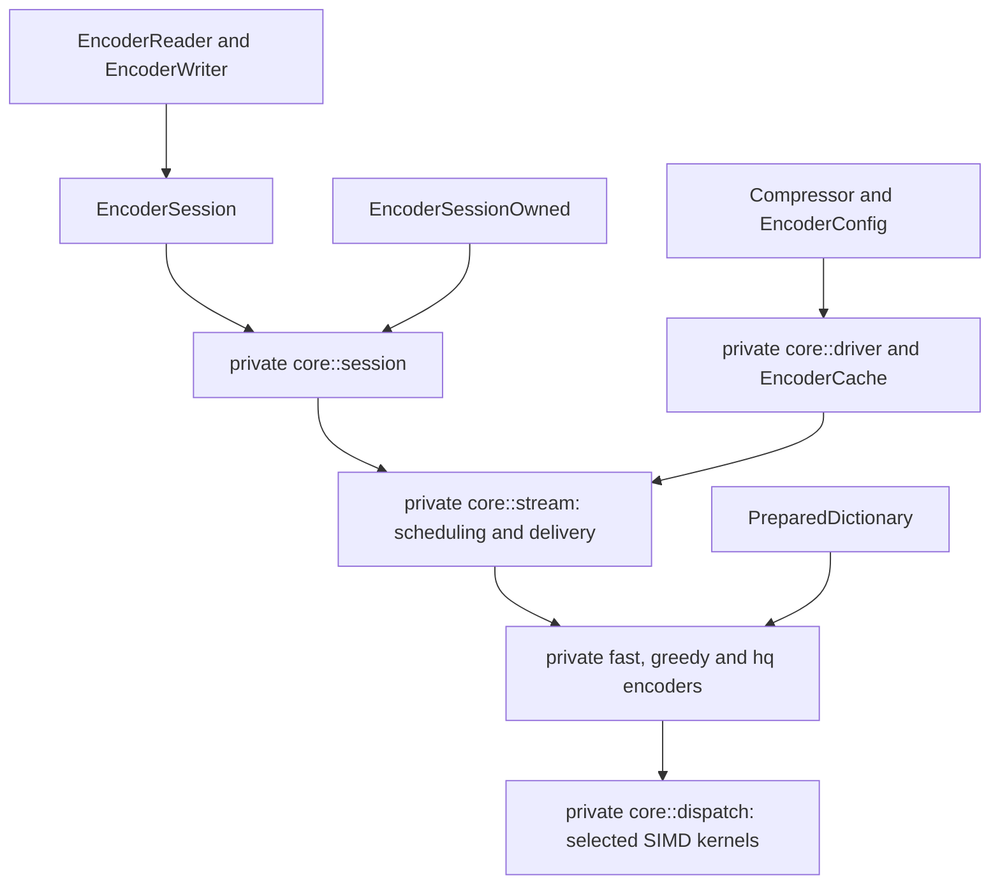
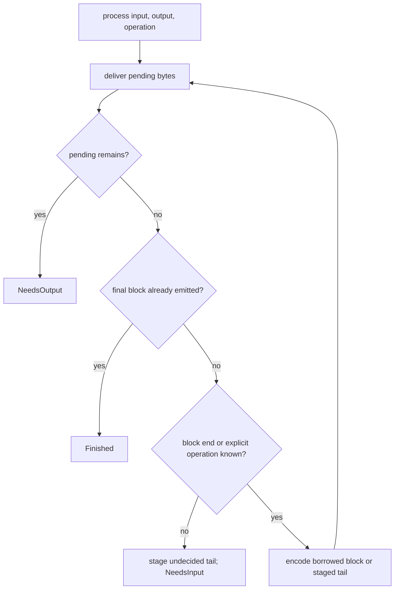
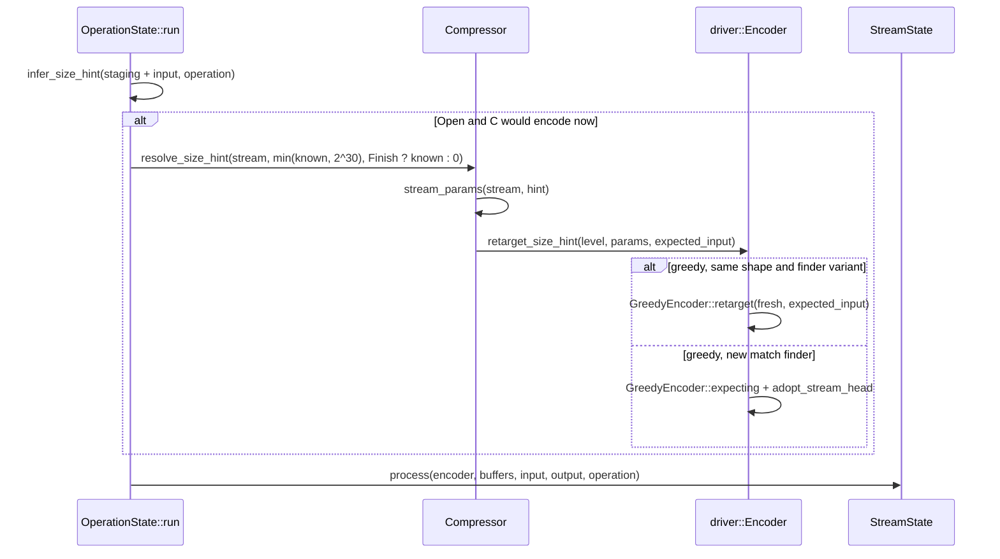

# Compressor

The public `compressor` module owns configuration, reusable codec state,
sessions, dictionaries and synchronous I/O. Private `core` modules own encoding
and state machines. See the [user guide](../docs/README.md) for usage.

## Boundaries and configuration



`EncoderConfig::new()` is a `const fn` returning the reference defaults;
`Default` delegates to it, so both always agree.

Validated configuration types enforce quality 0–11, standard windows 10–24,
large declarations 10–62, block bits 16–24 and legal distance parameters.
`Compressor::new` and `reconfigure` validate combinations. Large Window requires
quality 3 or higher; dictionary operations require quality 5 or higher.

`EncoderConfig::lower(size_hint)` builds private `CompressParams`. One-shot
operations declare the complete input length. Sessions and adapters use
`StreamConfig`: `InputSize::Exact` supplies the declared length, while an unknown
size starts at hint zero and is inferred before the first encode (see
[Size hint inference](#size-hint-inference)). The hint can change the quality 4–9 matcher selection.
Nonzero offsets require `experimental` and quality 2 or higher.

## Ownership and reuse

`Compressor` owns one `EncoderCache`, staging and pending-output storage. The
cache resets a compatible encoder and rebuilds it when its resolved shape changes:

| Family | Compatibility key |
| --- | --- |
| Fast | Quality, fragment limit and stream header |
| Greedy | Resolved parameters and match-finder variant; the size hint is retargeted |
| HQ | Resolved `HqParams` |

Reset clears logical stream state; retained bytes cannot authorize references
before the new stream's start. An encoding failure discards partial encoder state.
[Encoder workspace](encoder-workspace.md) specifies storage, accounting and reset.

`RetentionPolicy` runs after operations and session drop. `Aggressive` keeps
storage, `CurrentConfig` releases incompatible storage on reconfiguration,
`Bounded` releases it above its accounting ceiling, and `ReleaseAll` releases it
on completion. `trim` applies a policy immediately. Accounting includes owned
allocations and excludes caller output, shared dictionaries and allocator overhead.

```mermaid
stateDiagram-v2
    [*] --> Idle
    Idle --> Active: start
    Active --> Idle: drop session; retain completed or discard partial state
    Active --> Abandoned: forget session
    Abandoned --> Abandoned: operations return AbandonedSession
    Abandoned --> Idle: recover
```



Sessions borrow the compressor exclusively. `into_session` instead moves it into
an `EncoderSessionOwned` over the same `OperationState`, and `into_compressor`
runs the drop-time release path; see [owned sessions](owned-sessions.md).
`fork_empty` copies settings without workspace; concurrent independent streams
need separate compressors.

## One-shot and incremental flow

`compress` creates a Vec; `compress_into` appends and returns its new range.
Failure restores the destination's original length and prefix.
`compress_to_slice` reports `OutputTooSmall` instead of changing the encoding;
exact final length suffices, and failure may leave a partial prefix.
`max_compressed_size` supplies a conservative configuration-independent bound.
`compress_to_uninit` and the sessions' `process_uninit` write the same bytes
into `&mut [MaybeUninit<u8>]`; see [uninitialized output](uninit-output.md).

All serial paths use `core::stream::StreamState`. Complete input blocks are
borrowed directly when their end is known; only an undecided tail is staged.
A block is non-final only when something is known to follow it. Empty one-shot
input uses a validated allocation-free finalization path; see
[serial output identity](universal-encoding.md).



`Progress` reports exactly consumed input and produced output. Final output can
require multiple calls; `is_finished()` stays false until it has been delivered.
Completed sessions consume no further input. Failed sessions return `InvalidState`.
No-progress calls report `NeedsInput`, `NeedsOutput` or `Finished`.

`Process` accepts input without closing the stream. `Flush` emits accepted input
and byte padding, preserving the dictionary; an already aligned empty flush emits
nothing. `Finish` emits the last block. Frequent flushes can increase output size.
Equivalent configuration, dictionary, declared size, flush boundaries and offset
preserve bytes across APIs, chunk sizes, reuse and backends.

## Size hint inference

C's `BrotliEncoderCompressStream` runs `UpdateSizeHint` right before every
`EncodeData` while `BROTLI_PARAM_SIZE_HINT` is still zero, setting it to the
unprocessed ring-buffer bytes plus the caller's remaining `available_in`
(capped at 2^30). Its first `EncodeData` comes when the current input block
fills or a flush or finish is requested, and its hasher is set up there. The
hint then picks H4 or H54 at quality 4, H5 or H6 at 5–9, and gates the complex
static context map at 5–9 (all at one mebibyte). Async adapters build an encoder
per body without a length and hand it the whole body in one call, so this
inference decides their output.

`core::session::OperationState` mirrors it. A stream started with
`InputSize::Unknown` holds `SizeHint::Open`; `Exact` starts `Settled`. Before
the scheduler runs, `infer_size_hint` checks whether this call is the one C
would first encode in: staged bytes plus this call's input reach
`StreamState::block_limit` (the block size, or two bytes for a continuation's
flint), or the operation is not `Process`. If so and anything is known, it
settles the hint at `staging + input` and calls `Compressor::resolve_size_hint`,
which re-lowers the stream's parameters with that hint and asks the retained
encoder to `retarget_size_hint`. Encoders that do not read the hint (fast,
high-quality) ignore it.

The greedy encoder takes two values. The inferred hint goes into `GreedyParams`
and decides what reaches the bytes: the match finder plan and the context-map
gate. The expected input sizes storage only — the matcher's quick/full variant
and layout, and the window's capacity — and is the known total only when the
first encode is a finish of at most `SIZED_STORAGE_LIMIT` (4 KiB); otherwise it
stays zero (unknown), as before inference existed. After a flush or a full block
the stream goes on, and above 4 KiB a fresh encoder sized for the known total
measured slower on JSON and HTML than one sized for an unknown total (up to
+24% at qualities 2, 3 and 5 from 6 KiB, quality 6 from 10 KiB); at or below it
the compact and quick slot maps and the on-demand bucket layouts win (1 KiB
JSON at quality 6: 62 -> 22 us). A greedy encoder that has
encoded no input retargets in place when the hint keeps its shape and the
expected input its match-finder variant, and is otherwise rebuilt
(`GreedyEncoder::expecting`) from the same level; the rebuilt encoder adopts the
header bits an empty first flush may already have written, so the stream is not
restarted.

```mermaid
stateDiagram-v2
    [*] --> Settled: InputSize::Exact
    [*] --> Open: InputSize::Unknown
    Open --> Open: Process below one block, or nothing known yet
    Open --> Settled: block fills, Flush or Finish with input known
    Settled --> [*]: release or reinit
```



Streams whose inferred hint resolves the same as zero emit the same bytes as
before. A body of at most 4 KiB that is finished in the call that first encodes
it now takes the small-input storage (quick H2–H4 slots, compact or sparse
bucket tables) instead of tables sized for an unbounded stream.

A full quick (H2/H3/H4/H54) table is not allocated by `QuickMatcher::new`. An
encoder built for a known size allocates it in its constructor
(`MatchFinder::materialize`); one built at `begin` for an unknown size allocates
it in `retarget_size_hint`, after the retarget or rebuild, so a rebuild for the
quick small-input variant discards no table. Either way the table is allocated
before the window: allocated at the matcher's first preparation instead, after
the window, it reused freed heap that `calloc` had to clear, 5-18% slower on
8-50 KiB streams at qualities 2 and 3. Preparation still allocates a table that
is missing, for streams that reach it without either.
A failure here fails the session like any encode error. The framed compressor's
resources share `OperationState`, so a resource of unknown length infers its hint
from its first chunk the same way.

## I/O and finalization

`EncoderWriter` owns its sink and a cursor-addressed outbox bounded to 128 KiB.
Only `head..end` holds pending bytes. It drains before accepting new input, then
pumps the session into bounded spare space. Large writes may accept a prefix.

```mermaid
sequenceDiagram
    participant Caller
    participant Writer
    participant Session
    participant Sink
    Caller->>Writer: write(input)
    Writer->>Sink: drain pending output
    alt drain fails
        Writer-->>Caller: error; no input accepted
    else drain succeeds
        Writer->>Session: process input into bounded outbox
        Session-->>Writer: consumed and produced counts
        Writer->>Sink: attempt delivery
        Writer-->>Caller: accepted count; delivery error deferred if necessary
    end
    Caller->>Writer: try_finish
    loop until final output delivered
        Writer->>Session: Finish
        Writer->>Sink: drain
    end
    Writer->>Sink: flush
```

Short writes advance the cursor; `Interrupted` retries, `Ok(0)` becomes
`WriteZero`, and other errors preserve the exact unwritten suffix. A write never
both accepts caller input and returns an error. `try_finish` resumes after sink
errors; consuming `finish` returns the writer inside `FinishError` on failure.
Dropping an adapter performs no I/O or finalization.

`EncoderReader` owns its source and a cursor-addressed input buffer, writing
compressed bytes directly into the caller's slice. The buffer is sized to its
64 KiB chunk once, and `input[head..end]` marks the bytes the encoder has not yet
taken; a refill reads over the previous chunk rather than clearing and
zero-filling it again, so streaming 64 KiB costs no memset after the first
read. Empty reads have no side
effects; interrupted source reads retry. EOF switches to `Finish`. `into_parts`
returns the source and unaccepted read-ahead bytes.

## Dispatch and errors

Backend selection occurs when the compressor is built. The cache selects
`Selected<S>` kernels when creating an encoder; dispatch at block boundaries
passes the concrete SIMD token into inner loops. Feature detection and virtual
calls stay outside hot loops. `no_std` uses the compile-time backend.

`ConfigError`, `DictionaryError`, `EncodeError` and `SizeOverflow` separate
configuration, preparation, execution and size arithmetic failures. Public error
enums are non-exhaustive. Private core errors map into contextual high-level
variants; I/O conversion retains the original error as a source. SIMD types,
FFI and private implementation errors do not appear in public signatures.

## Verification and known gaps

Cross-API, C differential, lifecycle, retention, backend and I/O fault tests cover
these contracts; see [validation](../docs/correctness.md) and
[development checks](../docs/development.md).

- Only one encoder workspace is retained; alternating incompatible configurations
  can rebuild it on every operation.
- Encoder history is capped at 30 bits even for wider declarations.
- Serialized dictionaries, continuations and framing require `experimental`.
- C byte identity uses equivalent streaming settings; native C one-shot shortcuts
  are a different byte oracle.

[Parallel compression](parallel-compression.md) owns separate planning, staging
and assembly over private independent fragments. [Native decompression](decompressor.md)
is an independently selectable subsystem.
