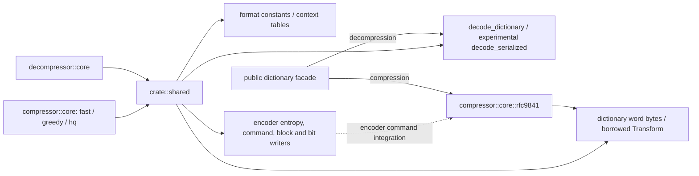
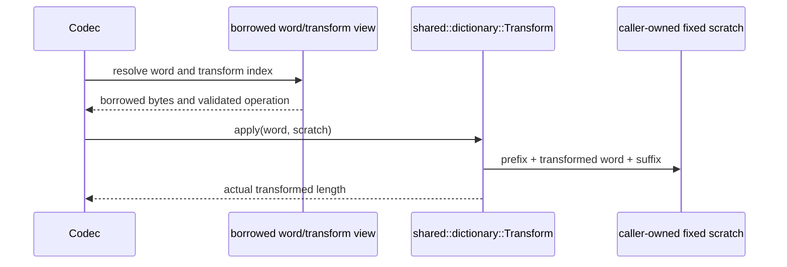
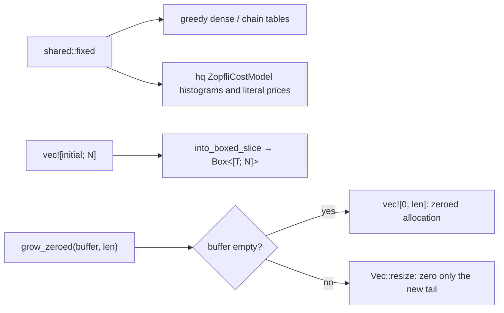

# Private common codec primitives

`src/shared` is a private crate-root module. It replaces
`src/compressor/core/shared`; both codecs import it directly. It is not a public
re-export or a second implementation. Existing bit writer, entropy construction,
match scans, command/metablock representations and ring buffer keep their encoder
behavior and tests. Binary dictionary/transform data is stored once here.

The decoder uses wire constants, context tables, built-in words, shared borrowed
transform application and decode-only dictionary storage. It owns its own bit
reader, Huffman reader, window/history and parser state in `decompressor::core`;
encoder bit output and match-search types are not reused as decoder state.

The encoder's experimental transform-list ownership and index construction stay
under `compressor::core::rfc9841`, but application delegates to the same borrowed
`Transform` used by decoding. The shared module still contains encoder-only
primitives: command integration depends on private RFC9841 encoder types. This
is a crate-private dependency, not a fully independent reusable package. Backend
selection remains at each public codec's construction boundary; existing encoder
SIMD dispatch stays in `compressor::core::dispatch`.

Transform operations are byte-oriented format rules, not general Unicode case
conversion. Incomplete sequences use initialized guard space in the fixed scratch;
suffix output overwrites any casing writes beyond the logical word. Custom shift
operations and custom serialized representations compile only with `experimental`.
No transformed dictionary is materialized. Borrowed inputs outlive one application,
and no core keeps caller pointers between operations.

`shared::fixed` (compression only) builds `Box<[T; N]>` tables:
`fixed_table(initial)` allocates through a `Vec` of exactly `N` entries, so a
zero fill reaches the allocator as a zeroed allocation, and
`fixed_table_from_vec(values, initial)` resizes an existing vector into one
without copying. The greedy matchers' dense and chain tables and the
high-quality cost model's histograms use it. A zero-valued table is built
with `vec!` rather than by collecting an iterator: `vec![0; n]` reaches
`alloc_zeroed` for every element type, while a collected `u32` table compiles
to an allocation plus an explicit `memset` (up to 1800× slower on a fresh
16 MiB table touched in its first page).

`grow_zeroed(buffer, len)` grows a reusable `Vec` workspace. An empty buffer is
allocated zeroed, so a large buffer most of which is never written costs no
writes; a buffer that already holds data grows with `Vec::resize`, which an
allocator may perform in place, and never shrinks. Greedy, high-quality and fast
encoder output storage and the fast encoder's hash table use it. Buffers that
are sized per block and written in full before they are read are resized
without a preceding `clear()`, so only newly exposed elements are zero-filled.

Known gap: encoder-specific primitives remain colocated with format-neutral data;
there is no standalone common-data crate. This keeps existing private dependencies
and public API identities intact while making common data accessible to both codecs.

Codec gates remove unused private primitives as well as public APIs. Encoder
search/hash/entropy modules require `compression`; decoder dictionary modules
require `decompression`. Built-in words and format tables are common. Public
decode dictionary types live in `src/dictionary/decode.rs`, with the root
facade retaining prepared dictionary exports when compression is enabled.
Shared configuration and finish errors live in private root modules; see
[codec feature boundaries](codec-features.md) for their ownership diagram.
