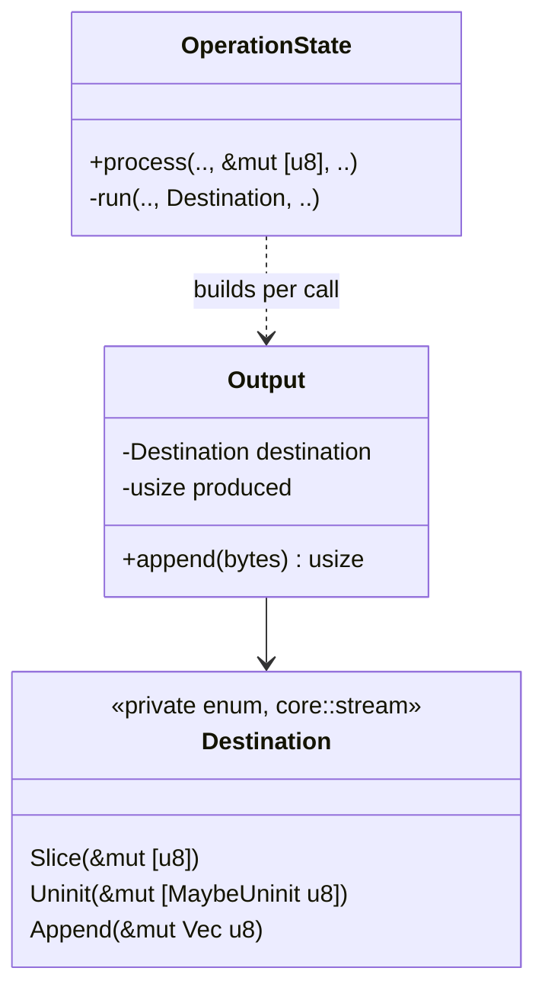
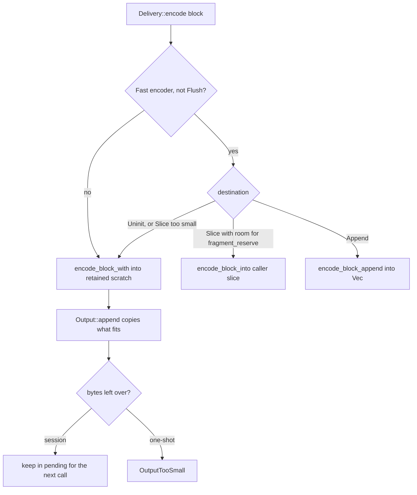
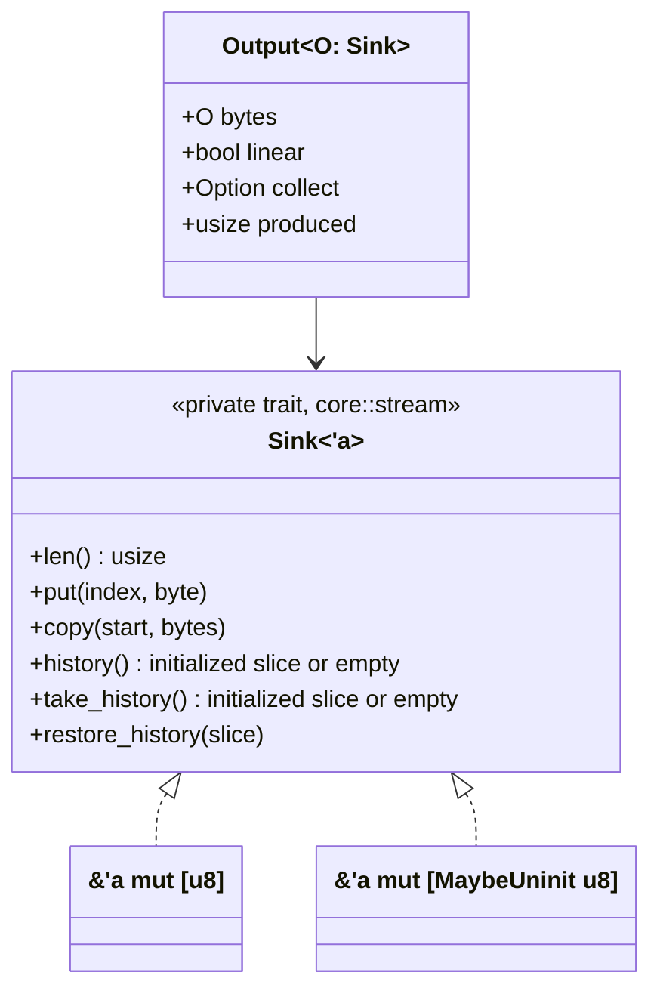
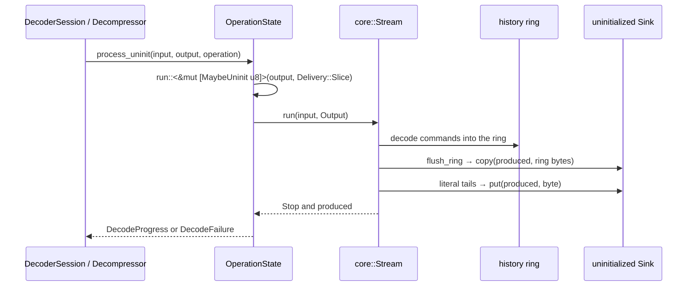

# Uninitialized output

Sessions and one-shot slice APIs have `*_uninit` siblings that write into
`&mut [MaybeUninit<u8>]`: spare `Vec` capacity, a foreign buffer, or C memory
that was never initialized. They produce the same bytes, counts, statuses and
errors as the initialized-slice methods, and the crate stays free of `unsafe`
(`src/lib.rs` forbids it outside tests).

## Public API surface

| Initialized | Uninitialized | Owner |
| --- | --- | --- |
| `EncoderSession::process` | `EncoderSession::process_uninit` | `compressor::session` |
| `EncoderSessionOwned::process` | `EncoderSessionOwned::process_uninit` | `compressor::session` |
| `Compressor::compress_to_slice` | `Compressor::compress_to_uninit` | `compressor::encoder` |
| `DecoderSession::process` | `DecoderSession::process_uninit` | `decompressor::session` |
| `DecoderSessionOwned::process` | `DecoderSessionOwned::process_uninit` | `decompressor::session` |
| `Decompressor::decompress_to_slice` | `Decompressor::decompress_to_uninit` | `decompressor::decoder` |

`flush` and `finish` have no uninitialized siblings: they are shorthands for
`process`. Dictionary one-shots and framed sessions have none either.

The contract every method keeps: on success exactly `output[..produced]` (or
`dst[..written]`) is initialized and no byte after it is written. Calls of the
initialized and uninitialized method may be mixed on one session. After a
decoder `DecodeFailure`, its `produced` prefix is initialized as well; after an
encoder error, or a decoder error other than `OutputTooSmall`, callers treat
the destination as uninitialized.

## Why a separate path

Safe Rust can write a `MaybeUninit<u8>` but can neither read one back nor view
a range of them as `&mut [u8]`; `write_copy_of_slice` (the only safe view, and
itself a copy) needs Rust 1.93 and the MSRV is 1.89. Two existing fast paths
read their destination and so cannot run on uninitialized memory:

- the q0/q1 in-place fragment writer (`FastEncoder::encode_block_into`),
  whose bit writer keeps a partial byte, writes 8-byte words read-modify-write,
  rewinds and patches meta-block headers in the caller's slice;
- the decoder's linear one-shot delivery (`Delivery::Linear`), which uses the
  caller's slice as the first member's history.

The uninitialized methods take the paths that already exist for small
destinations instead: encoder scratch followed by one copy, and ring delivery.
The initialized methods are unchanged and keep both fast paths.

## Compressor

`SessionCore` and `OwnedSessionCore` forward `process_uninit` to
`OperationState::run` with `Destination::Uninit`; `process` keeps its
`&mut [u8]` entry, which the framed resource driver also calls, and wraps it in
`Destination::Slice`. The one-shot `compress_to_slice_attached` and
`compress_to_uninit_attached` share `driver::compress_to_destination`, which
also writes the empty-input stream through `Output::append`.

`Output::append` copies into `Uninit` through `shared::uninit::copy_to_uninit`,
a `zip` + `MaybeUninit::write` loop that compiles to a `memcpy` and keeps the
MSRV. It copies exactly the bytes it counts, which is what makes the
"nothing past `produced`" contract hold; the in-place `Slice` path may leave
scratch bytes past `produced`, which initialized callers never relied on.

## Decompressor

Every write of decoded bytes into the destination goes through `Sink::put`
(per-byte literal tails, `emit`) or `Sink::copy` (ring flushes, stored
meta-blocks, prefix runs). The bulk command loop works on the ring or on the
linear slice it took out with `take_history` and hands back with
`restore_history`. Only the initialized slice can be linear history:
`history` and `take_history` return an empty slice for the uninitialized one,
`restore_history` accepts only that empty slice back, and an uninitialized
sink is only ever run with `Delivery::Slice`, where `linear` is false.

`OperationState::run`, `Stream::run`, `run_stages`, `fast`, `emit`,
`flush_ring`, `copy_ring` and `write_ring` are generic over the sink, so each
destination type gets its own instantiation and no call chooses a variant at
run time. The first version matched on a `Sink` enum inside those helpers;
the match itself was cheap, but `run_stages` inlines every stage and the
SIMD command loop into one function, and the extra arms changed that
function's register allocation. Decoding alice29 then executed 9% more
instructions (callgrind, q0 and q5) and the cold decoder comparison was 4-7%
slower on text and binary corpora. The initialized instantiation now compiles
to the same slice writes as before uninitialized output existed.

`decompress_to_uninit` first asks `stored_one_shot`, the check
`Decompressor::decompress` also uses, whether `src` is one complete stored
member under a configuration without limits or other members; if its payload
fits in `dst`, it is copied with `copy_to_uninit` and no session or ring is
created. Otherwise, including a stored payload that does not fit, it runs one
`process_uninit(.., Finish)` on a fresh session and shares `one_shot_outcome`
with `decompress_to_slice`, so `OutputTooSmall` and `TrailingData` are
reported identically.

## C ABI

`mbrotli-ffi` views the caller's output as `&mut [MaybeUninit<u8>]`. Where
zeroing it is cheap next to the work, it zeroes the buffer and calls the
initialized method instead: `compress_to_slice` at q0/q1, which writes
fragments in place, and `decompress_to_slice` when the capacity exceeds the
input or is at most 1 KiB, which uses the destination as history. Otherwise it calls
`compress_to_uninit` and `decompress_to_uninit`. An uninitialized C buffer is
never viewed as `&mut [u8]` before it has been zeroed. See [C ABI](c-abi.md).

## Invariants

- An uninitialized destination is never read, and the uninitialized methods
  write no byte past the reported count. The C ABI may zero a whole
  destination first, as its header documents.
- Uninitialized and initialized methods produce identical streams: the fast
  encoder's in-place and scratch paths are already byte-identical, and ring and
  linear decoder delivery write the same bytes.
- The encoder chooses between `Destination` variants once per call or per
  helper invocation, never inside the SIMD copy kernels. The decoder does not
  choose at run time at all: it is monomorphized per `Sink` type, so the
  initialized decode loop carries no uninitialized-output code.

## Verification

- `tests/encode_uninit.rs`: `process_uninit` and mixed calls against `process`
  for every quality, two windows, output windows from 1 byte to 1 MiB (the
  latter drives the q0/q1 in-place path on the initialized side), sentinel
  checks past `produced`, owned sessions, and `compress_to_uninit` against
  `compress_to_slice` including short and empty destinations.
- `tests/decode_uninit.rs`: `process_uninit` against `process` across qualities,
  input chunks and output windows, a corrupt stream's failure progress, owned
  sessions, and `decompress_to_uninit` against `decompress_to_slice` for
  success, `OutputTooSmall`, trailing and truncated input.
- AFL: `encoder_session` and `decoder_session` drive borrowed and owned
  sessions with `process` and `process_uninit` mixed call by call, check that
  nothing is written past `produced`, and restart owned sessions with `reinit`
  from every state; `streaming_equivalence` and `output_capacity` compare
  `compress_to_uninit` with the initialized one-shots, and `decompress`
  compares `decompress_to_uninit` with ring delivery.
- Unit tests in `shared::uninit` and the `mbrotli-ffi` core tests, which now
  run on uninitialized destinations.

## Known gaps

- q0/q1 `process_uninit` and `compress_to_uninit` copy each block once from
  scratch; the initialized methods write it in place when the destination has
  room for a whole fragment.
- `decompress_to_uninit` decodes compressed members through the ring and
  copies out, where `decompress_to_slice` uses the destination as history; a
  complete stored member that fits is copied straight from the input.
  `mbrotli_compress` and `mbrotli_decompress` avoid these costs only for
  capacities they can afford to zero (see [C ABI](c-abi.md)).
- No uninitialized variants for dictionary one-shots or framed sessions.
- A program that calls an uninitialized decoder method links a second
  instantiation of the decode loop: about 106 KiB more `.text` on x86_64 for
  a binary using both `decompress` and `decompress_to_uninit`. Programs that
  use only initialized output do not pay it.
