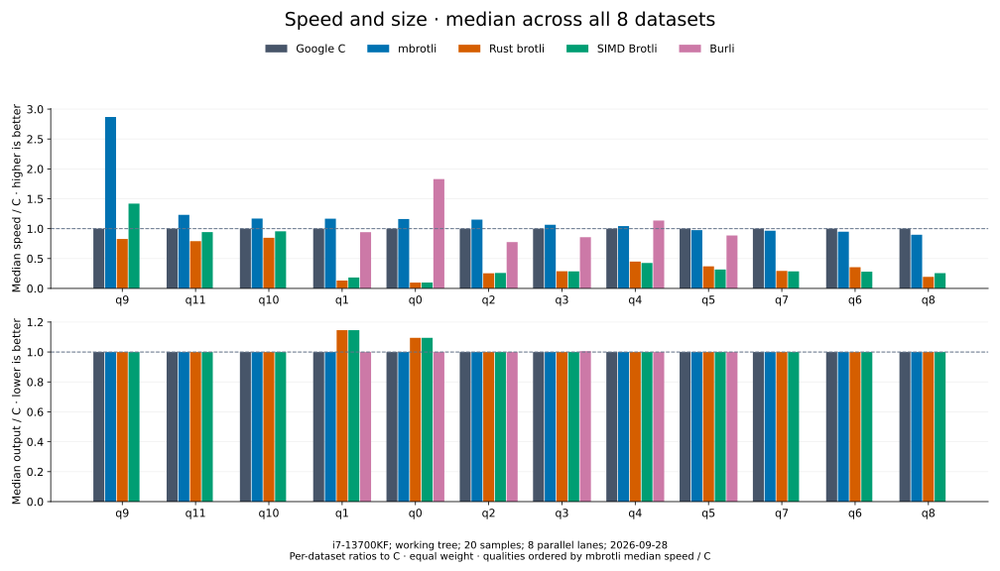

# Benchmark results

## lzbench (independent)

[lzbench](https://github.com/inikep/lzbench) is a long-running open-source
in-memory benchmark: every codec is built from source into one binary with the
same compiler and flags and runs on the same data and machine. Its maintainer ran
these results, not us: lzbench 2.4 (gcc 15.2), the 211 MB
[Silesia corpus](http://sun.aei.polsl.pl/~sdeor/index.php?page=silesia), one
thread of an AMD EPYC 9555P with turbo disabled. [Full table][lzbench-results].

mbrotli 0.5.2 against Google Brotli 1.2.0; bold marks the faster result. Ratio is
the compressed size as a percentage of the input and matches for both.

| Level | Compress mbrotli | Compress brotli | Decompress mbrotli | Decompress brotli | Ratio, % |
| ----: | ---------------: | --------------: | -----------------: | ----------------: | -------: |
| -11   |   **0.67 MB/s**  |       0.56 MB/s |           371 MB/s |      **383 MB/s** | 23.78 |
| -8    |   **14.4 MB/s**  |       12.6 MB/s |           419 MB/s |      **443 MB/s** | 26.96 |
| -5    |       50.0 MB/s  |   **53.3 MB/s** |           388 MB/s |      **419 MB/s** | 28.10 |
| -2    |        127 MB/s  |    **139 MB/s** |           349 MB/s |      **378 MB/s** | 32.12 |
| -0    |        341 MB/s  |        341 MB/s |           291 MB/s |      **322 MB/s** | 37.01 |

**Summary:** the same compressed size as Google Brotli (+0.005% at -11),
**14–20% faster** compression at -8 and -11, within 9% at lower levels, and
decompression 3–10% behind C.

### Local lzbench rerun (ours, not independent)

lzbench 2.4 (`inikep/lzbench` at `ec3b8c5`) built from source with mbrotli taken
from the working tree based on `5f39a1d0`, the way lzbench builds Rust codecs
(fat LTO, one codegen unit, lzbench's default `native` target CPU), with Google
Brotli 1.2.0 compiled by GCC 11.4 into the same binary. Intel Core i7-13700KF
under WSL2, one pinned core, the 211 MB Silesia tar, window 22; MB/s, best of
three iterations over two runs (2026-10-02). Bold marks the faster result.

| Level | Compress mbrotli | Compress brotli | Decompress mbrotli | Decompress brotli | Ratio, % |
| ----: | ---------------: | --------------: | -----------------: | ----------------: | -------: |
| -9    |      16.3 |  **17.5** | **762.6** |     672.9 | 26.75 |
| -8    |      23.2 |  **25.3** | **755.5** |     671.6 | 26.96 |
| -6    |      74.4 |  **78.0** | **714.7** |     641.0 | 27.59 |
| -5    |      90.5 |  **95.2** | **699.0** |     627.5 | 28.10 |
| -4    |     124.5 | **124.9** | **742.3** |     629.2 | 30.27 |
| -2    |     221.9 | **236.0** | **635.2** |     553.0 | 32.12 |
| -0    |     550.8 | **555.2** | **530.7** |     469.4 | 37.02 |

Compressed sizes are identical for both libraries at every level. This is not
the maintainer's host or compiler: GCC 11 builds C's decoder about a tenth
slower than the GCC 15 of the independent table, and the gaps differ from it.

## Our benchmarks

| Compare | Results | Data |
| --- | --- | --- |
| Compression speed and size | [Qualities 0–11](encoders/README.md) | [CSV](encoder-comparison.csv), [conditions](encoder-comparison.md), [size manifest](encoder-comparison-2026-10-02/sizes.csv) |
| Decompression speed on identical streams | [Source qualities 0–11](decoders/README.md) | [CSV](decoder-comparison.csv), [conditions](decoder-comparison.md) |

### Compression

Five libraries, 432 cases. Burli supports encoding at q0–q5; the other encoders
cover q0–q11. Each speed/size bar is the median of eight per-dataset ratios to C.
Higher speed and lower size are better. Equal quality numbers do not imply equal
output size. [Exact results and confidence bounds](encoders/README.md).

### Decompression

Four decoders restore the same C-produced streams in 384 cases. Quality is the
source encoder's setting. Each bar is the median of eight C-time/decoder-time
ratios; higher is faster. Burli decodes every quality. SIMD Brotli re-exports the
Rust brotli decoder project and is omitted. [Exact results](decoders/README.md), [size manifest](decoder-comparison-2026-10-02/sizes.csv).

### How to interpret the results

Published measurements use an Intel Core i7-13700KF under WSL2, generic mode,
window 22, and cold native APIs including construction, allocation and disposal.
Compression and decompression are dated 2026-10-02 and ran as parallel corpus
shards, one benchmark process per core: absolute timings are a few percent
below a single-core run, while ratios to C are comparable. See each
report for provenance and limits; these are measurements of recorded builds.

Empty and tiny inputs have equal weight with large inputs. Medians describe this
corpus, not a production workload distribution. C decoding knows the output
capacity; Rust brotli includes its native I/O buffers. The lowest mean is not
necessarily a statistically significant lead.

| Dataset | Input bytes | Content |
| --- | ---: | --- |
| empty | 0 | API overhead without input |
| tiny-text | 44 | Quick-brown-fox sentence |
| alice29 | 152,089 | Vendored Alice in Wonderland text |
| text-1m | 1,048,576 | Alice repeated cyclically |
| binary-64k | 65,536 | Structured binary bytes |
| random-64k | 65,536 | Prefix of the pseudorandom corpus |
| random-1m | 1,048,576 | Deterministic xorshift64 bytes |
| repeated-1m | 1,048,576 | Repeated `a` bytes |

### Reproduce

Use [benchmarking and profiling](../benchmarking.md) for validation, fresh timings
and report-generation commands. Published CSVs contain all measured rows;
quality pages expose the individual cases rather than only aggregate scores.

[lzbench-results]: https://github.com/inikep/lzbench/blob/2706ba16721e947a9240c70d080b8efa3f752da0/doc/lzbench24_sorted.md
