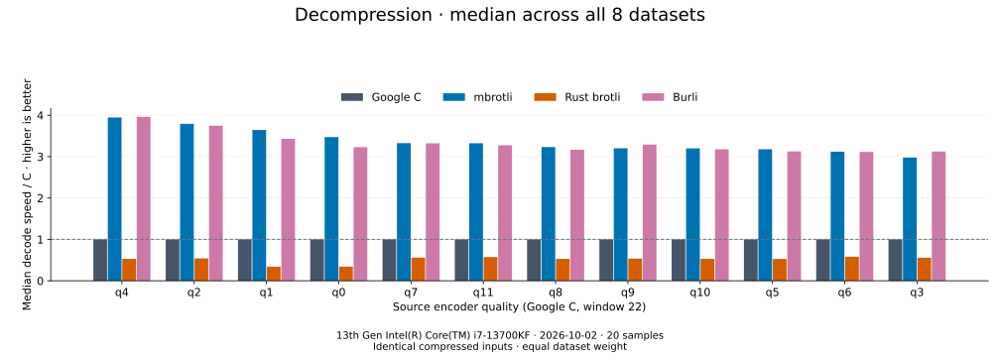

# Decoder comparison

[Benchmark index](../README.md)

Recorded run: **dec-2026-10-02** (2026-10-02).
[CSV](../decoder-comparison.csv) · [Environment](../decoder-comparison-environment.json) · [Methodology and limits](../decoder-comparison.md).

Each value is the median of C mean time / decoder mean time across all 8 datasets,
equally weighted. Higher is faster; 1× matches C.
Qualities are ordered by mbrotli median speed / C. Medians do not imply statistical significance.

All four decoders restore identical C-generated streams. Source quality is an encoder setting,
not a decoder setting. Burli decodes q0–q11; SIMD Brotli shares Rust brotli's decoder and is omitted.
Compressed sizes and ratios are properties of those shared inputs, so there is no decoder size ranking.

| Source quality | Google C | mbrotli | Rust brotli | Burli | mbrotli / Burli |
| --- | ---: | ---: | ---: | ---: | ---: |
| [q4](q4.md) | 1.000× | 3.946× | 0.531× | 3.962× | 1.022× |
| [q2](q2.md) | 1.000× | 3.792× | 0.539× | 3.748× | 1.023× |
| [q1](q1.md) | 1.000× | 3.644× | 0.341× | 3.431× | 1.009× |
| [q0](q0.md) | 1.000× | 3.471× | 0.342× | 3.228× | 0.971× |
| [q7](q7.md) | 1.000× | 3.325× | 0.559× | 3.322× | 0.999× |
| [q11](q11.md) | 1.000× | 3.322× | 0.573× | 3.272× | 1.019× |
| [q8](q8.md) | 1.000× | 3.232× | 0.529× | 3.166× | 0.968× |
| [q9](q9.md) | 1.000× | 3.201× | 0.534× | 3.291× | 0.984× |
| [q10](q10.md) | 1.000× | 3.199× | 0.529× | 3.177× | 1.013× |
| [q5](q5.md) | 1.000× | 3.177× | 0.527× | 3.126× | 1.011× |
| [q6](q6.md) | 1.000× | 3.120× | 0.579× | 3.114× | 1.000× |
| [q3](q3.md) | 1.000× | 2.978× | 0.556× | 3.123× | 0.970× |

The last column takes the median of direct Burli time / mbrotli time ratios;
it does not divide the two medians relative to C.

Open a source quality for all datasets, compressed/restored byte counts,
mean latency, confidence bounds and throughput. Measurements include cold construction,
allocation, decoding and disposal. C receives the known output capacity; Rust brotli
includes its native 4 KiB I/O adapter. See the linked methodology for reproducible commands
and the limits of this single-host comparison.
