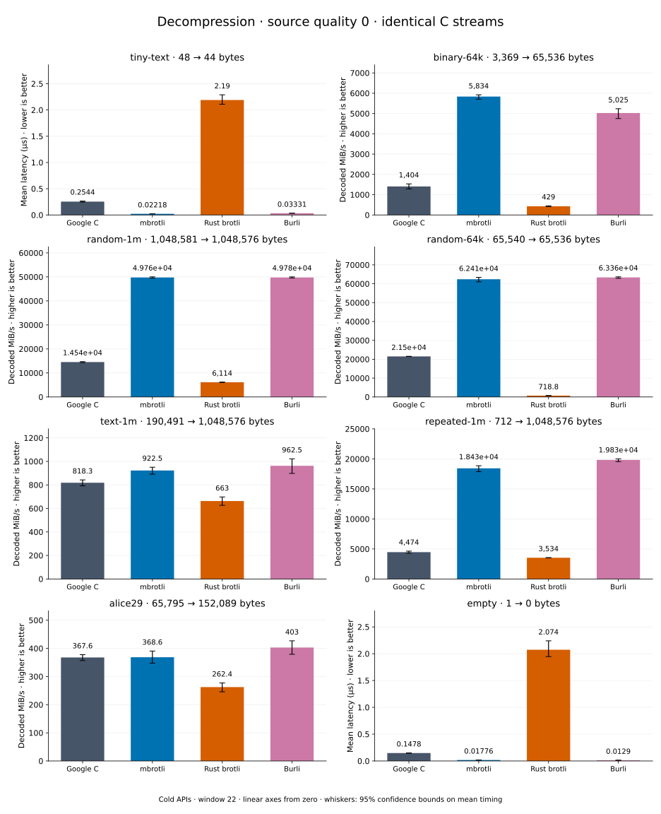

# Decompression of quality 0 streams

[Decoder overview](README.md) · [Benchmark index](../README.md)

Recorded run: **dec-2026-10-01** (2026-10-01).
[CSV](../decoder-comparison.csv) · [Environment](../decoder-comparison-environment.json) · [Methodology and limits](../decoder-comparison.md).

Quality belongs to the C encoder that prepared the input; decoders have no quality setting.
All four decode the same bytes. Burli is included at every source quality; SIMD Brotli
re-exports Rust brotli's decoder and is omitted.

## Median speed across 8 datasets

Median of per-dataset C mean time / decoder mean time ratios, with equal weight.
Higher is faster; 1× matches C. No confidence interval
is inferred for this across-dataset median.

| Decoder | Median speed / C |
| --- | ---: |
| Google C | 1.000× |
| mbrotli | 3.770× |
| Rust brotli | 0.363× |
| Burli | 3.501× |

mbrotli median speed / Burli: **0.972×** (direct per-dataset ratios).

Datasets are ranked by mbrotli speed relative to the fastest peer, highest first.
Throughput counts restored bytes; empty input has latency only. Whiskers and intervals
describe sampling uncertainty, not all host variation. Cold APIs include allocation
and disposal. C knows the output capacity; Rust brotli includes its 4 KiB I/O adapter.

## tiny-text

44-byte quick-brown-fox sentence.

**48 compressed → 44 restored bytes; compressed / original: 109.091%.**

| Decoder | Mean µs | 95% mean interval µs | Decoded MiB/s | Speed / C |
| --- | ---: | ---: | ---: | ---: |
| Google C | 0.2544 | 0.2441–0.2659 | 164.92 | 1.000× |
| mbrotli | 0.02218 | 0.02144–0.02305 | 1,892.18 | 11.473× |
| Rust brotli | 2.19 | 2.109–2.288 | 19.16 | 0.116× |
| Burli | 0.03331 | 0.03266–0.03411 | 1,259.63 | 7.638× |

## binary-64k

64 KiB of structured binary bytes: ((i / 16) XOR i) modulo 256.

**3,369 compressed → 65,536 restored bytes; compressed / original: 5.141%.**

| Decoder | Mean µs | 95% mean interval µs | Decoded MiB/s | Speed / C |
| --- | ---: | ---: | ---: | ---: |
| Google C | 44.51 | 40.78–48.57 | 1,404.18 | 1.000× |
| mbrotli | 10.71 | 10.56–10.96 | 5,834.07 | 4.155× |
| Rust brotli | 145.7 | 138.5–153 | 429.05 | 0.306× |
| Burli | 12.44 | 11.94–13.15 | 5,024.88 | 3.579× |

## random-1m

1 MiB of deterministic xorshift64 pseudorandom bytes.

**1,048,581 compressed → 1,048,576 restored bytes; compressed / original: 100.000%.**

| Decoder | Mean µs | 95% mean interval µs | Decoded MiB/s | Speed / C |
| --- | ---: | ---: | ---: | ---: |
| Google C | 68.77 | 67.9–69.95 | 14,540.65 | 1.000× |
| mbrotli | 20.1 | 19.99–20.21 | 49,760.18 | 3.422× |
| Rust brotli | 163.5 | 161.3–166.2 | 6,114.50 | 0.421× |
| Burli | 20.09 | 20–20.18 | 49,776.47 | 3.423× |

## random-64k

64 KiB prefix of the deterministic pseudorandom corpus.

**65,540 compressed → 65,536 restored bytes; compressed / original: 100.006%.**

| Decoder | Mean µs | 95% mean interval µs | Decoded MiB/s | Speed / C |
| --- | ---: | ---: | ---: | ---: |
| Google C | 2.906 | 2.898–2.918 | 21,503.62 | 1.000× |
| mbrotli | 1.002 | 0.9859–1.024 | 62,406.20 | 2.902× |
| Rust brotli | 86.95 | 86.4–87.63 | 718.84 | 0.033× |
| Burli | 0.9864 | 0.9815–0.9937 | 63,360.07 | 2.946× |

## text-1m

Alice text repeated cyclically to 1 MiB.

**190,491 compressed → 1,048,576 restored bytes; compressed / original: 18.167%.**

| Decoder | Mean µs | 95% mean interval µs | Decoded MiB/s | Speed / C |
| --- | ---: | ---: | ---: | ---: |
| Google C | 1,222 | 1,187–1,262 | 818.25 | 1.000× |
| mbrotli | 1,084 | 1,052–1,122 | 922.47 | 1.127× |
| Rust brotli | 1,508 | 1,434–1,597 | 662.96 | 0.810× |
| Burli | 1,039 | 978.7–1,114 | 962.51 | 1.176× |

## repeated-1m

1 MiB of repeated a bytes.

**712 compressed → 1,048,576 restored bytes; compressed / original: 0.068%.**

| Decoder | Mean µs | 95% mean interval µs | Decoded MiB/s | Speed / C |
| --- | ---: | ---: | ---: | ---: |
| Google C | 223.5 | 215.6–232.7 | 4,473.70 | 1.000× |
| mbrotli | 54.27 | 53.01–55.96 | 18,426.04 | 4.119× |
| Rust brotli | 283 | 280.9–285.7 | 3,534.08 | 0.790× |
| Burli | 50.42 | 49.97–51.14 | 19,833.04 | 4.433× |

## alice29

Vendored Alice in Wonderland text.

**65,795 compressed → 152,089 restored bytes; compressed / original: 43.261%.**

| Decoder | Mean µs | 95% mean interval µs | Decoded MiB/s | Speed / C |
| --- | ---: | ---: | ---: | ---: |
| Google C | 394.5 | 384.2–406.4 | 367.64 | 1.000× |
| mbrotli | 393.6 | 371.5–417.3 | 368.55 | 1.002× |
| Rust brotli | 552.7 | 523.1–590.1 | 262.43 | 0.714× |
| Burli | 359.9 | 339.9–382.7 | 402.96 | 1.096× |

## empty

Empty input; measures API overhead.

**1 compressed → 0 restored bytes; compressed / original: undefined.**

| Decoder | Mean µs | 95% mean interval µs | Decoded MiB/s | Speed / C |
| --- | ---: | ---: | ---: | ---: |
| Google C | 0.1478 | 0.1453–0.1509 | — | 1.000× |
| mbrotli | 0.01776 | 0.01693–0.01877 | — | 8.321× |
| Rust brotli | 2.074 | 1.946–2.24 | — | 0.071× |
| Burli | 0.0129 | 0.01198–0.014 | — | 11.459× |
