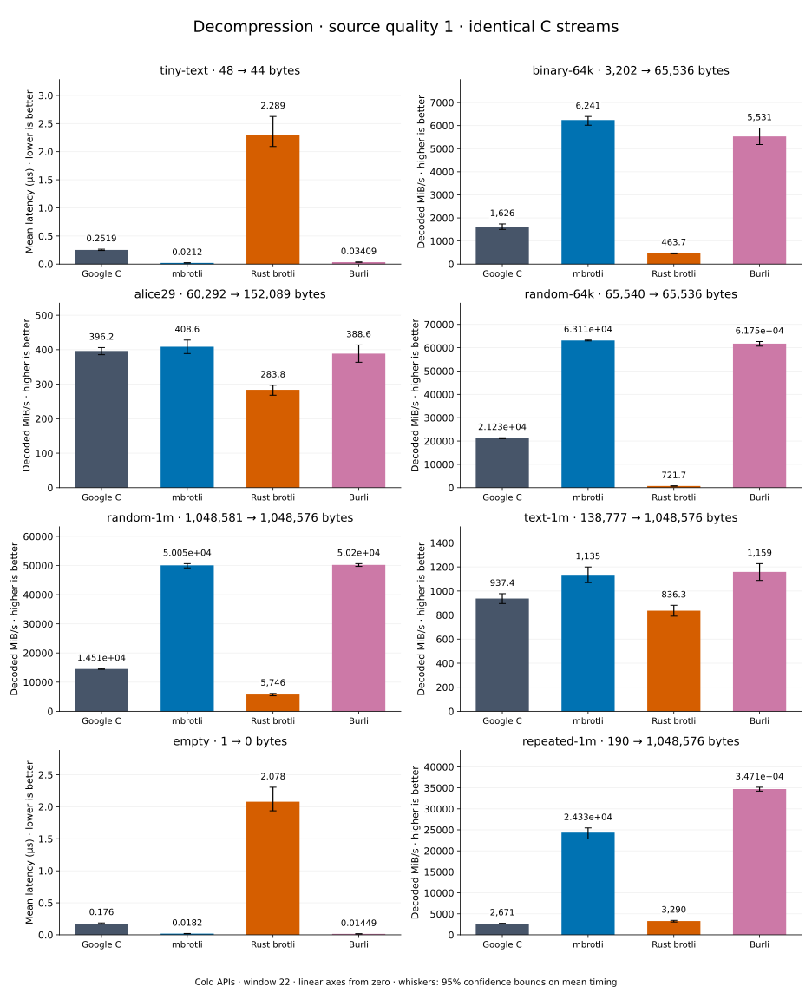

# Decompression of quality 1 streams

[Decoder overview](README.md) · [Benchmark index](../README.md)

Recorded run: **dec-2026-10-02** (2026-10-02).
[CSV](../decoder-comparison.csv) · [Environment](../decoder-comparison-environment.json) · [Methodology and limits](../decoder-comparison.md).

Quality belongs to the C encoder that prepared the input; decoders have no quality setting.
All four decode the same bytes. Burli is included at every source quality; SIMD Brotli
re-exports Rust brotli's decoder and is omitted.

## Median speed across 8 datasets

Median of per-dataset C mean time / decoder mean time ratios, with equal weight.
Higher is faster; 1× matches C. No confidence interval
is inferred for this across-dataset median.

| Decoder | Median speed / C |
| --- | ---: |
| Google C | 1.000× |
| mbrotli | 3.644× |
| Rust brotli | 0.341× |
| Burli | 3.431× |

mbrotli median speed / Burli: **1.009×** (direct per-dataset ratios).

Datasets are ranked by mbrotli speed relative to the fastest peer, highest first.
Throughput counts restored bytes; empty input has latency only. Whiskers and intervals
describe sampling uncertainty, not all host variation. Cold APIs include allocation
and disposal. C knows the output capacity; Rust brotli includes its 4 KiB I/O adapter.

## tiny-text

44-byte quick-brown-fox sentence.

**48 compressed → 44 restored bytes; compressed / original: 109.091%.**

| Decoder | Mean µs | 95% mean interval µs | Decoded MiB/s | Speed / C |
| --- | ---: | ---: | ---: | ---: |
| Google C | 0.2519 | 0.2417–0.2645 | 166.56 | 1.000× |
| mbrotli | 0.0212 | 0.02094–0.02152 | 1,979.32 | 11.883× |
| Rust brotli | 2.289 | 2.091–2.625 | 18.33 | 0.110× |
| Burli | 0.03409 | 0.03256–0.0362 | 1,230.85 | 7.390× |

## binary-64k

64 KiB of structured binary bytes: ((i / 16) XOR i) modulo 256.

**3,202 compressed → 65,536 restored bytes; compressed / original: 4.886%.**

| Decoder | Mean µs | 95% mean interval µs | Decoded MiB/s | Speed / C |
| --- | ---: | ---: | ---: | ---: |
| Google C | 38.45 | 35.91–41.62 | 1,625.65 | 1.000× |
| mbrotli | 10.01 | 9.773–10.39 | 6,241.38 | 3.839× |
| Rust brotli | 134.8 | 130.3–140.3 | 463.75 | 0.285× |
| Burli | 11.3 | 10.6–12.07 | 5,530.98 | 3.402× |

## alice29

Vendored Alice in Wonderland text.

**60,292 compressed → 152,089 restored bytes; compressed / original: 39.643%.**

| Decoder | Mean µs | 95% mean interval µs | Decoded MiB/s | Speed / C |
| --- | ---: | ---: | ---: | ---: |
| Google C | 366.1 | 357.1–376.3 | 396.24 | 1.000× |
| mbrotli | 355 | 339–373 | 408.60 | 1.031× |
| Rust brotli | 511.1 | 488.2–541.2 | 283.78 | 0.716× |
| Burli | 373.2 | 350.6–399 | 388.64 | 0.981× |

## random-64k

64 KiB prefix of the deterministic pseudorandom corpus.

**65,540 compressed → 65,536 restored bytes; compressed / original: 100.006%.**

| Decoder | Mean µs | 95% mean interval µs | Decoded MiB/s | Speed / C |
| --- | ---: | ---: | ---: | ---: |
| Google C | 2.945 | 2.919–2.975 | 21,225.06 | 1.000× |
| mbrotli | 0.9903 | 0.9875–0.9935 | 63,113.50 | 2.974× |
| Rust brotli | 86.6 | 86.09–87.37 | 721.74 | 0.034× |
| Burli | 1.012 | 0.9977–1.03 | 61,751.11 | 2.909× |

## random-1m

1 MiB of deterministic xorshift64 pseudorandom bytes.

**1,048,581 compressed → 1,048,576 restored bytes; compressed / original: 100.000%.**

| Decoder | Mean µs | 95% mean interval µs | Decoded MiB/s | Speed / C |
| --- | ---: | ---: | ---: | ---: |
| Google C | 68.92 | 68.37–69.58 | 14,510.53 | 1.000× |
| mbrotli | 19.98 | 19.75–20.33 | 50,048.69 | 3.449× |
| Rust brotli | 174 | 163.7–188.5 | 5,745.64 | 0.396× |
| Burli | 19.92 | 19.75–20.13 | 50,202.56 | 3.460× |

## text-1m

Alice text repeated cyclically to 1 MiB.

**138,777 compressed → 1,048,576 restored bytes; compressed / original: 13.235%.**

| Decoder | Mean µs | 95% mean interval µs | Decoded MiB/s | Speed / C |
| --- | ---: | ---: | ---: | ---: |
| Google C | 1,067 | 1,023–1,117 | 937.42 | 1.000× |
| mbrotli | 881.4 | 833.6–934.6 | 1,134.55 | 1.210× |
| Rust brotli | 1,196 | 1,135–1,264 | 836.31 | 0.892× |
| Burli | 862.9 | 814.7–919.2 | 1,158.86 | 1.236× |

## empty

Empty input; measures API overhead.

**1 compressed → 0 restored bytes; compressed / original: undefined.**

| Decoder | Mean µs | 95% mean interval µs | Decoded MiB/s | Speed / C |
| --- | ---: | ---: | ---: | ---: |
| Google C | 0.176 | 0.1678–0.1862 | — | 1.000× |
| mbrotli | 0.0182 | 0.01671–0.02037 | — | 9.669× |
| Rust brotli | 2.078 | 1.936–2.304 | — | 0.085× |
| Burli | 0.01449 | 0.01351–0.01555 | — | 12.141× |

## repeated-1m

1 MiB of repeated a bytes.

**190 compressed → 1,048,576 restored bytes; compressed / original: 0.018%.**

| Decoder | Mean µs | 95% mean interval µs | Decoded MiB/s | Speed / C |
| --- | ---: | ---: | ---: | ---: |
| Google C | 374.5 | 363.5–387.4 | 2,670.53 | 1.000× |
| mbrotli | 41.1 | 39.28–43.8 | 24,333.62 | 9.112× |
| Rust brotli | 303.9 | 291–327.7 | 3,290.31 | 1.232× |
| Burli | 28.81 | 28.46–29.22 | 34,712.27 | 12.998× |
