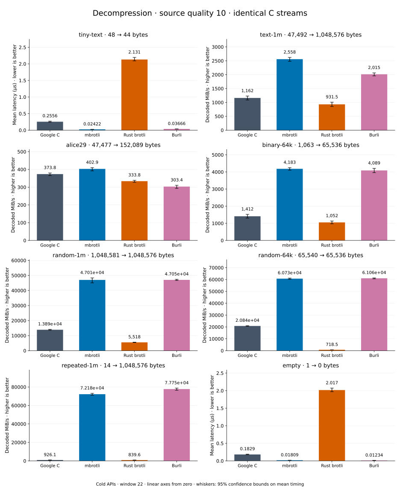

# Decompression of quality 10 streams

[Decoder overview](README.md) · [Benchmark index](../README.md)

Recorded run: **dec-2026-10-01** (2026-10-01).
[CSV](../decoder-comparison.csv) · [Environment](../decoder-comparison-environment.json) · [Methodology and limits](../decoder-comparison.md).

Quality belongs to the C encoder that prepared the input; decoders have no quality setting.
All four decode the same bytes. Burli is included at every source quality; SIMD Brotli
re-exports Rust brotli's decoder and is omitted.

## Median speed across 8 datasets

Median of per-dataset C mean time / decoder mean time ratios, with equal weight.
Higher is faster; 1× matches C. No confidence interval
is inferred for this across-dataset median.

| Decoder | Median speed / C |
| --- | ---: |
| Google C | 1.000× |
| mbrotli | 3.174× |
| Rust brotli | 0.571× |
| Burli | 3.159× |

mbrotli median speed / Burli: **1.011×** (direct per-dataset ratios).

Datasets are ranked by mbrotli speed relative to the fastest peer, highest first.
Throughput counts restored bytes; empty input has latency only. Whiskers and intervals
describe sampling uncertainty, not all host variation. Cold APIs include allocation
and disposal. C knows the output capacity; Rust brotli includes its 4 KiB I/O adapter.

## tiny-text

44-byte quick-brown-fox sentence.

**48 compressed → 44 restored bytes; compressed / original: 109.091%.**

| Decoder | Mean µs | 95% mean interval µs | Decoded MiB/s | Speed / C |
| --- | ---: | ---: | ---: | ---: |
| Google C | 0.2556 | 0.2418–0.2729 | 164.19 | 1.000× |
| mbrotli | 0.02422 | 0.02257–0.02611 | 1,732.48 | 10.552× |
| Rust brotli | 2.131 | 2.091–2.194 | 19.69 | 0.120× |
| Burli | 0.03666 | 0.0346–0.03904 | 1,144.57 | 6.971× |

## text-1m

Alice text repeated cyclically to 1 MiB.

**47,492 compressed → 1,048,576 restored bytes; compressed / original: 4.529%.**

| Decoder | Mean µs | 95% mean interval µs | Decoded MiB/s | Speed / C |
| --- | ---: | ---: | ---: | ---: |
| Google C | 860.8 | 812.3–919.8 | 1,161.71 | 1.000× |
| mbrotli | 390.9 | 381.4–403 | 2,558.27 | 2.202× |
| Rust brotli | 1,074 | 992.3–1,171 | 931.50 | 0.802× |
| Burli | 496.2 | 484.3–510.7 | 2,015.24 | 1.735× |

## alice29

Vendored Alice in Wonderland text.

**47,477 compressed → 152,089 restored bytes; compressed / original: 31.217%.**

| Decoder | Mean µs | 95% mean interval µs | Decoded MiB/s | Speed / C |
| --- | ---: | ---: | ---: | ---: |
| Google C | 388 | 381.5–397.2 | 373.81 | 1.000× |
| mbrotli | 360 | 353.8–369.9 | 402.95 | 1.078× |
| Rust brotli | 434.5 | 428.2–442.9 | 333.85 | 0.893× |
| Burli | 478 | 466.8–494.3 | 303.42 | 0.812× |

## binary-64k

64 KiB of structured binary bytes: ((i / 16) XOR i) modulo 256.

**1,063 compressed → 65,536 restored bytes; compressed / original: 1.622%.**

| Decoder | Mean µs | 95% mean interval µs | Decoded MiB/s | Speed / C |
| --- | ---: | ---: | ---: | ---: |
| Google C | 44.25 | 41.05–47.91 | 1,412.27 | 1.000× |
| mbrotli | 14.94 | 14.7–15.23 | 4,183.26 | 2.962× |
| Rust brotli | 59.39 | 55.12–64.27 | 1,052.45 | 0.745× |
| Burli | 15.29 | 14.85–15.79 | 4,088.92 | 2.895× |

## random-1m

1 MiB of deterministic xorshift64 pseudorandom bytes.

**1,048,581 compressed → 1,048,576 restored bytes; compressed / original: 100.000%.**

| Decoder | Mean µs | 95% mean interval µs | Decoded MiB/s | Speed / C |
| --- | ---: | ---: | ---: | ---: |
| Google C | 72.01 | 70.47–73.9 | 13,886.04 | 1.000× |
| mbrotli | 21.27 | 20.67–22.19 | 47,010.80 | 3.385× |
| Rust brotli | 181.2 | 177.6–185.6 | 5,517.71 | 0.397× |
| Burli | 21.26 | 21.09–21.43 | 47,045.23 | 3.388× |

## random-64k

64 KiB prefix of the deterministic pseudorandom corpus.

**65,540 compressed → 65,536 restored bytes; compressed / original: 100.006%.**

| Decoder | Mean µs | 95% mean interval µs | Decoded MiB/s | Speed / C |
| --- | ---: | ---: | ---: | ---: |
| Google C | 3 | 2.965–3.043 | 20,836.51 | 1.000× |
| mbrotli | 1.029 | 1.022–1.039 | 60,730.54 | 2.915× |
| Rust brotli | 86.99 | 86.45–87.78 | 718.51 | 0.034× |
| Burli | 1.024 | 1.018–1.032 | 61,057.07 | 2.930× |

## repeated-1m

1 MiB of repeated a bytes.

**14 compressed → 1,048,576 restored bytes; compressed / original: 0.001%.**

| Decoder | Mean µs | 95% mean interval µs | Decoded MiB/s | Speed / C |
| --- | ---: | ---: | ---: | ---: |
| Google C | 1,080 | 1,067–1,096 | 926.06 | 1.000× |
| mbrotli | 13.85 | 13.67–14.07 | 72,182.04 | 77.946× |
| Rust brotli | 1,191 | 1,162–1,225 | 839.55 | 0.907× |
| Burli | 12.86 | 12.69–13.08 | 77,752.40 | 83.961× |

## empty

Empty input; measures API overhead.

**1 compressed → 0 restored bytes; compressed / original: undefined.**

| Decoder | Mean µs | 95% mean interval µs | Decoded MiB/s | Speed / C |
| --- | ---: | ---: | ---: | ---: |
| Google C | 0.1829 | 0.1745–0.1926 | — | 1.000× |
| mbrotli | 0.01809 | 0.01726–0.01909 | — | 10.112× |
| Rust brotli | 2.017 | 1.971–2.072 | — | 0.091× |
| Burli | 0.01234 | 0.01188–0.01291 | — | 14.825× |
