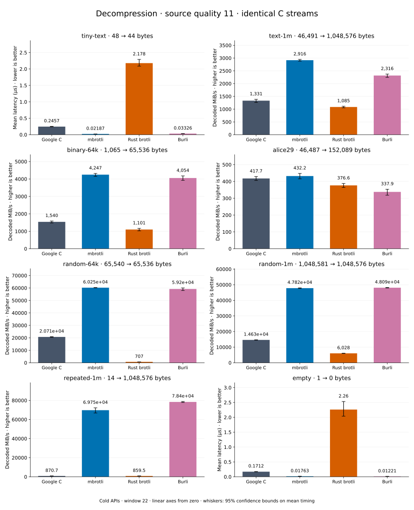

# Decompression of quality 11 streams

[Decoder overview](README.md) · [Benchmark index](../README.md)

Recorded run: **dec-2026-09-28** (2026-09-28).
[CSV](../decoder-comparison.csv) · [Environment](../decoder-comparison-environment.json) · [Methodology and limits](../decoder-comparison.md).

Quality belongs to the C encoder that prepared the input; decoders have no quality setting.
All four decode the same bytes. Burli is included at every source quality; SIMD Brotli
re-exports Rust brotli's decoder and is omitted.

## Median speed across 8 datasets

Median of per-dataset C mean time / decoder mean time ratios, with equal weight.
Higher is faster; 1× matches C. No confidence interval
is inferred for this across-dataset median.

| Decoder | Median speed / C |
| --- | ---: |
| Google C | 1.000× |
| mbrotli | 3.185× |
| Rust brotli | 0.613× |
| Burli | 3.177× |

mbrotli median speed / Burli: **1.036×** (direct per-dataset ratios).

Datasets are ranked by mbrotli speed relative to the fastest peer, highest first.
Throughput counts restored bytes; empty input has latency only. Whiskers and intervals
describe sampling uncertainty, not all host variation. Cold APIs include allocation
and disposal. C knows the output capacity; Rust brotli includes its 4 KiB I/O adapter.

## tiny-text

44-byte quick-brown-fox sentence.

**48 compressed → 44 restored bytes; compressed / original: 109.091%.**

| Decoder | Mean µs | 95% mean interval µs | Decoded MiB/s | Speed / C |
| --- | ---: | ---: | ---: | ---: |
| Google C | 0.247 | 0.2459–0.2483 | 169.85 | 1.000× |
| mbrotli | 0.0219 | 0.02127–0.0228 | 1,916.04 | 11.281× |
| Rust brotli | 2.096 | 2.089–2.104 | 20.02 | 0.118× |
| Burli | 0.03176 | 0.03122–0.03266 | 1,321.38 | 7.780× |

## text-1m

Alice text repeated cyclically to 1 MiB.

**46,491 compressed → 1,048,576 restored bytes; compressed / original: 4.434%.**

| Decoder | Mean µs | 95% mean interval µs | Decoded MiB/s | Speed / C |
| --- | ---: | ---: | ---: | ---: |
| Google C | 800 | 736.6–878.1 | 1,249.98 | 1.000× |
| mbrotli | 359.6 | 355.3–366.2 | 2,780.54 | 2.224× |
| Rust brotli | 913.7 | 909.6–918.6 | 1,094.42 | 0.876× |
| Burli | 437.7 | 426.4–451.7 | 2,284.61 | 1.828× |

## binary-64k

64 KiB of structured binary bytes: ((i / 16) XOR i) modulo 256.

**1,065 compressed → 65,536 restored bytes; compressed / original: 1.625%.**

| Decoder | Mean µs | 95% mean interval µs | Decoded MiB/s | Speed / C |
| --- | ---: | ---: | ---: | ---: |
| Google C | 40.63 | 39.08–42.78 | 1,538.08 | 1.000× |
| mbrotli | 14.74 | 14.43–15.13 | 4,239.56 | 2.756× |
| Rust brotli | 52.69 | 51.49–54.42 | 1,186.17 | 0.771× |
| Burli | 15.68 | 15.26–16.29 | 3,986.65 | 2.592× |

## alice29

Vendored Alice in Wonderland text.

**46,487 compressed → 152,089 restored bytes; compressed / original: 30.566%.**

| Decoder | Mean µs | 95% mean interval µs | Decoded MiB/s | Speed / C |
| --- | ---: | ---: | ---: | ---: |
| Google C | 328.9 | 327.5–330.3 | 441.02 | 1.000× |
| mbrotli | 321.5 | 310.7–334.8 | 451.15 | 1.023× |
| Rust brotli | 377.1 | 368.6–387.2 | 384.62 | 0.872× |
| Burli | 408.8 | 405.4–413.3 | 354.78 | 0.804× |

## random-1m

1 MiB of deterministic xorshift64 pseudorandom bytes.

**1,048,581 compressed → 1,048,576 restored bytes; compressed / original: 100.000%.**

| Decoder | Mean µs | 95% mean interval µs | Decoded MiB/s | Speed / C |
| --- | ---: | ---: | ---: | ---: |
| Google C | 68.22 | 67.41–69.33 | 14,657.39 | 1.000× |
| mbrotli | 20.11 | 19.85–20.51 | 49,726.96 | 3.393× |
| Rust brotli | 150.2 | 149.4–151 | 6,657.36 | 0.454× |
| Burli | 20.3 | 19.48–21.28 | 49,262.37 | 3.361× |

## random-64k

64 KiB prefix of the deterministic pseudorandom corpus.

**65,540 compressed → 65,536 restored bytes; compressed / original: 100.006%.**

| Decoder | Mean µs | 95% mean interval µs | Decoded MiB/s | Speed / C |
| --- | ---: | ---: | ---: | ---: |
| Google C | 2.955 | 2.915–3.008 | 21,151.67 | 1.000× |
| mbrotli | 0.9927 | 0.9807–1.009 | 62,960.27 | 2.977× |
| Rust brotli | 87.18 | 86.86–87.5 | 716.90 | 0.034× |
| Burli | 0.9871 | 0.9842–0.9913 | 63,319.02 | 2.994× |

## repeated-1m

1 MiB of repeated a bytes.

**14 compressed → 1,048,576 restored bytes; compressed / original: 0.001%.**

| Decoder | Mean µs | 95% mean interval µs | Decoded MiB/s | Speed / C |
| --- | ---: | ---: | ---: | ---: |
| Google C | 1,105 | 1,083–1,132 | 904.68 | 1.000× |
| mbrotli | 13.72 | 13.65–13.82 | 72,880.79 | 80.560× |
| Rust brotli | 1,122 | 1,120–1,124 | 891.02 | 0.985× |
| Burli | 12.86 | 12.69–13.07 | 77,757.34 | 85.950× |

## empty

Empty input; measures API overhead.

**1 compressed → 0 restored bytes; compressed / original: undefined.**

| Decoder | Mean µs | 95% mean interval µs | Decoded MiB/s | Speed / C |
| --- | ---: | ---: | ---: | ---: |
| Google C | 0.1621 | 0.1611–0.1632 | — | 1.000× |
| mbrotli | 0.01729 | 0.01679–0.01805 | — | 9.378× |
| Rust brotli | 2.019 | 2.011–2.027 | — | 0.080× |
| Burli | 0.01134 | 0.01127–0.01143 | — | 14.289× |
