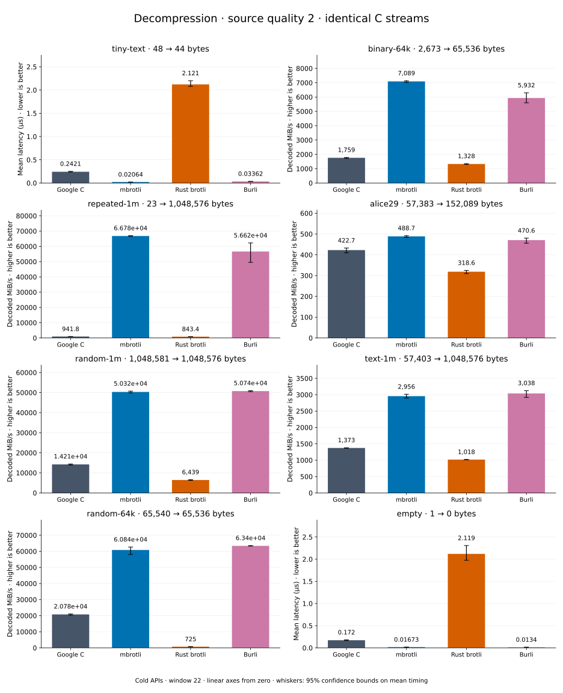

# Decompression of quality 2 streams

[Decoder overview](README.md) · [Benchmark index](../README.md)

Recorded run: **dec-2026-10-02** (2026-10-02).
[CSV](../decoder-comparison.csv) · [Environment](../decoder-comparison-environment.json) · [Methodology and limits](../decoder-comparison.md).

Quality belongs to the C encoder that prepared the input; decoders have no quality setting.
All four decode the same bytes. Burli is included at every source quality; SIMD Brotli
re-exports Rust brotli's decoder and is omitted.

## Median speed across 8 datasets

Median of per-dataset C mean time / decoder mean time ratios, with equal weight.
Higher is faster; 1× matches C. No confidence interval
is inferred for this across-dataset median.

| Decoder | Median speed / C |
| --- | ---: |
| Google C | 1.000× |
| mbrotli | 3.792× |
| Rust brotli | 0.539× |
| Burli | 3.748× |

mbrotli median speed / Burli: **1.023×** (direct per-dataset ratios).

Datasets are ranked by mbrotli speed relative to the fastest peer, highest first.
Throughput counts restored bytes; empty input has latency only. Whiskers and intervals
describe sampling uncertainty, not all host variation. Cold APIs include allocation
and disposal. C knows the output capacity; Rust brotli includes its 4 KiB I/O adapter.

## tiny-text

44-byte quick-brown-fox sentence.

**48 compressed → 44 restored bytes; compressed / original: 109.091%.**

| Decoder | Mean µs | 95% mean interval µs | Decoded MiB/s | Speed / C |
| --- | ---: | ---: | ---: | ---: |
| Google C | 0.2526 | 0.2357–0.2733 | 166.09 | 1.000× |
| mbrotli | 0.0224 | 0.02176–0.02318 | 1,872.99 | 11.277× |
| Rust brotli | 2.287 | 2.109–2.507 | 18.35 | 0.110× |
| Burli | 0.03224 | 0.03176–0.03289 | 1,301.67 | 7.837× |

## alice29

Vendored Alice in Wonderland text.

**57,383 compressed → 152,089 restored bytes; compressed / original: 37.730%.**

| Decoder | Mean µs | 95% mean interval µs | Decoded MiB/s | Speed / C |
| --- | ---: | ---: | ---: | ---: |
| Google C | 347.2 | 339.2–356 | 417.76 | 1.000× |
| mbrotli | 327 | 303.8–360.5 | 443.57 | 1.062× |
| Rust brotli | 523.4 | 496.6–550.2 | 277.12 | 0.663× |
| Burli | 378 | 340.6–417.4 | 383.72 | 0.919× |

## repeated-1m

1 MiB of repeated a bytes.

**23 compressed → 1,048,576 restored bytes; compressed / original: 0.002%.**

| Decoder | Mean µs | 95% mean interval µs | Decoded MiB/s | Speed / C |
| --- | ---: | ---: | ---: | ---: |
| Google C | 1,113 | 1,086–1,143 | 898.29 | 1.000× |
| mbrotli | 15.51 | 15.01–16.21 | 64,478.32 | 71.779× |
| Rust brotli | 1,166 | 1,139–1,198 | 857.80 | 0.955× |
| Burli | 16.27 | 15.94–16.69 | 61,471.08 | 68.431× |

## binary-64k

64 KiB of structured binary bytes: ((i / 16) XOR i) modulo 256.

**2,673 compressed → 65,536 restored bytes; compressed / original: 4.079%.**

| Decoder | Mean µs | 95% mean interval µs | Decoded MiB/s | Speed / C |
| --- | ---: | ---: | ---: | ---: |
| Google C | 39 | 36.23–42.51 | 1,602.55 | 1.000× |
| mbrotli | 9.33 | 9.129–9.647 | 6,699.11 | 4.180× |
| Rust brotli | 50.12 | 45.49–55.59 | 1,246.97 | 0.778× |
| Burli | 9.686 | 8.927–10.8 | 6,452.43 | 4.026× |

## text-1m

Alice text repeated cyclically to 1 MiB.

**57,403 compressed → 1,048,576 restored bytes; compressed / original: 5.474%.**

| Decoder | Mean µs | 95% mean interval µs | Decoded MiB/s | Speed / C |
| --- | ---: | ---: | ---: | ---: |
| Google C | 788.9 | 748.3–837.3 | 1,267.57 | 1.000× |
| mbrotli | 336.5 | 324.6–350.6 | 2,971.57 | 2.344× |
| Rust brotli | 971.2 | 933.7–1,023 | 1,029.69 | 0.812× |
| Burli | 339.1 | 324.8–355.9 | 2,948.72 | 2.326× |

## random-1m

1 MiB of deterministic xorshift64 pseudorandom bytes.

**1,048,581 compressed → 1,048,576 restored bytes; compressed / original: 100.000%.**

| Decoder | Mean µs | 95% mean interval µs | Decoded MiB/s | Speed / C |
| --- | ---: | ---: | ---: | ---: |
| Google C | 67.94 | 67.75–68.14 | 14,718.59 | 1.000× |
| mbrotli | 19.96 | 19.75–20.21 | 50,091.09 | 3.403× |
| Rust brotli | 163.9 | 162.1–166.2 | 6,100.65 | 0.414× |
| Burli | 19.58 | 19.5–19.69 | 51,066.78 | 3.470× |

## random-64k

64 KiB prefix of the deterministic pseudorandom corpus.

**65,540 compressed → 65,536 restored bytes; compressed / original: 100.006%.**

| Decoder | Mean µs | 95% mean interval µs | Decoded MiB/s | Speed / C |
| --- | ---: | ---: | ---: | ---: |
| Google C | 2.923 | 2.913–2.935 | 21,382.37 | 1.000× |
| mbrotli | 1.02 | 0.9965–1.058 | 61,249.84 | 2.865× |
| Rust brotli | 87.27 | 86.51–88.15 | 716.16 | 0.033× |
| Burli | 0.9973 | 0.9882–1.01 | 62,671.57 | 2.931× |

## empty

Empty input; measures API overhead.

**1 compressed → 0 restored bytes; compressed / original: undefined.**

| Decoder | Mean µs | 95% mean interval µs | Decoded MiB/s | Speed / C |
| --- | ---: | ---: | ---: | ---: |
| Google C | 0.1727 | 0.1659–0.1819 | — | 1.000× |
| mbrotli | 0.01878 | 0.01755–0.02017 | — | 9.200× |
| Rust brotli | 2.116 | 1.974–2.287 | — | 0.082× |
| Burli | 0.01303 | 0.0122–0.01403 | — | 13.262× |
