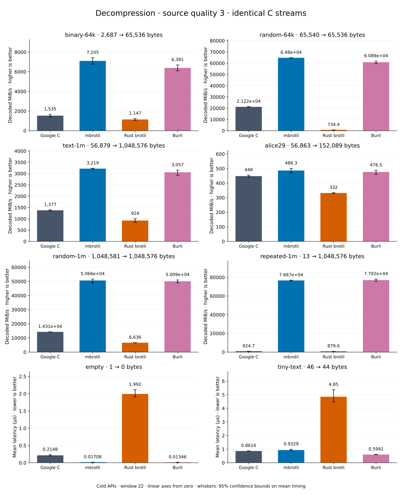

# Decompression of quality 3 streams

[Decoder overview](README.md) · [Benchmark index](../README.md)

Recorded run: **dec-2026-09-28** (2026-09-28).
[CSV](../decoder-comparison.csv) · [Environment](../decoder-comparison-environment.json) · [Methodology and limits](../decoder-comparison.md).

Quality belongs to the C encoder that prepared the input; decoders have no quality setting.
All four decode the same bytes. Burli is included at every source quality; SIMD Brotli
re-exports Rust brotli's decoder and is omitted.

## Median speed across 8 datasets

Median of per-dataset C mean time / decoder mean time ratios, with equal weight.
Higher is faster; 1× matches C. No confidence interval
is inferred for this across-dataset median.

| Decoder | Median speed / C |
| --- | ---: |
| Google C | 1.000× |
| mbrotli | 3.297× |
| Rust brotli | 0.567× |
| Burli | 3.186× |

mbrotli median speed / Burli: **1.016×** (direct per-dataset ratios).

Datasets are ranked by mbrotli speed relative to the fastest peer, highest first.
Throughput counts restored bytes; empty input has latency only. Whiskers and intervals
describe sampling uncertainty, not all host variation. Cold APIs include allocation
and disposal. C knows the output capacity; Rust brotli includes its 4 KiB I/O adapter.

## binary-64k

64 KiB of structured binary bytes: ((i / 16) XOR i) modulo 256.

**2,687 compressed → 65,536 restored bytes; compressed / original: 4.100%.**

| Decoder | Mean µs | 95% mean interval µs | Decoded MiB/s | Speed / C |
| --- | ---: | ---: | ---: | ---: |
| Google C | 40.72 | 37.37–44.58 | 1,534.83 | 1.000× |
| mbrotli | 8.797 | 8.407–9.251 | 7,104.91 | 4.629× |
| Rust brotli | 54.48 | 50.34–59.42 | 1,147.31 | 0.748× |
| Burli | 9.779 | 9.336–10.25 | 6,391.49 | 4.164× |

## random-64k

64 KiB prefix of the deterministic pseudorandom corpus.

**65,540 compressed → 65,536 restored bytes; compressed / original: 100.006%.**

| Decoder | Mean µs | 95% mean interval µs | Decoded MiB/s | Speed / C |
| --- | ---: | ---: | ---: | ---: |
| Google C | 2.946 | 2.916–2.988 | 21,217.13 | 1.000× |
| mbrotli | 0.9646 | 0.9628–0.9665 | 64,796.09 | 3.054× |
| Rust brotli | 85.1 | 84.66–85.66 | 734.43 | 0.035× |
| Burli | 1.026 | 1.01–1.046 | 60,891.51 | 2.870× |

## text-1m

Alice text repeated cyclically to 1 MiB.

**56,879 compressed → 1,048,576 restored bytes; compressed / original: 5.424%.**

| Decoder | Mean µs | 95% mean interval µs | Decoded MiB/s | Speed / C |
| --- | ---: | ---: | ---: | ---: |
| Google C | 726.3 | 716.8–740.8 | 1,376.86 | 1.000× |
| mbrotli | 310.6 | 309.4–311.9 | 3,219.19 | 2.338× |
| Rust brotli | 1,082 | 994.7–1,189 | 923.97 | 0.671× |
| Burli | 327.1 | 317.2–342.3 | 3,057.40 | 2.221× |

## alice29

Vendored Alice in Wonderland text.

**56,863 compressed → 152,089 restored bytes; compressed / original: 37.388%.**

| Decoder | Mean µs | 95% mean interval µs | Decoded MiB/s | Speed / C |
| --- | ---: | ---: | ---: | ---: |
| Google C | 323.8 | 318.7–330 | 448.01 | 1.000× |
| mbrotli | 298.2 | 289.3–308.9 | 486.35 | 1.086× |
| Rust brotli | 436.8 | 434.6–439.1 | 332.04 | 0.741× |
| Burli | 304.4 | 297.2–314.6 | 476.53 | 1.064× |

## random-1m

1 MiB of deterministic xorshift64 pseudorandom bytes.

**1,048,581 compressed → 1,048,576 restored bytes; compressed / original: 100.000%.**

| Decoder | Mean µs | 95% mean interval µs | Decoded MiB/s | Speed / C |
| --- | ---: | ---: | ---: | ---: |
| Google C | 69.9 | 69.58–70.28 | 14,306.64 | 1.000× |
| mbrotli | 19.74 | 19.35–20.43 | 50,658.49 | 3.541× |
| Rust brotli | 150.7 | 149–153 | 6,636.05 | 0.464× |
| Burli | 19.96 | 19.59–20.42 | 50,091.08 | 3.501× |

## repeated-1m

1 MiB of repeated a bytes.

**13 compressed → 1,048,576 restored bytes; compressed / original: 0.001%.**

| Decoder | Mean µs | 95% mean interval µs | Decoded MiB/s | Speed / C |
| --- | ---: | ---: | ---: | ---: |
| Google C | 1,081 | 1,067–1,099 | 924.74 | 1.000× |
| mbrotli | 13.04 | 12.99–13.1 | 76,670.18 | 82.910× |
| Rust brotli | 1,137 | 1,121–1,158 | 879.61 | 0.951× |
| Burli | 12.98 | 12.79–13.22 | 77,024.52 | 83.293× |

## empty

Empty input; measures API overhead.

**1 compressed → 0 restored bytes; compressed / original: undefined.**

| Decoder | Mean µs | 95% mean interval µs | Decoded MiB/s | Speed / C |
| --- | ---: | ---: | ---: | ---: |
| Google C | 0.2148 | 0.1976–0.2343 | — | 1.000× |
| mbrotli | 0.01708 | 0.01687–0.01736 | — | 12.581× |
| Rust brotli | 1.992 | 1.906–2.116 | — | 0.108× |
| Burli | 0.01346 | 0.01235–0.01479 | — | 15.965× |

## tiny-text

44-byte quick-brown-fox sentence.

**46 compressed → 44 restored bytes; compressed / original: 104.545%.**

| Decoder | Mean µs | 95% mean interval µs | Decoded MiB/s | Speed / C |
| --- | ---: | ---: | ---: | ---: |
| Google C | 0.8616 | 0.8516–0.8765 | 48.70 | 1.000× |
| mbrotli | 0.9329 | 0.8858–0.9916 | 44.98 | 0.924× |
| Rust brotli | 4.85 | 4.474–5.369 | 8.65 | 0.178× |
| Burli | 0.5991 | 0.5872–0.6152 | 70.04 | 1.438× |
