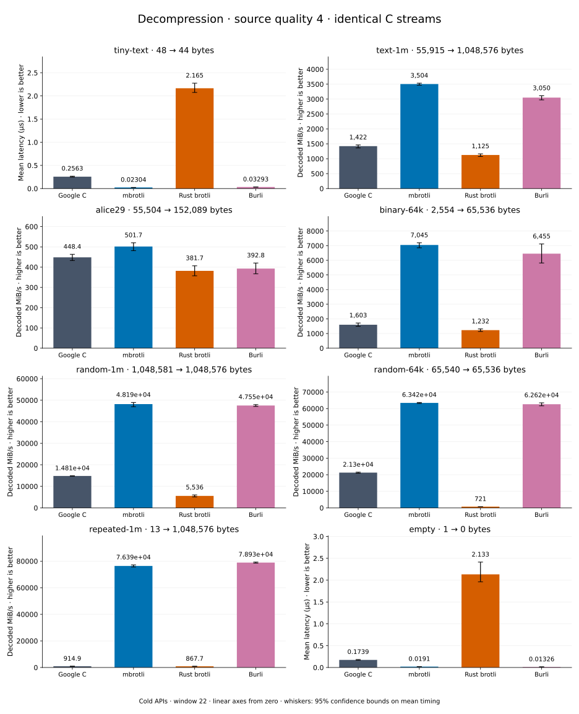

# Decompression of quality 4 streams

[Decoder overview](README.md) · [Benchmark index](../README.md)

Recorded run: **dec-2026-09-28** (2026-09-28).
[CSV](../decoder-comparison.csv) · [Environment](../decoder-comparison-environment.json) · [Methodology and limits](../decoder-comparison.md).

Quality belongs to the C encoder that prepared the input; decoders have no quality setting.
All four decode the same bytes. Burli is included at every source quality; SIMD Brotli
re-exports Rust brotli's decoder and is omitted.

## Median speed across 8 datasets

Median of per-dataset C mean time / decoder mean time ratios, with equal weight.
Higher is faster; 1× matches C. No confidence interval
is inferred for this across-dataset median.

| Decoder | Median speed / C |
| --- | ---: |
| Google C | 1.000× |
| mbrotli | 3.777× |
| Rust brotli | 0.577× |
| Burli | 3.493× |

mbrotli median speed / Burli: **1.057×** (direct per-dataset ratios).

Datasets are ranked by mbrotli speed relative to the fastest peer, highest first.
Throughput counts restored bytes; empty input has latency only. Whiskers and intervals
describe sampling uncertainty, not all host variation. Cold APIs include allocation
and disposal. C knows the output capacity; Rust brotli includes its 4 KiB I/O adapter.

## tiny-text

44-byte quick-brown-fox sentence.

**48 compressed → 44 restored bytes; compressed / original: 109.091%.**

| Decoder | Mean µs | 95% mean interval µs | Decoded MiB/s | Speed / C |
| --- | ---: | ---: | ---: | ---: |
| Google C | 0.2556 | 0.2473–0.2709 | 164.15 | 1.000× |
| mbrotli | 0.02399 | 0.02232–0.02581 | 1,749.00 | 10.655× |
| Rust brotli | 2.083 | 2.076–2.089 | 20.15 | 0.123× |
| Burli | 0.03214 | 0.0314–0.03313 | 1,305.76 | 7.955× |

## binary-64k

64 KiB of structured binary bytes: ((i / 16) XOR i) modulo 256.

**2,554 compressed → 65,536 restored bytes; compressed / original: 3.897%.**

| Decoder | Mean µs | 95% mean interval µs | Decoded MiB/s | Speed / C |
| --- | ---: | ---: | ---: | ---: |
| Google C | 35.34 | 34.97–35.92 | 1,768.43 | 1.000× |
| mbrotli | 9.089 | 8.578–9.776 | 6,876.80 | 3.889× |
| Rust brotli | 52.27 | 49.56–55.71 | 1,195.78 | 0.676× |
| Burli | 10.68 | 10.07–11.28 | 5,853.69 | 3.310× |

## text-1m

Alice text repeated cyclically to 1 MiB.

**55,915 compressed → 1,048,576 restored bytes; compressed / original: 5.332%.**

| Decoder | Mean µs | 95% mean interval µs | Decoded MiB/s | Speed / C |
| --- | ---: | ---: | ---: | ---: |
| Google C | 703.1 | 680–739.7 | 1,422.36 | 1.000× |
| mbrotli | 297.8 | 287.6–310.8 | 3,358.47 | 2.361× |
| Rust brotli | 884.7 | 880.9–888.9 | 1,130.36 | 0.795× |
| Burli | 332.8 | 321.2–348.7 | 3,005.07 | 2.113× |

## alice29

Vendored Alice in Wonderland text.

**55,504 compressed → 152,089 restored bytes; compressed / original: 36.494%.**

| Decoder | Mean µs | 95% mean interval µs | Decoded MiB/s | Speed / C |
| --- | ---: | ---: | ---: | ---: |
| Google C | 305.7 | 304.2–307.4 | 474.51 | 1.000× |
| mbrotli | 279.2 | 276.9–282.8 | 519.49 | 1.095× |
| Rust brotli | 356.2 | 341.3–375.1 | 407.25 | 0.858× |
| Burli | 315 | 313.8–316.6 | 460.39 | 0.970× |

## random-1m

1 MiB of deterministic xorshift64 pseudorandom bytes.

**1,048,581 compressed → 1,048,576 restored bytes; compressed / original: 100.000%.**

| Decoder | Mean µs | 95% mean interval µs | Decoded MiB/s | Speed / C |
| --- | ---: | ---: | ---: | ---: |
| Google C | 71.32 | 68.95–74.54 | 14,020.92 | 1.000× |
| mbrotli | 19.46 | 19.37–19.57 | 51,390.80 | 3.665× |
| Rust brotli | 149.4 | 148.3–150.6 | 6,695.15 | 0.478× |
| Burli | 19.4 | 19.34–19.49 | 51,539.84 | 3.676× |

## random-64k

64 KiB prefix of the deterministic pseudorandom corpus.

**65,540 compressed → 65,536 restored bytes; compressed / original: 100.006%.**

| Decoder | Mean µs | 95% mean interval µs | Decoded MiB/s | Speed / C |
| --- | ---: | ---: | ---: | ---: |
| Google C | 3.067 | 3.024–3.13 | 20,378.21 | 1.000× |
| mbrotli | 1.006 | 0.995–1.022 | 62,098.91 | 3.047× |
| Rust brotli | 86.11 | 85.77–86.57 | 725.81 | 0.036× |
| Burli | 0.9936 | 0.99–0.9979 | 62,903.82 | 3.087× |

## repeated-1m

1 MiB of repeated a bytes.

**13 compressed → 1,048,576 restored bytes; compressed / original: 0.001%.**

| Decoder | Mean µs | 95% mean interval µs | Decoded MiB/s | Speed / C |
| --- | ---: | ---: | ---: | ---: |
| Google C | 1,066 | 1,064–1,068 | 938.07 | 1.000× |
| mbrotli | 13.19 | 13.04–13.44 | 75,802.51 | 80.807× |
| Rust brotli | 1,165 | 1,136–1,200 | 858.66 | 0.915× |
| Burli | 12.66 | 12.63–12.7 | 79,005.40 | 84.221× |

## empty

Empty input; measures API overhead.

**1 compressed → 0 restored bytes; compressed / original: undefined.**

| Decoder | Mean µs | 95% mean interval µs | Decoded MiB/s | Speed / C |
| --- | ---: | ---: | ---: | ---: |
| Google C | 0.2059 | 0.1877–0.2314 | — | 1.000× |
| mbrotli | 0.01732 | 0.01692–0.01782 | — | 11.887× |
| Rust brotli | 2.287 | 1.965–2.723 | — | 0.090× |
| Burli | 0.01275 | 0.01182–0.01388 | — | 16.146× |
