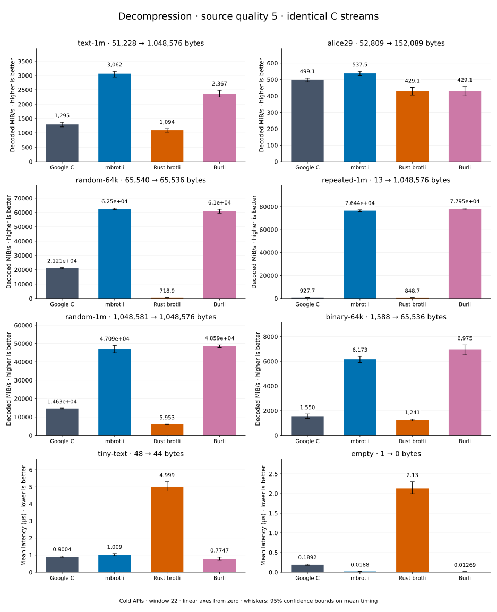

# Decompression of quality 5 streams

[Decoder overview](README.md) · [Benchmark index](../README.md)

Recorded run: **dec-2026-09-28** (2026-09-28).
[CSV](../decoder-comparison.csv) · [Environment](../decoder-comparison-environment.json) · [Methodology and limits](../decoder-comparison.md).

Quality belongs to the C encoder that prepared the input; decoders have no quality setting.
All four decode the same bytes. Burli is included at every source quality; SIMD Brotli
re-exports Rust brotli's decoder and is omitted.

## Median speed across 8 datasets

Median of per-dataset C mean time / decoder mean time ratios, with equal weight.
Higher is faster; 1× matches C. No confidence interval
is inferred for this across-dataset median.

| Decoder | Median speed / C |
| --- | ---: |
| Google C | 1.000× |
| mbrotli | 3.225× |
| Rust brotli | 0.566× |
| Burli | 3.260× |

mbrotli median speed / Burli: **0.979×** (direct per-dataset ratios).

Datasets are ranked by mbrotli speed relative to the fastest peer, highest first.
Throughput counts restored bytes; empty input has latency only. Whiskers and intervals
describe sampling uncertainty, not all host variation. Cold APIs include allocation
and disposal. C knows the output capacity; Rust brotli includes its 4 KiB I/O adapter.

## text-1m

Alice text repeated cyclically to 1 MiB.

**51,228 compressed → 1,048,576 restored bytes; compressed / original: 4.885%.**

| Decoder | Mean µs | 95% mean interval µs | Decoded MiB/s | Speed / C |
| --- | ---: | ---: | ---: | ---: |
| Google C | 728.8 | 704.5–765 | 1,372.08 | 1.000× |
| mbrotli | 329.2 | 314.9–347.5 | 3,037.59 | 2.214× |
| Rust brotli | 936.1 | 897.3–993.2 | 1,068.26 | 0.779× |
| Burli | 388.1 | 385.3–391.8 | 2,576.47 | 1.878× |

## alice29

Vendored Alice in Wonderland text.

**52,809 compressed → 152,089 restored bytes; compressed / original: 34.722%.**

| Decoder | Mean µs | 95% mean interval µs | Decoded MiB/s | Speed / C |
| --- | ---: | ---: | ---: | ---: |
| Google C | 294.1 | 286.2–304.1 | 493.25 | 1.000× |
| mbrotli | 257.6 | 256.1–259.5 | 563.04 | 1.141× |
| Rust brotli | 316.6 | 311–324.3 | 458.16 | 0.929× |
| Burli | 307.5 | 306.1–309.2 | 471.63 | 0.956× |

## random-1m

1 MiB of deterministic xorshift64 pseudorandom bytes.

**1,048,581 compressed → 1,048,576 restored bytes; compressed / original: 100.000%.**

| Decoder | Mean µs | 95% mean interval µs | Decoded MiB/s | Speed / C |
| --- | ---: | ---: | ---: | ---: |
| Google C | 68.91 | 68.71–69.15 | 14,512.02 | 1.000× |
| mbrotli | 19.7 | 19.66–19.74 | 50,757.55 | 3.498× |
| Rust brotli | 149.3 | 148.7–149.9 | 6,699.03 | 0.462× |
| Burli | 19.67 | 19.64–19.71 | 50,830.79 | 3.503× |

## repeated-1m

1 MiB of repeated a bytes.

**13 compressed → 1,048,576 restored bytes; compressed / original: 0.001%.**

| Decoder | Mean µs | 95% mean interval µs | Decoded MiB/s | Speed / C |
| --- | ---: | ---: | ---: | ---: |
| Google C | 1,063 | 1,061–1,066 | 940.59 | 1.000× |
| mbrotli | 12.91 | 12.86–12.98 | 77,464.69 | 82.357× |
| Rust brotli | 1,145 | 1,119–1,178 | 873.32 | 0.928× |
| Burli | 12.64 | 12.62–12.67 | 79,115.35 | 84.112× |

## random-64k

64 KiB prefix of the deterministic pseudorandom corpus.

**65,540 compressed → 65,536 restored bytes; compressed / original: 100.006%.**

| Decoder | Mean µs | 95% mean interval µs | Decoded MiB/s | Speed / C |
| --- | ---: | ---: | ---: | ---: |
| Google C | 2.922 | 2.908–2.938 | 21,391.37 | 1.000× |
| mbrotli | 0.9897 | 0.9877–0.9922 | 63,149.46 | 2.952× |
| Rust brotli | 86.19 | 86.09–86.29 | 725.18 | 0.034× |
| Burli | 0.9684 | 0.9637–0.9765 | 64,536.23 | 3.017× |

## binary-64k

64 KiB of structured binary bytes: ((i / 16) XOR i) modulo 256.

**1,588 compressed → 65,536 restored bytes; compressed / original: 2.423%.**

| Decoder | Mean µs | 95% mean interval µs | Decoded MiB/s | Speed / C |
| --- | ---: | ---: | ---: | ---: |
| Google C | 36.72 | 34.71–39.31 | 1,702.25 | 1.000× |
| mbrotli | 10.06 | 9.716–10.46 | 6,210.11 | 3.648× |
| Rust brotli | 54.72 | 51.11–58.64 | 1,142.12 | 0.671× |
| Burli | 9.324 | 8.971–9.757 | 6,703.25 | 3.938× |

## empty

Empty input; measures API overhead.

**1 compressed → 0 restored bytes; compressed / original: undefined.**

| Decoder | Mean µs | 95% mean interval µs | Decoded MiB/s | Speed / C |
| --- | ---: | ---: | ---: | ---: |
| Google C | 0.1698 | 0.1667–0.1733 | — | 1.000× |
| mbrotli | 0.01724 | 0.0168–0.01789 | — | 9.847× |
| Rust brotli | 1.978 | 1.929–2.038 | — | 0.086× |
| Burli | 0.01267 | 0.01198–0.0135 | — | 13.405× |

## tiny-text

44-byte quick-brown-fox sentence.

**48 compressed → 44 restored bytes; compressed / original: 109.091%.**

| Decoder | Mean µs | 95% mean interval µs | Decoded MiB/s | Speed / C |
| --- | ---: | ---: | ---: | ---: |
| Google C | 0.8664 | 0.8628–0.8714 | 48.43 | 1.000× |
| mbrotli | 1.014 | 1.006–1.023 | 41.38 | 0.854× |
| Rust brotli | 4.479 | 4.342–4.682 | 9.37 | 0.193× |
| Burli | 0.7319 | 0.6819–0.8006 | 57.33 | 1.184× |
