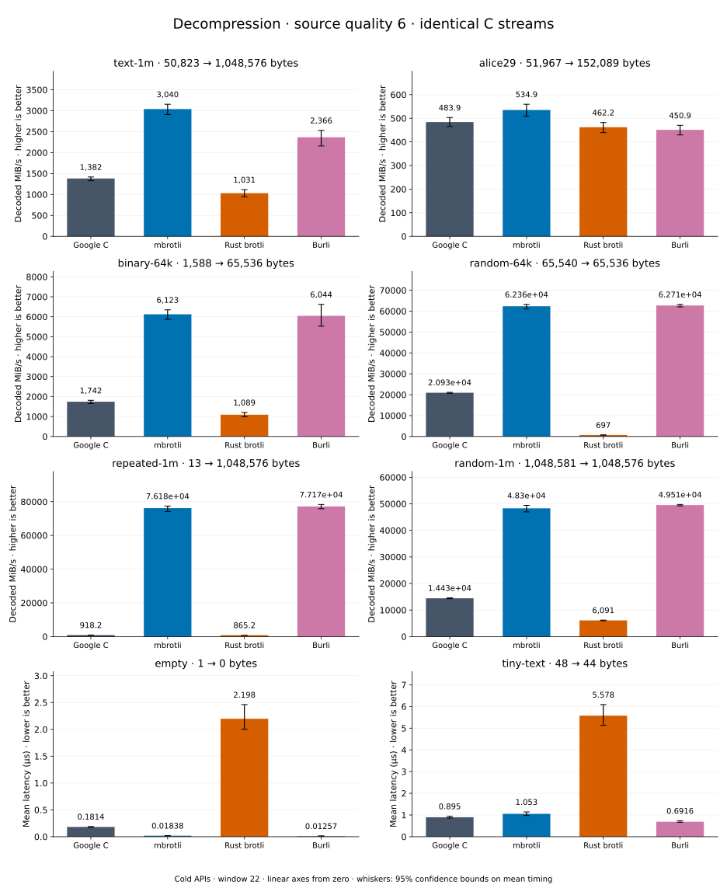

# Decompression of quality 6 streams

[Decoder overview](README.md) · [Benchmark index](../README.md)

Recorded run: **dec-2026-10-02** (2026-10-02).
[CSV](../decoder-comparison.csv) · [Environment](../decoder-comparison-environment.json) · [Methodology and limits](../decoder-comparison.md).

Quality belongs to the C encoder that prepared the input; decoders have no quality setting.
All four decode the same bytes. Burli is included at every source quality; SIMD Brotli
re-exports Rust brotli's decoder and is omitted.

## Median speed across 8 datasets

Median of per-dataset C mean time / decoder mean time ratios, with equal weight.
Higher is faster; 1× matches C. No confidence interval
is inferred for this across-dataset median.

| Decoder | Median speed / C |
| --- | ---: |
| Google C | 1.000× |
| mbrotli | 3.120× |
| Rust brotli | 0.579× |
| Burli | 3.114× |

mbrotli median speed / Burli: **1.000×** (direct per-dataset ratios).

Datasets are ranked by mbrotli speed relative to the fastest peer, highest first.
Throughput counts restored bytes; empty input has latency only. Whiskers and intervals
describe sampling uncertainty, not all host variation. Cold APIs include allocation
and disposal. C knows the output capacity; Rust brotli includes its 4 KiB I/O adapter.

## text-1m

Alice text repeated cyclically to 1 MiB.

**50,823 compressed → 1,048,576 restored bytes; compressed / original: 4.847%.**

| Decoder | Mean µs | 95% mean interval µs | Decoded MiB/s | Speed / C |
| --- | ---: | ---: | ---: | ---: |
| Google C | 753.2 | 718.9–792.9 | 1,327.58 | 1.000× |
| mbrotli | 328.7 | 315.8–349.5 | 3,042.41 | 2.292× |
| Rust brotli | 959 | 900.7–1,026 | 1,042.80 | 0.785× |
| Burli | 414.6 | 393.5–439 | 2,411.75 | 1.817× |

## alice29

Vendored Alice in Wonderland text.

**51,967 compressed → 152,089 restored bytes; compressed / original: 34.169%.**

| Decoder | Mean µs | 95% mean interval µs | Decoded MiB/s | Speed / C |
| --- | ---: | ---: | ---: | ---: |
| Google C | 299.6 | 284.9–316.4 | 484.13 | 1.000× |
| mbrotli | 264.7 | 256.8–274 | 547.86 | 1.132× |
| Rust brotli | 321.1 | 308.2–336.1 | 451.74 | 0.933× |
| Burli | 299.8 | 298.8–301.1 | 483.74 | 0.999× |

## random-1m

1 MiB of deterministic xorshift64 pseudorandom bytes.

**1,048,581 compressed → 1,048,576 restored bytes; compressed / original: 100.000%.**

| Decoder | Mean µs | 95% mean interval µs | Decoded MiB/s | Speed / C |
| --- | ---: | ---: | ---: | ---: |
| Google C | 69.81 | 69.39–70.3 | 14,324.75 | 1.000× |
| mbrotli | 19.12 | 18.94–19.39 | 52,299.19 | 3.651× |
| Rust brotli | 169.2 | 166.1–172.9 | 5,908.79 | 0.412× |
| Burli | 19.83 | 19.3–20.48 | 50,434.65 | 3.521× |

## binary-64k

64 KiB of structured binary bytes: ((i / 16) XOR i) modulo 256.

**1,588 compressed → 65,536 restored bytes; compressed / original: 2.423%.**

| Decoder | Mean µs | 95% mean interval µs | Decoded MiB/s | Speed / C |
| --- | ---: | ---: | ---: | ---: |
| Google C | 36.32 | 35.08–37.83 | 1,720.59 | 1.000× |
| mbrotli | 10.66 | 10.08–11.37 | 5,860.34 | 3.406× |
| Rust brotli | 48.75 | 46.88–51.01 | 1,282.13 | 0.745× |
| Burli | 11.02 | 9.997–12.05 | 5,673.07 | 3.297× |

## repeated-1m

1 MiB of repeated a bytes.

**13 compressed → 1,048,576 restored bytes; compressed / original: 0.001%.**

| Decoder | Mean µs | 95% mean interval µs | Decoded MiB/s | Speed / C |
| --- | ---: | ---: | ---: | ---: |
| Google C | 1,146 | 1,106–1,188 | 872.93 | 1.000× |
| mbrotli | 13.71 | 13.21–14.29 | 72,961.18 | 83.582× |
| Rust brotli | 1,185 | 1,149–1,228 | 844.00 | 0.967× |
| Burli | 13.27 | 12.75–14.1 | 75,378.56 | 86.351× |

## random-64k

64 KiB prefix of the deterministic pseudorandom corpus.

**65,540 compressed → 65,536 restored bytes; compressed / original: 100.006%.**

| Decoder | Mean µs | 95% mean interval µs | Decoded MiB/s | Speed / C |
| --- | ---: | ---: | ---: | ---: |
| Google C | 2.944 | 2.899–3.005 | 21,226.43 | 1.000× |
| mbrotli | 1.039 | 1.002–1.088 | 60,162.22 | 2.834× |
| Rust brotli | 88.15 | 86.94–89.69 | 708.99 | 0.033× |
| Burli | 1.005 | 0.9919–1.023 | 62,191.22 | 2.930× |

## empty

Empty input; measures API overhead.

**1 compressed → 0 restored bytes; compressed / original: undefined.**

| Decoder | Mean µs | 95% mean interval µs | Decoded MiB/s | Speed / C |
| --- | ---: | ---: | ---: | ---: |
| Google C | 0.1969 | 0.1777–0.2203 | — | 1.000× |
| mbrotli | 0.01711 | 0.01674–0.01757 | — | 11.509× |
| Rust brotli | 1.952 | 1.91–2.002 | — | 0.101× |
| Burli | 0.01531 | 0.01384–0.01685 | — | 12.857× |

## tiny-text

44-byte quick-brown-fox sentence.

**48 compressed → 44 restored bytes; compressed / original: 109.091%.**

| Decoder | Mean µs | 95% mean interval µs | Decoded MiB/s | Speed / C |
| --- | ---: | ---: | ---: | ---: |
| Google C | 1.017 | 0.9307–1.111 | 41.27 | 1.000× |
| mbrotli | 1.137 | 1.03–1.259 | 36.91 | 0.894× |
| Rust brotli | 5.448 | 5.067–5.861 | 7.70 | 0.187× |
| Burli | 0.7413 | 0.6754–0.8198 | 56.60 | 1.372× |
