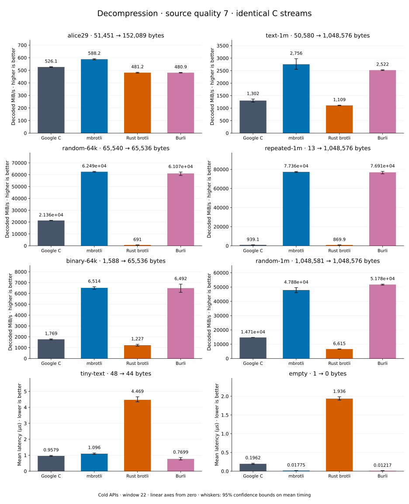

# Decompression of quality 7 streams

[Decoder overview](README.md) · [Benchmark index](../README.md)

Recorded run: **dec-2026-09-28** (2026-09-28).
[CSV](../decoder-comparison.csv) · [Environment](../decoder-comparison-environment.json) · [Methodology and limits](../decoder-comparison.md).

Quality belongs to the C encoder that prepared the input; decoders have no quality setting.
All four decode the same bytes. Burli is included at every source quality; SIMD Brotli
re-exports Rust brotli's decoder and is omitted.

## Median speed across 8 datasets

Median of per-dataset C mean time / decoder mean time ratios, with equal weight.
Higher is faster; 1× matches C. No confidence interval
is inferred for this across-dataset median.

| Decoder | Median speed / C |
| --- | ---: |
| Google C | 1.000× |
| mbrotli | 3.090× |
| Rust brotli | 0.572× |
| Burli | 3.189× |

mbrotli median speed / Burli: **1.005×** (direct per-dataset ratios).

Datasets are ranked by mbrotli speed relative to the fastest peer, highest first.
Throughput counts restored bytes; empty input has latency only. Whiskers and intervals
describe sampling uncertainty, not all host variation. Cold APIs include allocation
and disposal. C knows the output capacity; Rust brotli includes its 4 KiB I/O adapter.

## alice29

Vendored Alice in Wonderland text.

**51,451 compressed → 152,089 restored bytes; compressed / original: 33.830%.**

| Decoder | Mean µs | 95% mean interval µs | Decoded MiB/s | Speed / C |
| --- | ---: | ---: | ---: | ---: |
| Google C | 275.7 | 274.5–276.9 | 526.11 | 1.000× |
| mbrotli | 246.6 | 245–248.4 | 588.16 | 1.118× |
| Rust brotli | 301.4 | 299.5–303.5 | 481.20 | 0.915× |
| Burli | 301.6 | 300–303.3 | 480.87 | 0.914× |

## text-1m

Alice text repeated cyclically to 1 MiB.

**50,580 compressed → 1,048,576 restored bytes; compressed / original: 4.824%.**

| Decoder | Mean µs | 95% mean interval µs | Decoded MiB/s | Speed / C |
| --- | ---: | ---: | ---: | ---: |
| Google C | 768.1 | 733.4–808.2 | 1,301.83 | 1.000× |
| mbrotli | 362.8 | 335.8–391.4 | 2,756.09 | 2.117× |
| Rust brotli | 901.5 | 893.2–911.8 | 1,109.26 | 0.852× |
| Burli | 396.6 | 394.4–398.9 | 2,521.72 | 1.937× |

## random-64k

64 KiB prefix of the deterministic pseudorandom corpus.

**65,540 compressed → 65,536 restored bytes; compressed / original: 100.006%.**

| Decoder | Mean µs | 95% mean interval µs | Decoded MiB/s | Speed / C |
| --- | ---: | ---: | ---: | ---: |
| Google C | 2.926 | 2.915–2.938 | 21,363.20 | 1.000× |
| mbrotli | 1 | 0.9956–1.006 | 62,487.89 | 2.925× |
| Rust brotli | 90.44 | 89–91.8 | 691.04 | 0.032× |
| Burli | 1.023 | 1.004–1.053 | 61,066.99 | 2.859× |

## repeated-1m

1 MiB of repeated a bytes.

**13 compressed → 1,048,576 restored bytes; compressed / original: 0.001%.**

| Decoder | Mean µs | 95% mean interval µs | Decoded MiB/s | Speed / C |
| --- | ---: | ---: | ---: | ---: |
| Google C | 1,065 | 1,056–1,074 | 939.08 | 1.000× |
| mbrotli | 12.93 | 12.85–13.01 | 77,359.12 | 82.378× |
| Rust brotli | 1,149 | 1,127–1,181 | 869.94 | 0.926× |
| Burli | 13 | 12.84–13.27 | 76,907.69 | 81.897× |

## binary-64k

64 KiB of structured binary bytes: ((i / 16) XOR i) modulo 256.

**1,588 compressed → 65,536 restored bytes; compressed / original: 2.423%.**

| Decoder | Mean µs | 95% mean interval µs | Decoded MiB/s | Speed / C |
| --- | ---: | ---: | ---: | ---: |
| Google C | 35.34 | 34.66–36.47 | 1,768.74 | 1.000× |
| mbrotli | 9.594 | 9.434–9.8 | 6,514.42 | 3.683× |
| Rust brotli | 50.92 | 47.77–54.53 | 1,227.45 | 0.694× |
| Burli | 9.627 | 9.106–10.24 | 6,492.15 | 3.671× |

## random-1m

1 MiB of deterministic xorshift64 pseudorandom bytes.

**1,048,581 compressed → 1,048,576 restored bytes; compressed / original: 100.000%.**

| Decoder | Mean µs | 95% mean interval µs | Decoded MiB/s | Speed / C |
| --- | ---: | ---: | ---: | ---: |
| Google C | 67.97 | 67.84–68.14 | 14,712.76 | 1.000× |
| mbrotli | 20.88 | 20.16–21.7 | 47,884.95 | 3.255× |
| Rust brotli | 151.2 | 150.4–151.9 | 6,614.80 | 0.450× |
| Burli | 19.31 | 19.21–19.49 | 51,776.03 | 3.519× |

## tiny-text

44-byte quick-brown-fox sentence.

**48 compressed → 44 restored bytes; compressed / original: 109.091%.**

| Decoder | Mean µs | 95% mean interval µs | Decoded MiB/s | Speed / C |
| --- | ---: | ---: | ---: | ---: |
| Google C | 0.9579 | 0.9299–0.9882 | 43.81 | 1.000× |
| mbrotli | 1.096 | 1.06–1.139 | 38.28 | 0.874× |
| Rust brotli | 4.469 | 4.345–4.661 | 9.39 | 0.214× |
| Burli | 0.7699 | 0.7018–0.8526 | 54.50 | 1.244× |

## empty

Empty input; measures API overhead.

**1 compressed → 0 restored bytes; compressed / original: undefined.**

| Decoder | Mean µs | 95% mean interval µs | Decoded MiB/s | Speed / C |
| --- | ---: | ---: | ---: | ---: |
| Google C | 0.1962 | 0.182–0.2115 | — | 1.000× |
| mbrotli | 0.01775 | 0.01698–0.01861 | — | 11.050× |
| Rust brotli | 1.936 | 1.899–1.986 | — | 0.101× |
| Burli | 0.01217 | 0.01151–0.01295 | — | 16.115× |
