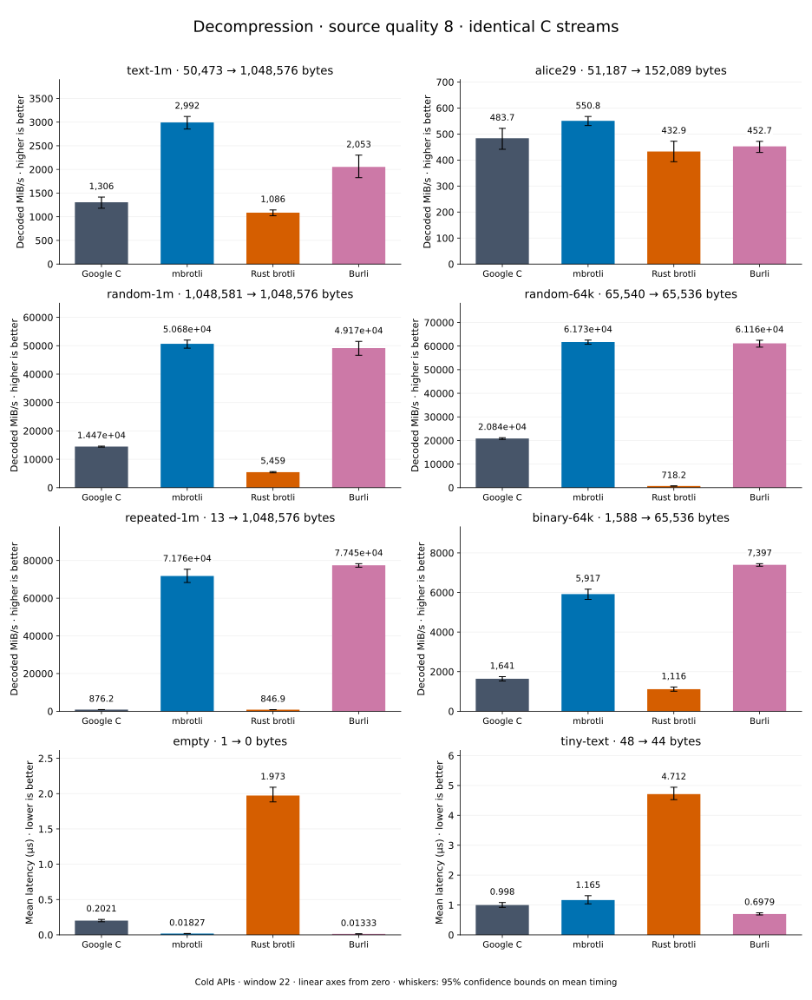

# Decompression of quality 8 streams

[Decoder overview](README.md) · [Benchmark index](../README.md)

Recorded run: **dec-2026-10-01** (2026-10-01).
[CSV](../decoder-comparison.csv) · [Environment](../decoder-comparison-environment.json) · [Methodology and limits](../decoder-comparison.md).

Quality belongs to the C encoder that prepared the input; decoders have no quality setting.
All four decode the same bytes. Burli is included at every source quality; SIMD Brotli
re-exports Rust brotli's decoder and is omitted.

## Median speed across 8 datasets

Median of per-dataset C mean time / decoder mean time ratios, with equal weight.
Higher is faster; 1× matches C. No confidence interval
is inferred for this across-dataset median.

| Decoder | Median speed / C |
| --- | ---: |
| Google C | 1.000× |
| mbrotli | 3.198× |
| Rust brotli | 0.537× |
| Burli | 3.214× |

mbrotli median speed / Burli: **0.956×** (direct per-dataset ratios).

Datasets are ranked by mbrotli speed relative to the fastest peer, highest first.
Throughput counts restored bytes; empty input has latency only. Whiskers and intervals
describe sampling uncertainty, not all host variation. Cold APIs include allocation
and disposal. C knows the output capacity; Rust brotli includes its 4 KiB I/O adapter.

## text-1m

Alice text repeated cyclically to 1 MiB.

**50,473 compressed → 1,048,576 restored bytes; compressed / original: 4.813%.**

| Decoder | Mean µs | 95% mean interval µs | Decoded MiB/s | Speed / C |
| --- | ---: | ---: | ---: | ---: |
| Google C | 739.4 | 712–773.4 | 1,352.52 | 1.000× |
| mbrotli | 330.3 | 319.9–342.5 | 3,027.44 | 2.238× |
| Rust brotli | 921.2 | 871.6–985.6 | 1,085.60 | 0.803× |
| Burli | 397.8 | 391–406.6 | 2,513.54 | 1.858× |

## alice29

Vendored Alice in Wonderland text.

**51,187 compressed → 152,089 restored bytes; compressed / original: 33.656%.**

| Decoder | Mean µs | 95% mean interval µs | Decoded MiB/s | Speed / C |
| --- | ---: | ---: | ---: | ---: |
| Google C | 275.9 | 272.8–279.4 | 525.65 | 1.000× |
| mbrotli | 269.5 | 259.3–281.3 | 538.13 | 1.024× |
| Rust brotli | 313.5 | 299.7–332.3 | 462.60 | 0.880× |
| Burli | 340.9 | 315.9–371.1 | 425.43 | 0.809× |

## random-1m

1 MiB of deterministic xorshift64 pseudorandom bytes.

**1,048,581 compressed → 1,048,576 restored bytes; compressed / original: 100.000%.**

| Decoder | Mean µs | 95% mean interval µs | Decoded MiB/s | Speed / C |
| --- | ---: | ---: | ---: | ---: |
| Google C | 68.97 | 68.77–69.2 | 14,498.99 | 1.000× |
| mbrotli | 20.54 | 20.48–20.62 | 48,676.58 | 3.357× |
| Rust brotli | 167.1 | 165.2–169.3 | 5,983.44 | 0.413× |
| Burli | 20.46 | 20.4–20.54 | 48,870.22 | 3.371× |

## random-64k

64 KiB prefix of the deterministic pseudorandom corpus.

**65,540 compressed → 65,536 restored bytes; compressed / original: 100.006%.**

| Decoder | Mean µs | 95% mean interval µs | Decoded MiB/s | Speed / C |
| --- | ---: | ---: | ---: | ---: |
| Google C | 3.06 | 2.941–3.275 | 20,427.11 | 1.000× |
| mbrotli | 1.007 | 1.002–1.013 | 62,064.27 | 3.038× |
| Rust brotli | 86.88 | 86.28–87.57 | 719.39 | 0.035× |
| Burli | 1.001 | 0.9989–1.003 | 62,453.45 | 3.057× |

## repeated-1m

1 MiB of repeated a bytes.

**13 compressed → 1,048,576 restored bytes; compressed / original: 0.001%.**

| Decoder | Mean µs | 95% mean interval µs | Decoded MiB/s | Speed / C |
| --- | ---: | ---: | ---: | ---: |
| Google C | 1,131 | 1,098–1,166 | 884.49 | 1.000× |
| mbrotli | 13.73 | 13.12–14.49 | 72,812.77 | 82.322× |
| Rust brotli | 1,182 | 1,149–1,224 | 845.95 | 0.956× |
| Burli | 12.62 | 12.59–12.66 | 79,218.94 | 89.565× |

## binary-64k

64 KiB of structured binary bytes: ((i / 16) XOR i) modulo 256.

**1,588 compressed → 65,536 restored bytes; compressed / original: 2.423%.**

| Decoder | Mean µs | 95% mean interval µs | Decoded MiB/s | Speed / C |
| --- | ---: | ---: | ---: | ---: |
| Google C | 36.14 | 34.59–38.67 | 1,729.30 | 1.000× |
| mbrotli | 10.3 | 9.809–10.87 | 6,067.74 | 3.509× |
| Rust brotli | 54.62 | 50.14–59.84 | 1,144.37 | 0.662× |
| Burli | 9.137 | 8.742–9.655 | 6,840.35 | 3.956× |

## empty

Empty input; measures API overhead.

**1 compressed → 0 restored bytes; compressed / original: undefined.**

| Decoder | Mean µs | 95% mean interval µs | Decoded MiB/s | Speed / C |
| --- | ---: | ---: | ---: | ---: |
| Google C | 0.1727 | 0.1632–0.1845 | — | 1.000× |
| mbrotli | 0.01768 | 0.01701–0.01852 | — | 9.766× |
| Rust brotli | 1.98 | 1.929–2.053 | — | 0.087× |
| Burli | 0.01299 | 0.0124–0.01365 | — | 13.296× |

## tiny-text

44-byte quick-brown-fox sentence.

**48 compressed → 44 restored bytes; compressed / original: 109.091%.**

| Decoder | Mean µs | 95% mean interval µs | Decoded MiB/s | Speed / C |
| --- | ---: | ---: | ---: | ---: |
| Google C | 0.8606 | 0.8505–0.8728 | 48.76 | 1.000× |
| mbrotli | 0.9801 | 0.9472–1.024 | 42.81 | 0.878× |
| Rust brotli | 4.771 | 4.647–4.915 | 8.79 | 0.180× |
| Burli | 0.7066 | 0.673–0.7532 | 59.38 | 1.218× |
