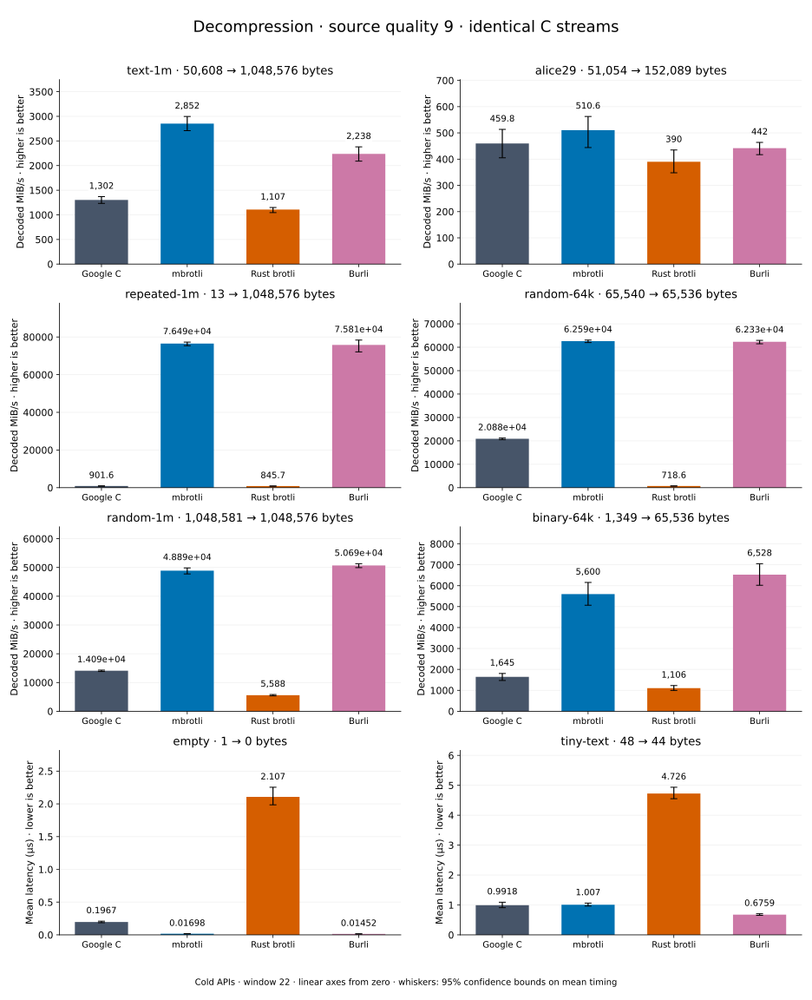

# Decompression of quality 9 streams

[Decoder overview](README.md) · [Benchmark index](../README.md)

Recorded run: **dec-2026-09-28** (2026-09-28).
[CSV](../decoder-comparison.csv) · [Environment](../decoder-comparison-environment.json) · [Methodology and limits](../decoder-comparison.md).

Quality belongs to the C encoder that prepared the input; decoders have no quality setting.
All four decode the same bytes. Burli is included at every source quality; SIMD Brotli
re-exports Rust brotli's decoder and is omitted.

## Median speed across 8 datasets

Median of per-dataset C mean time / decoder mean time ratios, with equal weight.
Higher is faster; 1× matches C. No confidence interval
is inferred for this across-dataset median.

| Decoder | Median speed / C |
| --- | ---: |
| Google C | 1.000× |
| mbrotli | 3.231× |
| Rust brotli | 0.596× |
| Burli | 3.412× |

mbrotli median speed / Burli: **0.970×** (direct per-dataset ratios).

Datasets are ranked by mbrotli speed relative to the fastest peer, highest first.
Throughput counts restored bytes; empty input has latency only. Whiskers and intervals
describe sampling uncertainty, not all host variation. Cold APIs include allocation
and disposal. C knows the output capacity; Rust brotli includes its 4 KiB I/O adapter.

## text-1m

Alice text repeated cyclically to 1 MiB.

**50,608 compressed → 1,048,576 restored bytes; compressed / original: 4.826%.**

| Decoder | Mean µs | 95% mean interval µs | Decoded MiB/s | Speed / C |
| --- | ---: | ---: | ---: | ---: |
| Google C | 734.5 | 721.1–749.5 | 1,361.40 | 1.000× |
| mbrotli | 338.6 | 320.5–362.6 | 2,952.94 | 2.169× |
| Rust brotli | 976.8 | 939.5–1,021 | 1,023.73 | 0.752× |
| Burli | 405.5 | 399.8–412.5 | 2,466.21 | 1.812× |

## alice29

Vendored Alice in Wonderland text.

**51,054 compressed → 152,089 restored bytes; compressed / original: 33.569%.**

| Decoder | Mean µs | 95% mean interval µs | Decoded MiB/s | Speed / C |
| --- | ---: | ---: | ---: | ---: |
| Google C | 282.3 | 278–287.6 | 513.74 | 1.000× |
| mbrotli | 250.2 | 249–251.4 | 579.74 | 1.128× |
| Rust brotli | 303 | 301.3–304.9 | 478.72 | 0.932× |
| Burli | 340.4 | 333.8–349.1 | 426.13 | 0.829× |

## repeated-1m

1 MiB of repeated a bytes.

**13 compressed → 1,048,576 restored bytes; compressed / original: 0.001%.**

| Decoder | Mean µs | 95% mean interval µs | Decoded MiB/s | Speed / C |
| --- | ---: | ---: | ---: | ---: |
| Google C | 1,065 | 1,062–1,069 | 939.02 | 1.000× |
| mbrotli | 12.48 | 12.44–12.52 | 80,127.38 | 85.331× |
| Rust brotli | 1,139 | 1,116–1,175 | 878.28 | 0.935× |
| Burli | 13.47 | 13.28–13.65 | 74,215.36 | 79.035× |

## random-1m

1 MiB of deterministic xorshift64 pseudorandom bytes.

**1,048,581 compressed → 1,048,576 restored bytes; compressed / original: 100.000%.**

| Decoder | Mean µs | 95% mean interval µs | Decoded MiB/s | Speed / C |
| --- | ---: | ---: | ---: | ---: |
| Google C | 70.8 | 69.64–72.02 | 14,124.87 | 1.000× |
| mbrotli | 19.23 | 18.65–19.95 | 52,011.27 | 3.682× |
| Rust brotli | 161.2 | 154.3–169.7 | 6,204.34 | 0.439× |
| Burli | 18.8 | 18.74–18.85 | 53,200.24 | 3.766× |

## binary-64k

64 KiB of structured binary bytes: ((i / 16) XOR i) modulo 256.

**1,349 compressed → 65,536 restored bytes; compressed / original: 2.058%.**

| Decoder | Mean µs | 95% mean interval µs | Decoded MiB/s | Speed / C |
| --- | ---: | ---: | ---: | ---: |
| Google C | 39.62 | 35.93–43.95 | 1,577.50 | 1.000× |
| mbrotli | 10.01 | 9.55–10.55 | 6,244.34 | 3.958× |
| Rust brotli | 48.96 | 47.23–51.22 | 1,276.55 | 0.809× |
| Burli | 9.626 | 8.929–10.44 | 6,492.73 | 4.116× |

## random-64k

64 KiB prefix of the deterministic pseudorandom corpus.

**65,540 compressed → 65,536 restored bytes; compressed / original: 100.006%.**

| Decoder | Mean µs | 95% mean interval µs | Decoded MiB/s | Speed / C |
| --- | ---: | ---: | ---: | ---: |
| Google C | 2.996 | 2.964–3.033 | 20,857.90 | 1.000× |
| mbrotli | 1.078 | 1.049–1.128 | 57,965.77 | 2.779× |
| Rust brotli | 88.18 | 86.57–89.83 | 708.80 | 0.034× |
| Burli | 0.9801 | 0.9764–0.9838 | 63,769.65 | 3.057× |

## empty

Empty input; measures API overhead.

**1 compressed → 0 restored bytes; compressed / original: undefined.**

| Decoder | Mean µs | 95% mean interval µs | Decoded MiB/s | Speed / C |
| --- | ---: | ---: | ---: | ---: |
| Google C | 0.197 | 0.1829–0.2127 | — | 1.000× |
| mbrotli | 0.01695 | 0.01684–0.01708 | — | 11.620× |
| Rust brotli | 2.002 | 1.929–2.139 | — | 0.098× |
| Burli | 0.01203 | 0.0112–0.01313 | — | 16.372× |

## tiny-text

44-byte quick-brown-fox sentence.

**48 compressed → 44 restored bytes; compressed / original: 109.091%.**

| Decoder | Mean µs | 95% mean interval µs | Decoded MiB/s | Speed / C |
| --- | ---: | ---: | ---: | ---: |
| Google C | 0.9099 | 0.8835–0.9402 | 46.12 | 1.000× |
| mbrotli | 1.02 | 1.012–1.027 | 41.14 | 0.892× |
| Rust brotli | 4.571 | 4.409–4.757 | 9.18 | 0.199× |
| Burli | 0.6836 | 0.6799–0.6877 | 61.39 | 1.331× |
