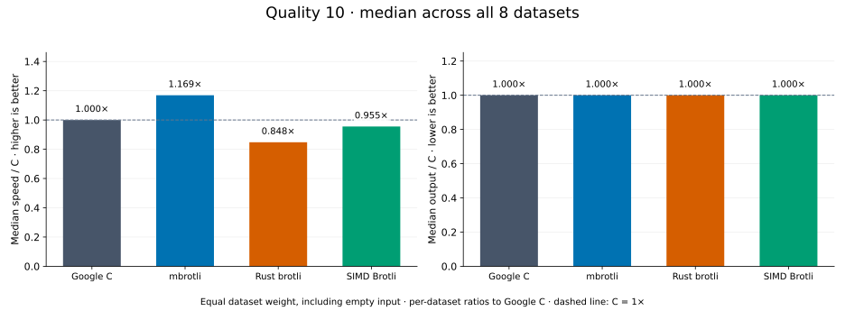
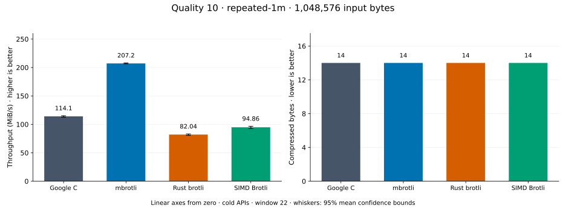
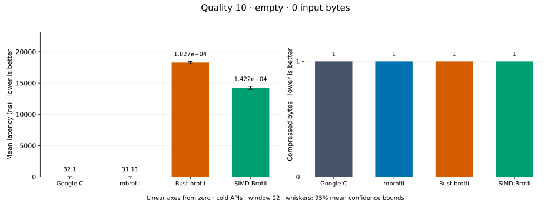
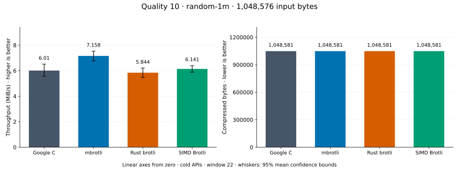
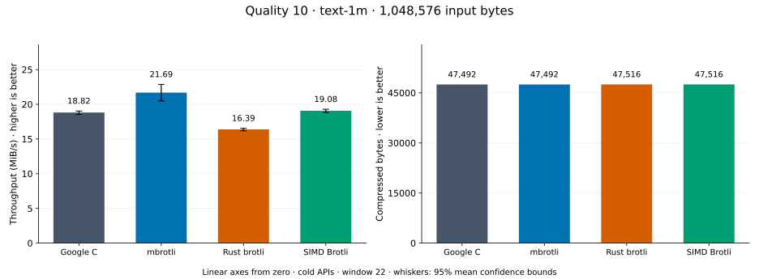
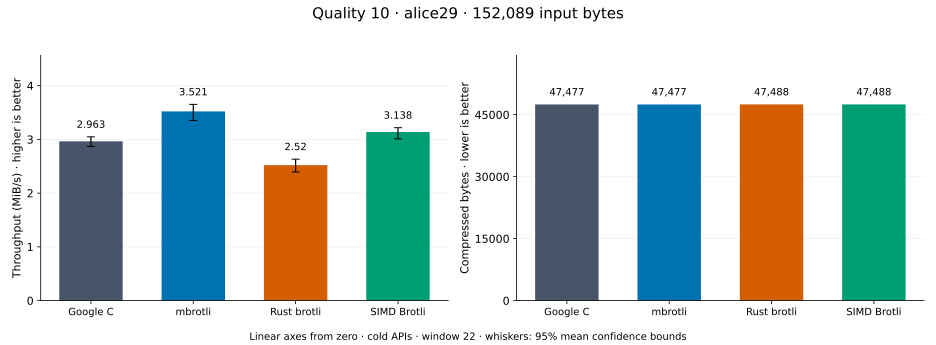
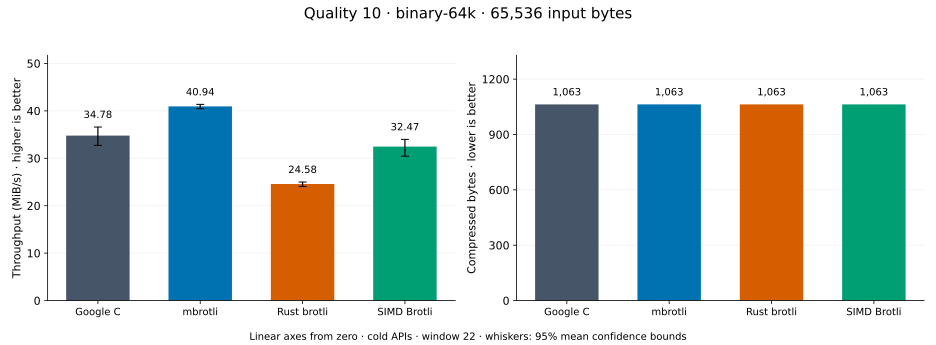
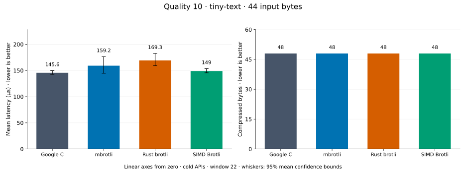
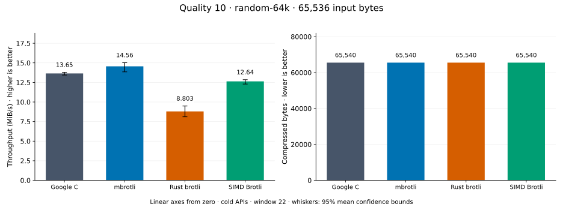

# Compression quality 10

[Benchmark index](../README.md) · [Median overview](README.md) · [← Quality 9](q9.md) · [Quality 11 →](q11.md)

Recorded run: **enc-2026-10-02** (2026-10-02).
[Raw results](../encoder-comparison.csv) · [Environment](../encoder-comparison-environment.json) · [Run analysis](../encoder-comparison.md).

## Median across all datasets

Each of the eight datasets has equal weight, including empty and tiny input.
Speed / C = C mean latency / implementation mean latency; output / C = implementation bytes / C bytes.
We take the median of these eight per-dataset ratios separately for speed and size.
1× matches C; higher speed and lower output are better. These are medians across datasets,
not median sample latencies, and do not imply equal compressed size or statistical significance.

| Implementation | Median speed / C ↑ | Median output / C ↓ | Datasets |
| --- | ---: | ---: | ---: |
| Google C | 1.000× | 1.000× | 8 |
| mbrotli | 1.172× | 1.000× | 8 |
| Rust brotli | 0.775× | 1.000× | 8 |
| SIMD Brotli | 0.970× | 1.000× | 8 |

Measurement setup and interpretation

Google C Brotli 1.2.0, mbrotli at the recorded optimized checkout, Rust brotli 9.0.0,
and SIMD Brotli 10.0.1 are compared at this quality.
**Burli supports only qualities 0–5; it has no results at this quality.**

These are cold native API measurements: construction, allocation, compression, and disposal.
Generic mode, window 22, known input size; 20 samples, 1 s warmup, at least 3 s measurement.
Host: 13th Gen Intel(R) Core(TM) i7-13700KF, Eight parallel single-threaded lanes pinned to logical CPUs 0,2,4,6,8,10,12,14 (distinct cores in the WSL2 topology), one Criterion process per lane: the encoder sweep sharded by corpus over CPUs 0,2,4,6 and the decoder sweep over CPUs 8,10,12,14, both at once.; unset; Cargo release defaults, runtime SIMD dispatch.
Rust brotli and SIMD Brotli include their native 4 KiB I/O adapters.

Chart whiskers and table intervals describe 95% confidence bounds on mean timing.
They do not capture all host or allocator variation. Throughput bounds are transformed latency bounds.
Output / input is compressed bytes divided by input bytes; smaller is better, and values above 100% mean expansion.
For empty input, throughput and output / input are undefined (—).
See the [run analysis](../encoder-comparison.md#final-measurements) for measurement limitations.

## Dataset details

Ordered by mbrotli speed / fastest competing implementation, highest first; all eight datasets are shown.
This order uses recorded mean latency, not statistical significance. Bars start at zero.

[repeated-1m](#repeated-1m) · [empty](#empty) · [random-1m](#random-1m) · [text-1m](#text-1m) · [alice29](#alice29) · [binary-64k](#binary-64k) · [tiny-text](#tiny-text) · [random-64k](#random-64k)

### repeated-1m

1 MiB of repeated a bytes. **Input: 1,048,576 bytes.**

mbrotli speed / fastest peer (Google C): **1.827×**; output: 14 / 14 bytes.

Exact measurements and confidence bounds

| Implementation | Mean, µs | 95% mean interval, µs | MiB/s | Output bytes | Output / input | Speed / C |
| --- | ---: | ---: | ---: | ---: | ---: | ---: |
| Google C | 8,979 | 8,725–9,306 | 111.37 | 14 | 0.001% | 1.000× |
| mbrotli | 4,915 | 4,889–4,944 | 203.44 | 14 | 0.001% | 1.827× |
| Rust brotli | 1.227e+04 | 1.211e+04–1.246e+04 | 81.50 | 14 | 0.001% | 0.732× |
| SIMD Brotli | 1.113e+04 | 1.055e+04–1.191e+04 | 89.82 | 14 | 0.001% | 0.807× |

### empty

Empty input; measures API overhead. **Input: 0 bytes.**

mbrotli speed / fastest peer (Google C): **1.213×**; output: 1 / 1 bytes.

Exact measurements and confidence bounds

| Implementation | Mean, ns | 95% mean interval, ns | MiB/s | Output bytes | Output / input | Speed / C |
| --- | ---: | ---: | ---: | ---: | ---: | ---: |
| Google C | 32.79 | 32.09–33.6 | — | 1 | — | 1.000× |
| mbrotli | 27.04 | 26.45–27.79 | — | 1 | — | 1.213× |
| Rust brotli | 1.873e+04 | 1.847e+04–1.901e+04 | — | 1 | — | 0.002× |
| SIMD Brotli | 1.49e+04 | 1.457e+04–1.532e+04 | — | 1 | — | 0.002× |

### random-1m

1 MiB of deterministic xorshift64 pseudorandom bytes. **Input: 1,048,576 bytes.**

mbrotli speed / fastest peer (SIMD Brotli): **1.166×**; output: 1,048,581 / 1,048,581 bytes.

Exact measurements and confidence bounds

| Implementation | Mean, µs | 95% mean interval, µs | MiB/s | Output bytes | Output / input | Speed / C |
| --- | ---: | ---: | ---: | ---: | ---: | ---: |
| Google C | 1.664e+05 | 1.535e+05–1.797e+05 | 6.01 | 1,048,581 | 100.000% | 1.000× |
| mbrotli | 1.397e+05 | 1.327e+05–1.477e+05 | 7.16 | 1,048,581 | 100.000% | 1.191× |
| Rust brotli | 1.711e+05 | 1.611e+05–1.83e+05 | 5.84 | 1,048,581 | 100.000% | 0.972× |
| SIMD Brotli | 1.628e+05 | 1.562e+05–1.701e+05 | 6.14 | 1,048,581 | 100.000% | 1.022× |

### text-1m

Alice text repeated cyclically to 1 MiB. **Input: 1,048,576 bytes.**

mbrotli speed / fastest peer (SIMD Brotli): **1.137×**; output: 47,492 / 47,516 bytes.

Exact measurements and confidence bounds

| Implementation | Mean, µs | 95% mean interval, µs | MiB/s | Output bytes | Output / input | Speed / C |
| --- | ---: | ---: | ---: | ---: | ---: | ---: |
| Google C | 5.315e+04 | 5.254e+04–5.393e+04 | 18.82 | 47,492 | 4.529% | 1.000× |
| mbrotli | 4.61e+04 | 4.373e+04–4.882e+04 | 21.69 | 47,492 | 4.529% | 1.153× |
| Rust brotli | 6.102e+04 | 6.045e+04–6.18e+04 | 16.39 | 47,516 | 4.531% | 0.871× |
| SIMD Brotli | 5.242e+04 | 5.185e+04–5.317e+04 | 19.08 | 47,516 | 4.531% | 1.014× |

### alice29

Vendored Alice in Wonderland text. **Input: 152,089 bytes.**

mbrotli speed / fastest peer (SIMD Brotli): **1.100×**; output: 47,477 / 47,488 bytes.

Exact measurements and confidence bounds

| Implementation | Mean, µs | 95% mean interval, µs | MiB/s | Output bytes | Output / input | Speed / C |
| --- | ---: | ---: | ---: | ---: | ---: | ---: |
| Google C | 4.994e+04 | 4.765e+04–5.269e+04 | 2.90 | 47,477 | 31.217% | 1.000× |
| mbrotli | 4.4e+04 | 4.142e+04–4.692e+04 | 3.30 | 47,477 | 31.217% | 1.135× |
| Rust brotli | 6.1e+04 | 5.812e+04–6.442e+04 | 2.38 | 47,488 | 31.224% | 0.819× |
| SIMD Brotli | 4.841e+04 | 4.661e+04–5.055e+04 | 3.00 | 47,488 | 31.224% | 1.032× |

### binary-64k

64 KiB of structured binary bytes: ((i / 16) XOR i) modulo 256. **Input: 65,536 bytes.**

mbrotli speed / fastest peer (Google C): **1.072×**; output: 1,063 / 1,063 bytes.

Exact measurements and confidence bounds

| Implementation | Mean, µs | 95% mean interval, µs | MiB/s | Output bytes | Output / input | Speed / C |
| --- | ---: | ---: | ---: | ---: | ---: | ---: |
| Google C | 1,694 | 1,669–1,729 | 36.88 | 1,063 | 1.622% | 1.000× |
| mbrotli | 1,581 | 1,515–1,665 | 39.53 | 1,063 | 1.622% | 1.072× |
| Rust brotli | 2,582 | 2,516–2,657 | 24.21 | 1,063 | 1.622% | 0.656× |
| SIMD Brotli | 1,888 | 1,808–1,988 | 33.10 | 1,063 | 1.622% | 0.897× |

### tiny-text

44-byte quick-brown-fox sentence. **Input: 44 bytes.**

mbrotli speed / fastest peer (Rust brotli): **1.068×**; output: 48 / 48 bytes.

Exact measurements and confidence bounds

| Implementation | Mean, µs | 95% mean interval, µs | MiB/s | Output bytes | Output / input | Speed / C |
| --- | ---: | ---: | ---: | ---: | ---: | ---: |
| Google C | 194.9 | 172.4–219.2 | 0.22 | 48 | 109.091% | 1.000× |
| mbrotli | 146.1 | 141–154.5 | 0.29 | 48 | 109.091% | 1.334× |
| Rust brotli | 156.1 | 152.7–160.9 | 0.27 | 48 | 109.091% | 1.248× |
| SIMD Brotli | 161.6 | 155.7–169.2 | 0.26 | 48 | 109.091% | 1.206× |

### random-64k

64 KiB prefix of the deterministic pseudorandom corpus. **Input: 65,536 bytes.**

mbrotli speed / fastest peer (Google C): **1.066×**; output: 65,540 / 65,540 bytes.

Exact measurements and confidence bounds

| Implementation | Mean, µs | 95% mean interval, µs | MiB/s | Output bytes | Output / input | Speed / C |
| --- | ---: | ---: | ---: | ---: | ---: | ---: |
| Google C | 4,579 | 4,534–4,650 | 13.65 | 65,540 | 100.006% | 1.000× |
| mbrotli | 4,294 | 4,159–4,512 | 14.56 | 65,540 | 100.006% | 1.066× |
| Rust brotli | 7,100 | 6,586–7,702 | 8.80 | 65,540 | 100.006% | 0.645× |
| SIMD Brotli | 4,945 | 4,864–5,084 | 12.64 | 65,540 | 100.006% | 0.926× |

