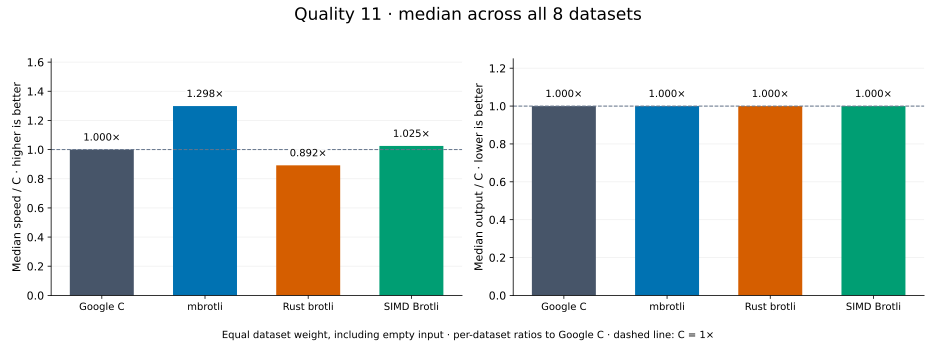
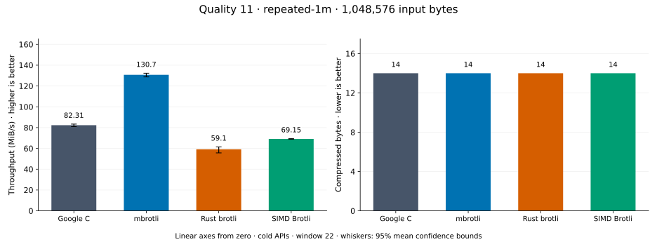
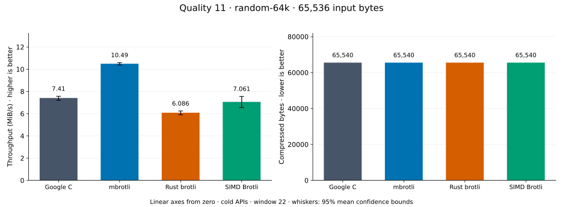
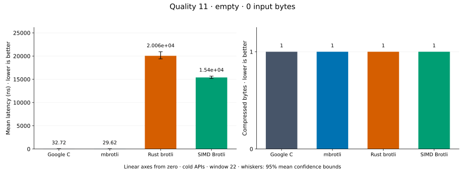
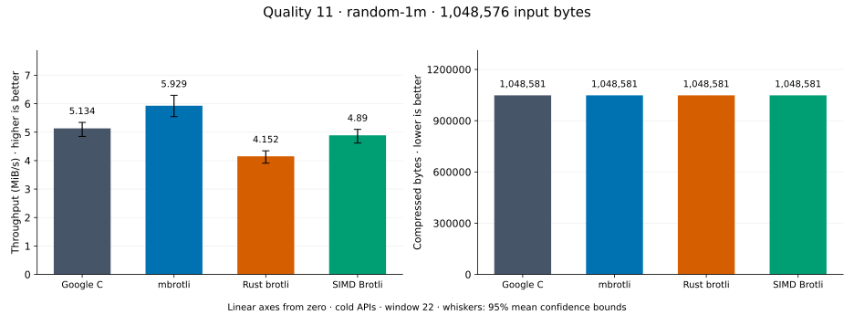
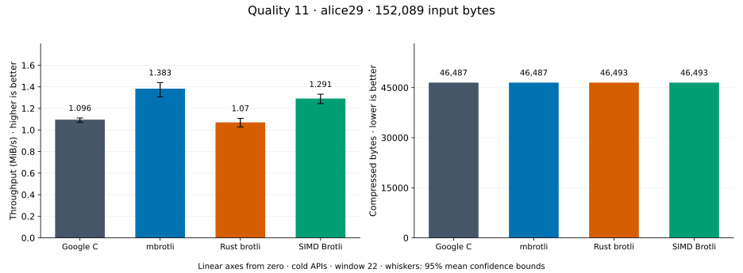
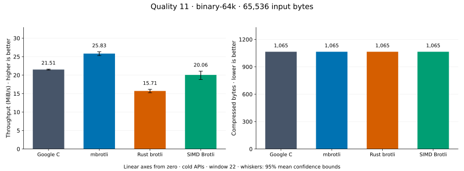
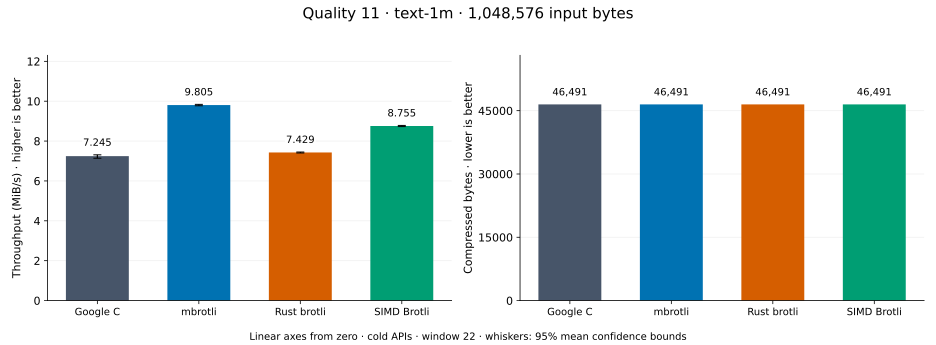
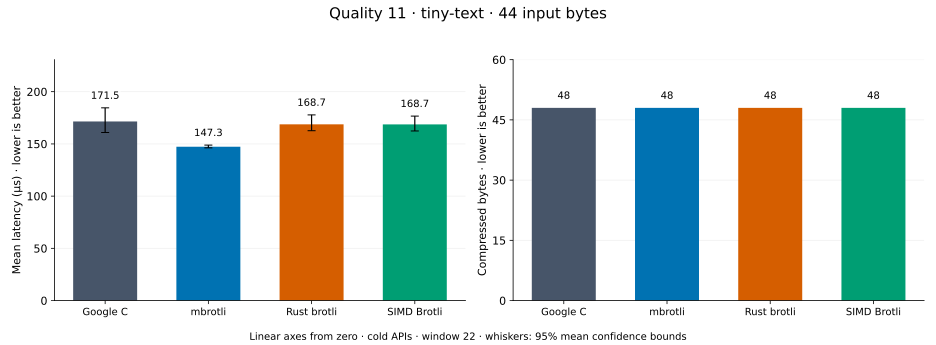

# Compression quality 11

[Benchmark index](../README.md) · [Median overview](README.md) · [← Quality 10](q10.md)

Recorded run: **enc-2026-10-01** (2026-10-01).
[Raw results](../encoder-comparison.csv) · [Environment](../encoder-comparison-environment.json) · [Run analysis](../encoder-comparison.md).

## Median across all datasets

Each of the eight datasets has equal weight, including empty and tiny input.
Speed / C = C mean latency / implementation mean latency; output / C = implementation bytes / C bytes.
We take the median of these eight per-dataset ratios separately for speed and size.
1× matches C; higher speed and lower output are better. These are medians across datasets,
not median sample latencies, and do not imply equal compressed size or statistical significance.

| Implementation | Median speed / C ↑ | Median output / C ↓ | Datasets |
| --- | ---: | ---: | ---: |
| Google C | 1.000× | 1.000× | 8 |
| mbrotli | 1.298× | 1.000× | 8 |
| Rust brotli | 0.892× | 1.000× | 8 |
| SIMD Brotli | 1.025× | 1.000× | 8 |

Measurement setup and interpretation

Google C Brotli 1.2.0, mbrotli at the recorded optimized checkout, Rust brotli 9.0.0,
and SIMD Brotli 10.0.1 are compared at this quality.
**Burli supports only qualities 0–5; it has no results at this quality.**

These are cold native API measurements: construction, allocation, compression, and disposal.
Generic mode, window 22, known input size; 20 samples, 1 s warmup, at least 3 s measurement.
Host: 13th Gen Intel(R) Core(TM) i7-13700KF, Eight parallel single-threaded lanes pinned to logical CPUs 0,2,4,6,8,10,12,14 (distinct cores in the WSL2 topology), one Criterion process per lane: the encoder sweep sharded by corpus over CPUs 0,2,4,6 and the decoder sweep over CPUs 8,10,12,14, both at once.; unset; Cargo release defaults, runtime SIMD dispatch.
Rust brotli and SIMD Brotli include their native 4 KiB I/O adapters.

Chart whiskers and table intervals describe 95% confidence bounds on mean timing.
They do not capture all host or allocator variation. Throughput bounds are transformed latency bounds.
Output / input is compressed bytes divided by input bytes; smaller is better, and values above 100% mean expansion.
For empty input, throughput and output / input are undefined (—).
See the [run analysis](../encoder-comparison.md#final-measurements) for measurement limitations.

## Dataset details

Ordered by mbrotli speed / fastest competing implementation, highest first; all eight datasets are shown.
This order uses recorded mean latency, not statistical significance. Bars start at zero.

[repeated-1m](#repeated-1m) · [random-64k](#random-64k) · [empty](#empty) · [random-1m](#random-1m) · [alice29](#alice29) · [binary-64k](#binary-64k) · [text-1m](#text-1m) · [tiny-text](#tiny-text)

### repeated-1m

1 MiB of repeated a bytes. **Input: 1,048,576 bytes.**

mbrotli speed / fastest peer (Google C): **1.587×**; output: 14 / 14 bytes.

Exact measurements and confidence bounds

| Implementation | Mean, µs | 95% mean interval, µs | MiB/s | Output bytes | Output / input | Speed / C |
| --- | ---: | ---: | ---: | ---: | ---: | ---: |
| Google C | 1.212e+04 | 1.206e+04–1.218e+04 | 82.51 | 14 | 0.001% | 1.000× |
| mbrotli | 7,639 | 7,593–7,682 | 130.92 | 14 | 0.001% | 1.587× |
| Rust brotli | 1.62e+04 | 1.613e+04–1.626e+04 | 61.74 | 14 | 0.001% | 0.748× |
| SIMD Brotli | 1.43e+04 | 1.421e+04–1.442e+04 | 69.93 | 14 | 0.001% | 0.848× |

### random-64k

64 KiB prefix of the deterministic pseudorandom corpus. **Input: 65,536 bytes.**

mbrotli speed / fastest peer (SIMD Brotli): **1.358×**; output: 65,540 / 65,540 bytes.

Exact measurements and confidence bounds

| Implementation | Mean, µs | 95% mean interval, µs | MiB/s | Output bytes | Output / input | Speed / C |
| --- | ---: | ---: | ---: | ---: | ---: | ---: |
| Google C | 8,380 | 8,294–8,493 | 7.46 | 65,540 | 100.006% | 1.000× |
| mbrotli | 6,013 | 5,955–6,087 | 10.39 | 65,540 | 100.006% | 1.394× |
| Rust brotli | 1.006e+04 | 1.003e+04–1.009e+04 | 6.21 | 65,540 | 100.006% | 0.833× |
| SIMD Brotli | 8,165 | 8,118–8,214 | 7.65 | 65,540 | 100.006% | 1.026× |

### empty

Empty input; measures API overhead. **Input: 0 bytes.**

mbrotli speed / fastest peer (Google C): **1.220×**; output: 1 / 1 bytes.

Exact measurements and confidence bounds

| Implementation | Mean, ns | 95% mean interval, ns | MiB/s | Output bytes | Output / input | Speed / C |
| --- | ---: | ---: | ---: | ---: | ---: | ---: |
| Google C | 32.66 | 31.91–33.51 | — | 1 | — | 1.000× |
| mbrotli | 26.77 | 26.45–27.25 | — | 1 | — | 1.220× |
| Rust brotli | 1.954e+04 | 1.92e+04–1.995e+04 | — | 1 | — | 0.002× |
| SIMD Brotli | 1.552e+04 | 1.538e+04–1.567e+04 | — | 1 | — | 0.002× |

### random-1m

1 MiB of deterministic xorshift64 pseudorandom bytes. **Input: 1,048,576 bytes.**

mbrotli speed / fastest peer (SIMD Brotli): **1.218×**; output: 1,048,581 / 1,048,581 bytes.

Exact measurements and confidence bounds

| Implementation | Mean, µs | 95% mean interval, µs | MiB/s | Output bytes | Output / input | Speed / C |
| --- | ---: | ---: | ---: | ---: | ---: | ---: |
| Google C | 2.238e+05 | 2.132e+05–2.356e+05 | 4.47 | 1,048,581 | 100.000% | 1.000× |
| mbrotli | 1.794e+05 | 1.746e+05–1.843e+05 | 5.57 | 1,048,581 | 100.000% | 1.247× |
| Rust brotli | 2.353e+05 | 2.26e+05–2.468e+05 | 4.25 | 1,048,581 | 100.000% | 0.951× |
| SIMD Brotli | 2.185e+05 | 2.101e+05–2.284e+05 | 4.58 | 1,048,581 | 100.000% | 1.024× |

### alice29

Vendored Alice in Wonderland text. **Input: 152,089 bytes.**

mbrotli speed / fastest peer (SIMD Brotli): **1.156×**; output: 46,487 / 46,493 bytes.

Exact measurements and confidence bounds

| Implementation | Mean, µs | 95% mean interval, µs | MiB/s | Output bytes | Output / input | Speed / C |
| --- | ---: | ---: | ---: | ---: | ---: | ---: |
| Google C | 1.418e+05 | 1.362e+05–1.488e+05 | 1.02 | 46,487 | 30.566% | 1.000× |
| mbrotli | 1.023e+05 | 1.002e+05–1.046e+05 | 1.42 | 46,487 | 30.566% | 1.387× |
| Rust brotli | 1.418e+05 | 1.342e+05–1.511e+05 | 1.02 | 46,493 | 30.570% | 1.000× |
| SIMD Brotli | 1.182e+05 | 1.127e+05–1.255e+05 | 1.23 | 46,493 | 30.570% | 1.200× |

### binary-64k

64 KiB of structured binary bytes: ((i / 16) XOR i) modulo 256. **Input: 65,536 bytes.**

mbrotli speed / fastest peer (Google C): **1.139×**; output: 1,065 / 1,065 bytes.

Exact measurements and confidence bounds

| Implementation | Mean, µs | 95% mean interval, µs | MiB/s | Output bytes | Output / input | Speed / C |
| --- | ---: | ---: | ---: | ---: | ---: | ---: |
| Google C | 3,031 | 2,990–3,079 | 20.62 | 1,065 | 1.625% | 1.000× |
| mbrotli | 2,661 | 2,510–2,841 | 23.49 | 1,065 | 1.625% | 1.139× |
| Rust brotli | 4,034 | 3,852–4,314 | 15.49 | 1,065 | 1.625% | 0.751× |
| SIMD Brotli | 3,221 | 3,057–3,420 | 19.41 | 1,065 | 1.625% | 0.941× |

### text-1m

Alice text repeated cyclically to 1 MiB. **Input: 1,048,576 bytes.**

mbrotli speed / fastest peer (SIMD Brotli): **1.125×**; output: 46,491 / 46,491 bytes.

Exact measurements and confidence bounds

| Implementation | Mean, µs | 95% mean interval, µs | MiB/s | Output bytes | Output / input | Speed / C |
| --- | ---: | ---: | ---: | ---: | ---: | ---: |
| Google C | 1.392e+05 | 1.386e+05–1.401e+05 | 7.18 | 46,491 | 4.434% | 1.000× |
| mbrotli | 1.032e+05 | 1.028e+05–1.035e+05 | 9.69 | 46,491 | 4.434% | 1.350× |
| Rust brotli | 1.357e+05 | 1.353e+05–1.36e+05 | 7.37 | 46,491 | 4.434% | 1.026× |
| SIMD Brotli | 1.161e+05 | 1.158e+05–1.164e+05 | 8.62 | 46,491 | 4.434% | 1.200× |

### tiny-text

44-byte quick-brown-fox sentence. **Input: 44 bytes.**

mbrotli speed / fastest peer (SIMD Brotli): **1.062×**; output: 48 / 48 bytes.

Exact measurements and confidence bounds

| Implementation | Mean, µs | 95% mean interval, µs | MiB/s | Output bytes | Output / input | Speed / C |
| --- | ---: | ---: | ---: | ---: | ---: | ---: |
| Google C | 162.9 | 160.7–165.9 | 0.26 | 48 | 109.091% | 1.000× |
| mbrotli | 146.4 | 145.8–147.1 | 0.29 | 48 | 109.091% | 1.112× |
| Rust brotli | 164.1 | 163.2–165.1 | 0.26 | 48 | 109.091% | 0.993× |
| SIMD Brotli | 155.5 | 153.2–158.4 | 0.27 | 48 | 109.091% | 1.047× |

