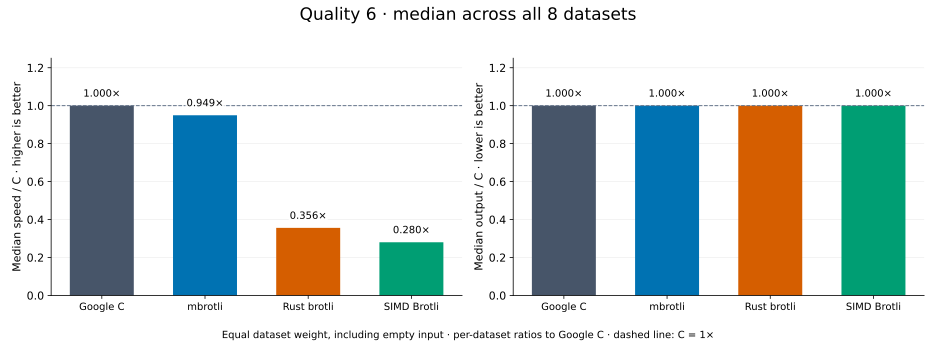
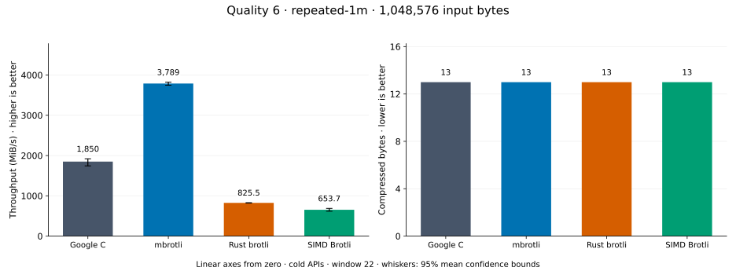
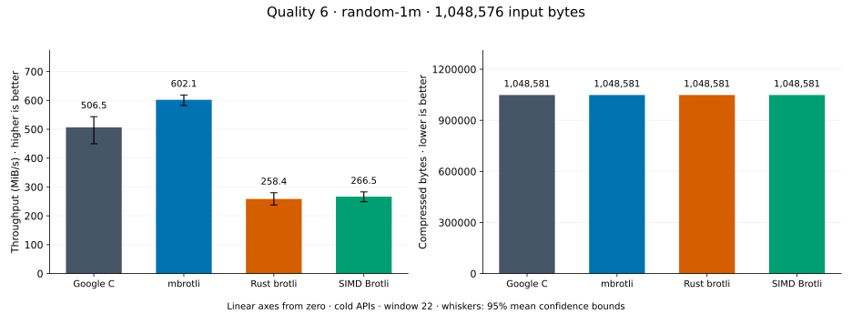
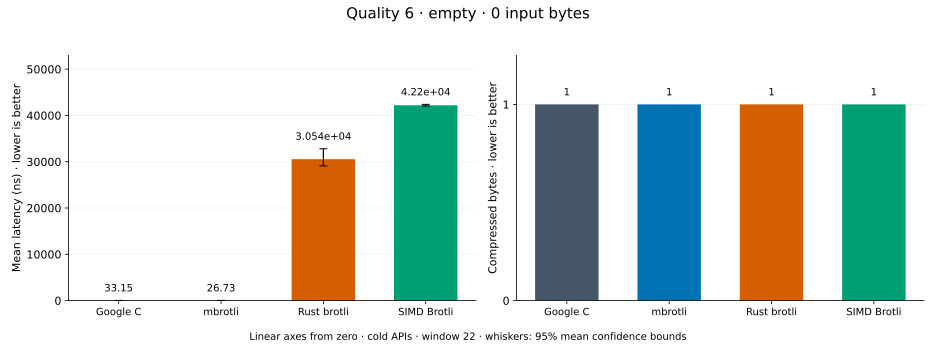
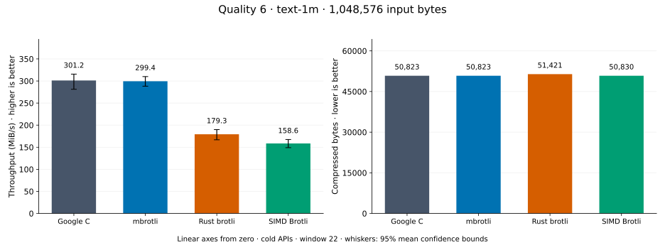
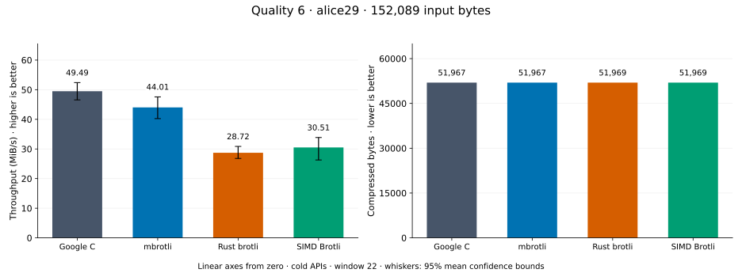
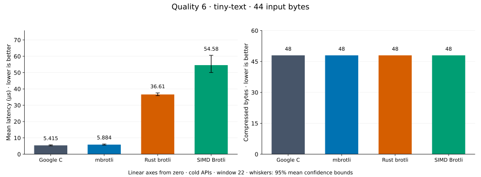
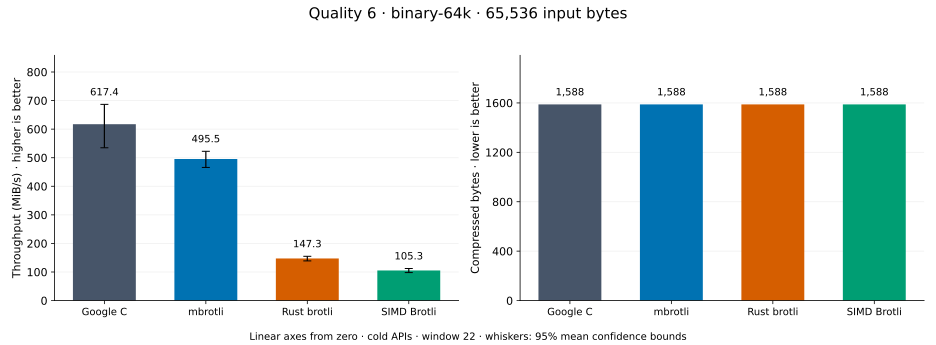
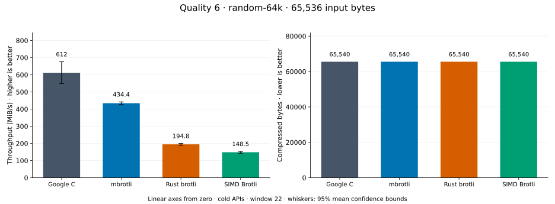

# Compression quality 6

[Benchmark index](../README.md) · [Median overview](README.md) · [← Quality 5](q5.md) · [Quality 7 →](q7.md)

Recorded run: **enc-2026-09-28** (2026-09-28).
[Raw results](../encoder-comparison.csv) · [Environment](../encoder-comparison-environment.json) · [Run analysis](../encoder-comparison.md).

## Median across all datasets

Each of the eight datasets has equal weight, including empty and tiny input.
Speed / C = C mean latency / implementation mean latency; output / C = implementation bytes / C bytes.
We take the median of these eight per-dataset ratios separately for speed and size.
1× matches C; higher speed and lower output are better. These are medians across datasets,
not median sample latencies, and do not imply equal compressed size or statistical significance.

| Implementation | Median speed / C ↑ | Median output / C ↓ | Datasets |
| --- | ---: | ---: | ---: |
| Google C | 1.000× | 1.000× | 8 |
| mbrotli | 0.949× | 1.000× | 8 |
| Rust brotli | 0.356× | 1.000× | 8 |
| SIMD Brotli | 0.280× | 1.000× | 8 |

Measurement setup and interpretation

Google C Brotli 1.2.0, mbrotli at the recorded optimized checkout, Rust brotli 9.0.0,
and SIMD Brotli 10.0.1 are compared at this quality.
**Burli supports only qualities 0–5; it has no results at this quality.**

These are cold native API measurements: construction, allocation, compression, and disposal.
Generic mode, window 22, known input size; 20 samples, 1 s warmup, at least 3 s measurement.
Host: 13th Gen Intel(R) Core(TM) i7-13700KF, Eight parallel single-threaded lanes pinned to logical CPUs 0,2,4,6,8,10,12,14 (distinct cores in the WSL2 topology), one Criterion process per lane; the comparison sweeps were sharded by corpus over four lanes each while the root API A/B benchmarks ran on the other four.; unset; Cargo release defaults, runtime SIMD dispatch.
Rust brotli and SIMD Brotli include their native 4 KiB I/O adapters.

Chart whiskers and table intervals describe 95% confidence bounds on mean timing.
They do not capture all host or allocator variation. Throughput bounds are transformed latency bounds.
Output / input is compressed bytes divided by input bytes; smaller is better, and values above 100% mean expansion.
For empty input, throughput and output / input are undefined (—).
See the [run analysis](../encoder-comparison.md#final-measurements) for measurement limitations.

## Dataset details

Ordered by mbrotli speed / fastest competing implementation, highest first; all eight datasets are shown.
This order uses recorded mean latency, not statistical significance. Bars start at zero.

[repeated-1m](#repeated-1m) · [random-1m](#random-1m) · [empty](#empty) · [text-1m](#text-1m) · [alice29](#alice29) · [tiny-text](#tiny-text) · [binary-64k](#binary-64k) · [random-64k](#random-64k)

### repeated-1m

1 MiB of repeated a bytes. **Input: 1,048,576 bytes.**

mbrotli speed / fastest peer (Google C): **2.048×**; output: 13 / 13 bytes.

Exact measurements and confidence bounds

| Implementation | Mean, µs | 95% mean interval, µs | MiB/s | Output bytes | Output / input | Speed / C |
| --- | ---: | ---: | ---: | ---: | ---: | ---: |
| Google C | 540.5 | 520.8–573.5 | 1,850.07 | 13 | 0.001% | 1.000× |
| mbrotli | 263.9 | 261.6–266.9 | 3,788.76 | 13 | 0.001% | 2.048× |
| Rust brotli | 1,211 | 1,205–1,218 | 825.49 | 13 | 0.001% | 0.446× |
| SIMD Brotli | 1,530 | 1,453–1,618 | 653.71 | 13 | 0.001% | 0.353× |

### random-1m

1 MiB of deterministic xorshift64 pseudorandom bytes. **Input: 1,048,576 bytes.**

mbrotli speed / fastest peer (Google C): **1.091×**; output: 1,048,581 / 1,048,581 bytes.

Exact measurements and confidence bounds

| Implementation | Mean, µs | 95% mean interval, µs | MiB/s | Output bytes | Output / input | Speed / C |
| --- | ---: | ---: | ---: | ---: | ---: | ---: |
| Google C | 1,846 | 1,787–1,931 | 541.67 | 1,048,581 | 100.000% | 1.000× |
| mbrotli | 1,692 | 1,671–1,723 | 591.01 | 1,048,581 | 100.000% | 1.091× |
| Rust brotli | 3,224 | 3,147–3,346 | 310.15 | 1,048,581 | 100.000% | 0.573× |
| SIMD Brotli | 3,509 | 3,447–3,587 | 284.98 | 1,048,581 | 100.000% | 0.526× |

### empty

Empty input; measures API overhead. **Input: 0 bytes.**

mbrotli speed / fastest peer (Google C): **1.013×**; output: 1 / 1 bytes.

Exact measurements and confidence bounds

| Implementation | Mean, ns | 95% mean interval, ns | MiB/s | Output bytes | Output / input | Speed / C |
| --- | ---: | ---: | ---: | ---: | ---: | ---: |
| Google C | 32.57 | 32–33.3 | — | 1 | — | 1.000× |
| mbrotli | 32.17 | 30.78–33.73 | — | 1 | — | 1.013× |
| Rust brotli | 2.866e+04 | 2.839e+04–2.893e+04 | — | 1 | — | 0.001× |
| SIMD Brotli | 4.284e+04 | 4.237e+04–4.338e+04 | — | 1 | — | 0.001× |

### text-1m

Alice text repeated cyclically to 1 MiB. **Input: 1,048,576 bytes.**

mbrotli speed / fastest peer (Google C): **0.986×**; output: 50,823 / 50,823 bytes.

Exact measurements and confidence bounds

| Implementation | Mean, µs | 95% mean interval, µs | MiB/s | Output bytes | Output / input | Speed / C |
| --- | ---: | ---: | ---: | ---: | ---: | ---: |
| Google C | 3,182 | 3,126–3,266 | 314.29 | 50,823 | 4.847% | 1.000× |
| mbrotli | 3,226 | 3,154–3,327 | 310.02 | 50,823 | 4.847% | 0.986× |
| Rust brotli | 4,928 | 4,866–4,993 | 202.91 | 51,421 | 4.904% | 0.646× |
| SIMD Brotli | 5,966 | 5,636–6,352 | 167.61 | 50,830 | 4.848% | 0.533× |

### alice29

Vendored Alice in Wonderland text. **Input: 152,089 bytes.**

mbrotli speed / fastest peer (Google C): **0.912×**; output: 51,967 / 51,967 bytes.

Exact measurements and confidence bounds

| Implementation | Mean, µs | 95% mean interval, µs | MiB/s | Output bytes | Output / input | Speed / C |
| --- | ---: | ---: | ---: | ---: | ---: | ---: |
| Google C | 2,680 | 2,613–2,759 | 54.12 | 51,967 | 34.169% | 1.000× |
| mbrotli | 2,937 | 2,877–3,008 | 49.38 | 51,967 | 34.169% | 0.912× |
| Rust brotli | 4,163 | 3,949–4,476 | 34.84 | 51,969 | 34.170% | 0.644× |
| SIMD Brotli | 4,174 | 4,158–4,191 | 34.75 | 51,969 | 34.170% | 0.642× |

### tiny-text

44-byte quick-brown-fox sentence. **Input: 44 bytes.**

mbrotli speed / fastest peer (Google C): **0.888×**; output: 48 / 48 bytes.

Exact measurements and confidence bounds

| Implementation | Mean, µs | 95% mean interval, µs | MiB/s | Output bytes | Output / input | Speed / C |
| --- | ---: | ---: | ---: | ---: | ---: | ---: |
| Google C | 4.678 | 4.608–4.75 | 8.97 | 48 | 109.091% | 1.000× |
| mbrotli | 5.27 | 5.231–5.32 | 7.96 | 48 | 109.091% | 0.888× |
| Rust brotli | 34.85 | 34.7–35.02 | 1.20 | 48 | 109.091% | 0.134× |
| SIMD Brotli | 50.12 | 49.89–50.35 | 0.84 | 48 | 109.091% | 0.093× |

### binary-64k

64 KiB of structured binary bytes: ((i / 16) XOR i) modulo 256. **Input: 65,536 bytes.**

mbrotli speed / fastest peer (Google C): **0.641×**; output: 1,588 / 1,588 bytes.

Exact measurements and confidence bounds

| Implementation | Mean, µs | 95% mean interval, µs | MiB/s | Output bytes | Output / input | Speed / C |
| --- | ---: | ---: | ---: | ---: | ---: | ---: |
| Google C | 86.27 | 83.71–89.64 | 724.45 | 1,588 | 2.423% | 1.000× |
| mbrotli | 134.5 | 127.1–143.5 | 464.70 | 1,588 | 2.423% | 0.641× |
| Rust brotli | 399 | 395–404.3 | 156.66 | 1,588 | 2.423% | 0.216× |
| SIMD Brotli | 508.2 | 500.5–518.6 | 122.98 | 1,588 | 2.423% | 0.170× |

### random-64k

64 KiB prefix of the deterministic pseudorandom corpus. **Input: 65,536 bytes.**

mbrotli speed / fastest peer (Google C): **0.599×**; output: 65,540 / 65,540 bytes.

Exact measurements and confidence bounds

| Implementation | Mean, µs | 95% mean interval, µs | MiB/s | Output bytes | Output / input | Speed / C |
| --- | ---: | ---: | ---: | ---: | ---: | ---: |
| Google C | 84.38 | 83.41–85.2 | 740.72 | 65,540 | 100.006% | 1.000× |
| mbrotli | 141 | 140.4–141.7 | 443.34 | 65,540 | 100.006% | 0.599× |
| Rust brotli | 318 | 316.5–319.6 | 196.54 | 65,540 | 100.006% | 0.265× |
| SIMD Brotli | 407.8 | 399.1–422.1 | 153.26 | 65,540 | 100.006% | 0.207× |

