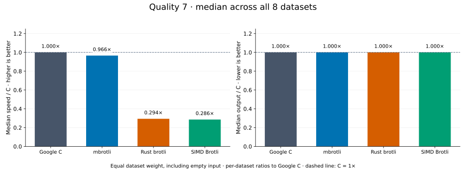
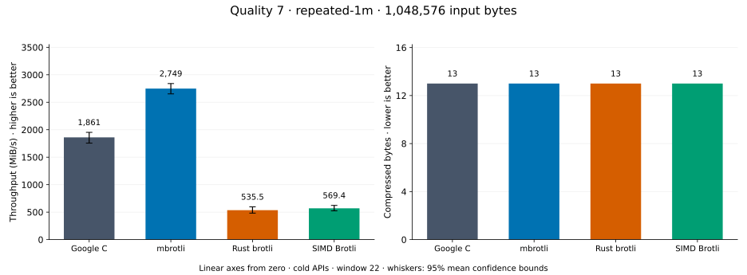
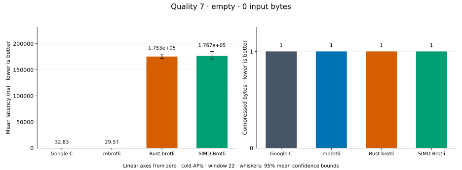
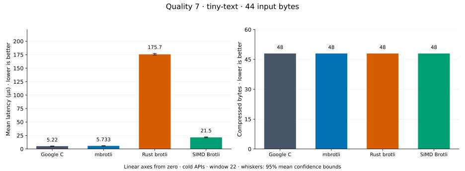
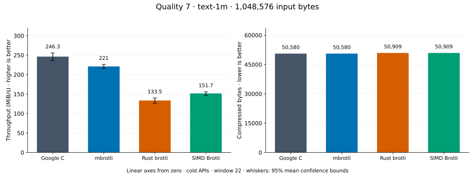
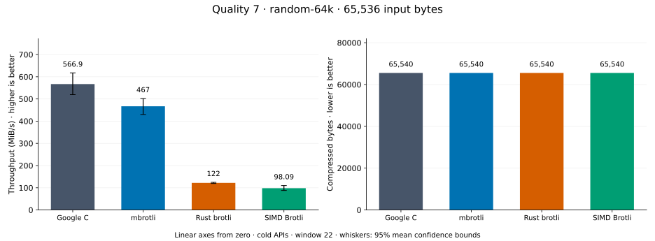
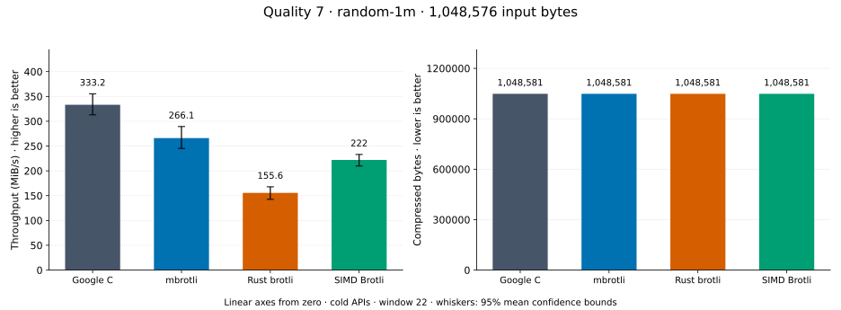
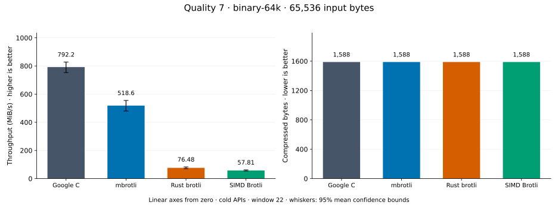
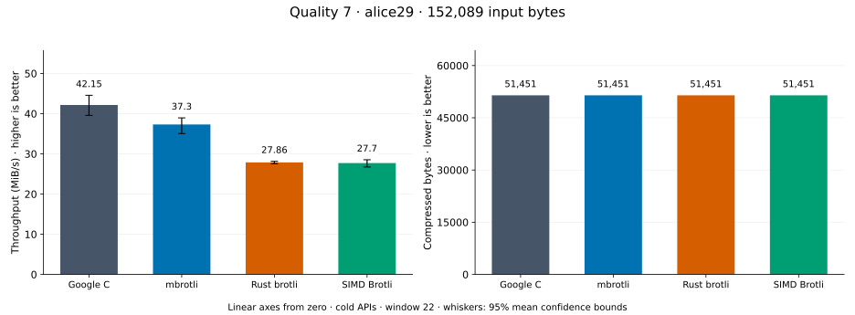

# Compression quality 7

[Benchmark index](../README.md) · [Median overview](README.md) · [← Quality 6](q6.md) · [Quality 8 →](q8.md)

Recorded run: **enc-2026-10-02** (2026-10-02).
[Raw results](../encoder-comparison.csv) · [Environment](../encoder-comparison-environment.json) · [Run analysis](../encoder-comparison.md).

## Median across all datasets

Each of the eight datasets has equal weight, including empty and tiny input.
Speed / C = C mean latency / implementation mean latency; output / C = implementation bytes / C bytes.
We take the median of these eight per-dataset ratios separately for speed and size.
1× matches C; higher speed and lower output are better. These are medians across datasets,
not median sample latencies, and do not imply equal compressed size or statistical significance.

| Implementation | Median speed / C ↑ | Median output / C ↓ | Datasets |
| --- | ---: | ---: | ---: |
| Google C | 1.000× | 1.000× | 8 |
| mbrotli | 0.861× | 1.000× | 8 |
| Rust brotli | 0.251× | 1.000× | 8 |
| SIMD Brotli | 0.274× | 1.000× | 8 |

Measurement setup and interpretation

Google C Brotli 1.2.0, mbrotli at the recorded optimized checkout, Rust brotli 9.0.0,
and SIMD Brotli 10.0.1 are compared at this quality.
**Burli supports only qualities 0–5; it has no results at this quality.**

These are cold native API measurements: construction, allocation, compression, and disposal.
Generic mode, window 22, known input size; 20 samples, 1 s warmup, at least 3 s measurement.
Host: 13th Gen Intel(R) Core(TM) i7-13700KF, Eight parallel single-threaded lanes pinned to logical CPUs 0,2,4,6,8,10,12,14 (distinct cores in the WSL2 topology), one Criterion process per lane: the encoder sweep sharded by corpus over CPUs 0,2,4,6 and the decoder sweep over CPUs 8,10,12,14, both at once.; unset; Cargo release defaults, runtime SIMD dispatch.
Rust brotli and SIMD Brotli include their native 4 KiB I/O adapters.

Chart whiskers and table intervals describe 95% confidence bounds on mean timing.
They do not capture all host or allocator variation. Throughput bounds are transformed latency bounds.
Output / input is compressed bytes divided by input bytes; smaller is better, and values above 100% mean expansion.
For empty input, throughput and output / input are undefined (—).
See the [run analysis](../encoder-comparison.md#final-measurements) for measurement limitations.

## Dataset details

Ordered by mbrotli speed / fastest competing implementation, highest first; all eight datasets are shown.
This order uses recorded mean latency, not statistical significance. Bars start at zero.

[repeated-1m](#repeated-1m) · [empty](#empty) · [tiny-text](#tiny-text) · [text-1m](#text-1m) · [random-64k](#random-64k) · [random-1m](#random-1m) · [binary-64k](#binary-64k) · [alice29](#alice29)

### repeated-1m

1 MiB of repeated a bytes. **Input: 1,048,576 bytes.**

mbrotli speed / fastest peer (Google C): **1.477×**; output: 13 / 13 bytes.

Exact measurements and confidence bounds

| Implementation | Mean, µs | 95% mean interval, µs | MiB/s | Output bytes | Output / input | Speed / C |
| --- | ---: | ---: | ---: | ---: | ---: | ---: |
| Google C | 537.4 | 512.2–569.6 | 1,860.73 | 13 | 0.001% | 1.000× |
| mbrotli | 363.8 | 352.1–377 | 2,748.97 | 13 | 0.001% | 1.477× |
| Rust brotli | 1,868 | 1,679–2,076 | 535.47 | 13 | 0.001% | 0.288× |
| SIMD Brotli | 1,756 | 1,607–1,912 | 569.40 | 13 | 0.001% | 0.306× |

### empty

Empty input; measures API overhead. **Input: 0 bytes.**

mbrotli speed / fastest peer (Google C): **1.124×**; output: 1 / 1 bytes.

Exact measurements and confidence bounds

| Implementation | Mean, ns | 95% mean interval, ns | MiB/s | Output bytes | Output / input | Speed / C |
| --- | ---: | ---: | ---: | ---: | ---: | ---: |
| Google C | 35.29 | 33.36–37.63 | — | 1 | — | 1.000× |
| mbrotli | 31.39 | 28.62–34.39 | — | 1 | — | 1.124× |
| Rust brotli | 1.773e+05 | 1.716e+05–1.843e+05 | — | 1 | — | 0.000× |
| SIMD Brotli | 1.764e+05 | 1.734e+05–1.803e+05 | — | 1 | — | 0.000× |

### tiny-text

44-byte quick-brown-fox sentence. **Input: 44 bytes.**

mbrotli speed / fastest peer (Google C): **0.911×**; output: 48 / 48 bytes.

Exact measurements and confidence bounds

| Implementation | Mean, µs | 95% mean interval, µs | MiB/s | Output bytes | Output / input | Speed / C |
| --- | ---: | ---: | ---: | ---: | ---: | ---: |
| Google C | 5.22 | 5.012–5.477 | 8.04 | 48 | 109.091% | 1.000× |
| mbrotli | 5.733 | 5.4–6.146 | 7.32 | 48 | 109.091% | 0.911× |
| Rust brotli | 175.7 | 174.6–177.3 | 0.24 | 48 | 109.091% | 0.030× |
| SIMD Brotli | 21.5 | 20.86–22.47 | 1.95 | 48 | 109.091% | 0.243× |

### text-1m

Alice text repeated cyclically to 1 MiB. **Input: 1,048,576 bytes.**

mbrotli speed / fastest peer (Google C): **0.897×**; output: 50,580 / 50,580 bytes.

Exact measurements and confidence bounds

| Implementation | Mean, µs | 95% mean interval, µs | MiB/s | Output bytes | Output / input | Speed / C |
| --- | ---: | ---: | ---: | ---: | ---: | ---: |
| Google C | 4,060 | 3,911–4,236 | 246.30 | 50,580 | 4.824% | 1.000× |
| mbrotli | 4,524 | 4,423–4,638 | 221.04 | 50,580 | 4.824% | 0.897× |
| Rust brotli | 7,491 | 7,146–7,908 | 133.49 | 50,909 | 4.855% | 0.542× |
| SIMD Brotli | 6,594 | 6,413–6,812 | 151.66 | 50,909 | 4.855% | 0.616× |

### random-64k

64 KiB prefix of the deterministic pseudorandom corpus. **Input: 65,536 bytes.**

mbrotli speed / fastest peer (Google C): **0.824×**; output: 65,540 / 65,540 bytes.

Exact measurements and confidence bounds

| Implementation | Mean, µs | 95% mean interval, µs | MiB/s | Output bytes | Output / input | Speed / C |
| --- | ---: | ---: | ---: | ---: | ---: | ---: |
| Google C | 110.2 | 101.3–120.3 | 566.93 | 65,540 | 100.006% | 1.000× |
| mbrotli | 133.8 | 124.6–145.4 | 466.96 | 65,540 | 100.006% | 0.824× |
| Rust brotli | 512.3 | 502.9–523.4 | 121.99 | 65,540 | 100.006% | 0.215× |
| SIMD Brotli | 637.2 | 568.6–710.5 | 98.09 | 65,540 | 100.006% | 0.173× |

### random-1m

1 MiB of deterministic xorshift64 pseudorandom bytes. **Input: 1,048,576 bytes.**

mbrotli speed / fastest peer (Google C): **0.799×**; output: 1,048,581 / 1,048,581 bytes.

Exact measurements and confidence bounds

| Implementation | Mean, µs | 95% mean interval, µs | MiB/s | Output bytes | Output / input | Speed / C |
| --- | ---: | ---: | ---: | ---: | ---: | ---: |
| Google C | 3,001 | 2,815–3,197 | 333.22 | 1,048,581 | 100.000% | 1.000× |
| mbrotli | 3,758 | 3,456–4,079 | 266.08 | 1,048,581 | 100.000% | 0.799× |
| Rust brotli | 6,426 | 5,957–7,013 | 155.61 | 1,048,581 | 100.000% | 0.467× |
| SIMD Brotli | 4,504 | 4,291–4,769 | 222.01 | 1,048,581 | 100.000% | 0.666× |

### binary-64k

64 KiB of structured binary bytes: ((i / 16) XOR i) modulo 256. **Input: 65,536 bytes.**

mbrotli speed / fastest peer (Google C): **0.655×**; output: 1,588 / 1,588 bytes.

Exact measurements and confidence bounds

| Implementation | Mean, µs | 95% mean interval, µs | MiB/s | Output bytes | Output / input | Speed / C |
| --- | ---: | ---: | ---: | ---: | ---: | ---: |
| Google C | 78.89 | 75.47–82.99 | 792.21 | 1,588 | 2.423% | 1.000× |
| mbrotli | 120.5 | 112.6–130.2 | 518.56 | 1,588 | 2.423% | 0.655× |
| Rust brotli | 817.2 | 755.8–884.8 | 76.48 | 1,588 | 2.423% | 0.097× |
| SIMD Brotli | 1,081 | 1,010–1,159 | 57.81 | 1,588 | 2.423% | 0.073× |

### alice29

Vendored Alice in Wonderland text. **Input: 152,089 bytes.**

mbrotli speed / fastest peer (Google C): **0.644×**; output: 51,451 / 51,451 bytes.

Exact measurements and confidence bounds

| Implementation | Mean, µs | 95% mean interval, µs | MiB/s | Output bytes | Output / input | Speed / C |
| --- | ---: | ---: | ---: | ---: | ---: | ---: |
| Google C | 3,440 | 3,222–3,738 | 42.16 | 51,451 | 33.830% | 1.000× |
| mbrotli | 5,340 | 4,765–6,021 | 27.16 | 51,451 | 33.830% | 0.644× |
| Rust brotli | 6,055 | 5,856–6,337 | 23.95 | 51,451 | 33.830% | 0.568× |
| SIMD Brotli | 5,496 | 5,289–5,733 | 26.39 | 51,451 | 33.830% | 0.626× |

