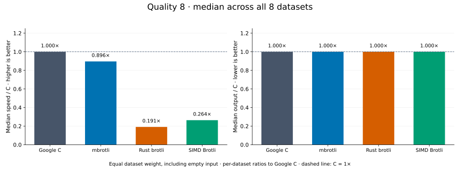
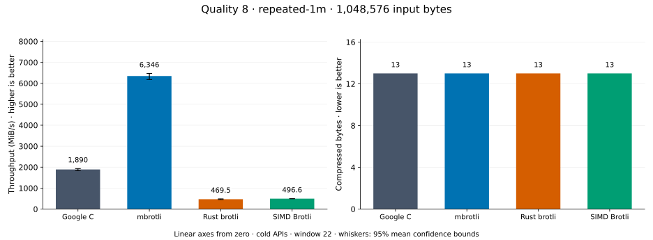
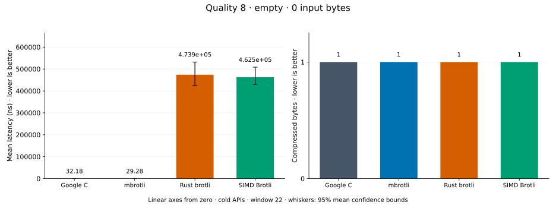
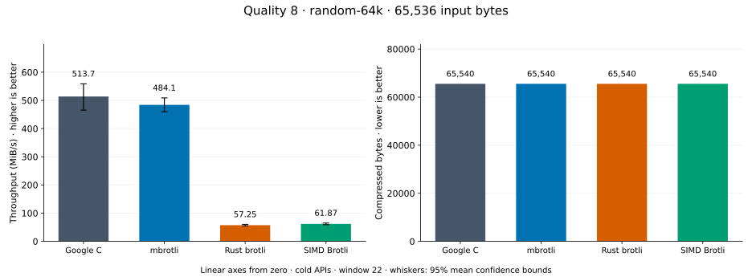
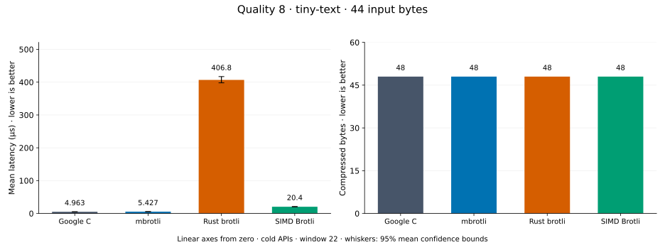
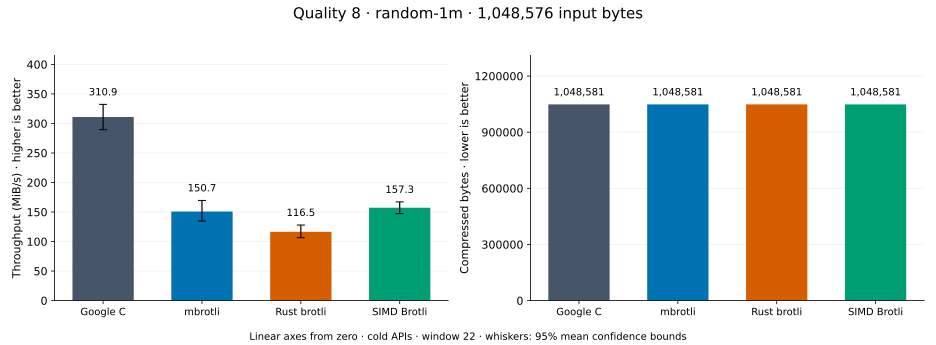
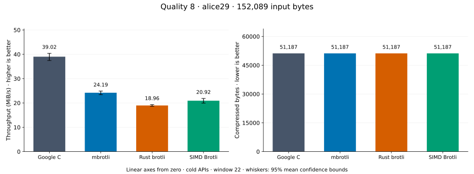
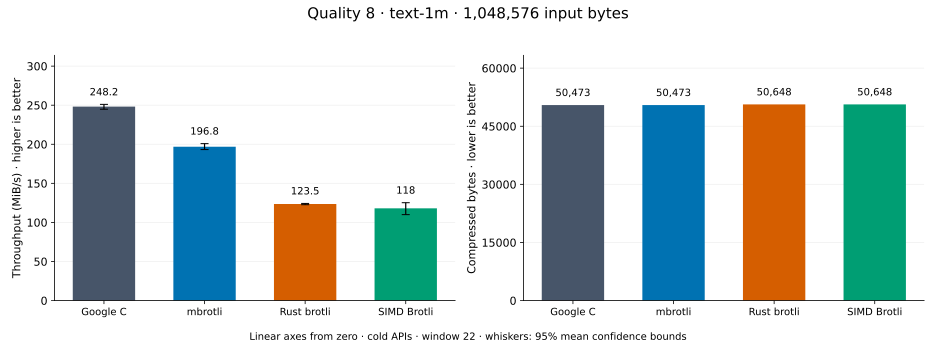
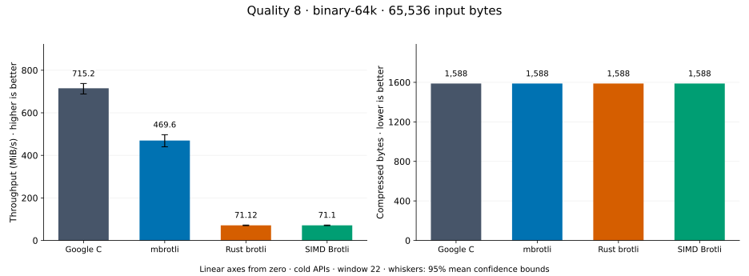

# Compression quality 8

[Benchmark index](../README.md) · [Median overview](README.md) · [← Quality 7](q7.md) · [Quality 9 →](q9.md)

Recorded run: **enc-2026-09-28** (2026-09-28).
[Raw results](../encoder-comparison.csv) · [Environment](../encoder-comparison-environment.json) · [Run analysis](../encoder-comparison.md).

## Median across all datasets

Each of the eight datasets has equal weight, including empty and tiny input.
Speed / C = C mean latency / implementation mean latency; output / C = implementation bytes / C bytes.
We take the median of these eight per-dataset ratios separately for speed and size.
1× matches C; higher speed and lower output are better. These are medians across datasets,
not median sample latencies, and do not imply equal compressed size or statistical significance.

| Implementation | Median speed / C ↑ | Median output / C ↓ | Datasets |
| --- | ---: | ---: | ---: |
| Google C | 1.000× | 1.000× | 8 |
| mbrotli | 0.898× | 1.000× | 8 |
| Rust brotli | 0.194× | 1.000× | 8 |
| SIMD Brotli | 0.256× | 1.000× | 8 |

Measurement setup and interpretation

Google C Brotli 1.2.0, mbrotli at the recorded optimized checkout, Rust brotli 9.0.0,
and SIMD Brotli 10.0.1 are compared at this quality.
**Burli supports only qualities 0–5; it has no results at this quality.**

These are cold native API measurements: construction, allocation, compression, and disposal.
Generic mode, window 22, known input size; 20 samples, 1 s warmup, at least 3 s measurement.
Host: 13th Gen Intel(R) Core(TM) i7-13700KF, Eight parallel single-threaded lanes pinned to logical CPUs 0,2,4,6,8,10,12,14 (distinct cores in the WSL2 topology), one Criterion process per lane; the comparison sweeps were sharded by corpus over four lanes each while the root API A/B benchmarks ran on the other four.; unset; Cargo release defaults, runtime SIMD dispatch.
Rust brotli and SIMD Brotli include their native 4 KiB I/O adapters.

Chart whiskers and table intervals describe 95% confidence bounds on mean timing.
They do not capture all host or allocator variation. Throughput bounds are transformed latency bounds.
Output / input is compressed bytes divided by input bytes; smaller is better, and values above 100% mean expansion.
For empty input, throughput and output / input are undefined (—).
See the [run analysis](../encoder-comparison.md#final-measurements) for measurement limitations.

## Dataset details

Ordered by mbrotli speed / fastest competing implementation, highest first; all eight datasets are shown.
This order uses recorded mean latency, not statistical significance. Bars start at zero.

[repeated-1m](#repeated-1m) · [empty](#empty) · [random-64k](#random-64k) · [tiny-text](#tiny-text) · [random-1m](#random-1m) · [alice29](#alice29) · [text-1m](#text-1m) · [binary-64k](#binary-64k)

### repeated-1m

1 MiB of repeated a bytes. **Input: 1,048,576 bytes.**

mbrotli speed / fastest peer (Google C): **3.591×**; output: 13 / 13 bytes.

Exact measurements and confidence bounds

| Implementation | Mean, µs | 95% mean interval, µs | MiB/s | Output bytes | Output / input | Speed / C |
| --- | ---: | ---: | ---: | ---: | ---: | ---: |
| Google C | 543.9 | 521–572.9 | 1,838.55 | 13 | 0.001% | 1.000× |
| mbrotli | 151.5 | 150–153.4 | 6,602.34 | 13 | 0.001% | 3.591× |
| Rust brotli | 2,136 | 2,075–2,221 | 468.25 | 13 | 0.001% | 0.255× |
| SIMD Brotli | 2,024 | 1,991–2,048 | 494.05 | 13 | 0.001% | 0.269× |

### empty

Empty input; measures API overhead. **Input: 0 bytes.**

mbrotli speed / fastest peer (Google C): **1.040×**; output: 1 / 1 bytes.

Exact measurements and confidence bounds

| Implementation | Mean, ns | 95% mean interval, ns | MiB/s | Output bytes | Output / input | Speed / C |
| --- | ---: | ---: | ---: | ---: | ---: | ---: |
| Google C | 31.99 | 31.6–32.51 | — | 1 | — | 1.000× |
| mbrotli | 30.77 | 29.8–31.83 | — | 1 | — | 1.040× |
| Rust brotli | 3.537e+05 | 3.523e+05–3.553e+05 | — | 1 | — | 0.000× |
| SIMD Brotli | 3.556e+05 | 3.533e+05–3.578e+05 | — | 1 | — | 0.000× |

### random-64k

64 KiB prefix of the deterministic pseudorandom corpus. **Input: 65,536 bytes.**

mbrotli speed / fastest peer (Google C): **0.976×**; output: 65,540 / 65,540 bytes.

Exact measurements and confidence bounds

| Implementation | Mean, µs | 95% mean interval, µs | MiB/s | Output bytes | Output / input | Speed / C |
| --- | ---: | ---: | ---: | ---: | ---: | ---: |
| Google C | 123.1 | 116.3–131.4 | 507.67 | 65,540 | 100.006% | 1.000× |
| mbrotli | 126.2 | 123.3–130 | 495.24 | 65,540 | 100.006% | 0.976× |
| Rust brotli | 923.9 | 829.4–1,033 | 67.65 | 65,540 | 100.006% | 0.133× |
| SIMD Brotli | 846.7 | 818.8–873.3 | 73.81 | 65,540 | 100.006% | 0.145× |

### tiny-text

44-byte quick-brown-fox sentence. **Input: 44 bytes.**

mbrotli speed / fastest peer (Google C): **0.915×**; output: 48 / 48 bytes.

Exact measurements and confidence bounds

| Implementation | Mean, µs | 95% mean interval, µs | MiB/s | Output bytes | Output / input | Speed / C |
| --- | ---: | ---: | ---: | ---: | ---: | ---: |
| Google C | 4.963 | 4.802–5.236 | 8.45 | 48 | 109.091% | 1.000× |
| mbrotli | 5.427 | 5.359–5.523 | 7.73 | 48 | 109.091% | 0.915× |
| Rust brotli | 406.8 | 397.9–417 | 0.10 | 48 | 109.091% | 0.012× |
| SIMD Brotli | 20.4 | 20.02–21.03 | 2.06 | 48 | 109.091% | 0.243× |

### random-1m

1 MiB of deterministic xorshift64 pseudorandom bytes. **Input: 1,048,576 bytes.**

mbrotli speed / fastest peer (Google C): **0.882×**; output: 1,048,581 / 1,048,581 bytes.

Exact measurements and confidence bounds

| Implementation | Mean, µs | 95% mean interval, µs | MiB/s | Output bytes | Output / input | Speed / C |
| --- | ---: | ---: | ---: | ---: | ---: | ---: |
| Google C | 3,268 | 3,241–3,294 | 305.96 | 1,048,581 | 100.000% | 1.000× |
| mbrotli | 3,705 | 3,655–3,748 | 269.94 | 1,048,581 | 100.000% | 0.882× |
| Rust brotli | 5,405 | 5,348–5,468 | 185.03 | 1,048,581 | 100.000% | 0.605× |
| SIMD Brotli | 5,661 | 5,566–5,747 | 176.66 | 1,048,581 | 100.000% | 0.577× |

### alice29

Vendored Alice in Wonderland text. **Input: 152,089 bytes.**

mbrotli speed / fastest peer (Google C): **0.808×**; output: 51,187 / 51,187 bytes.

Exact measurements and confidence bounds

| Implementation | Mean, µs | 95% mean interval, µs | MiB/s | Output bytes | Output / input | Speed / C |
| --- | ---: | ---: | ---: | ---: | ---: | ---: |
| Google C | 3,855 | 3,750–3,987 | 37.62 | 51,187 | 33.656% | 1.000× |
| mbrotli | 4,773 | 4,737–4,821 | 30.39 | 51,187 | 33.656% | 0.808× |
| Rust brotli | 6,930 | 6,728–7,213 | 20.93 | 51,187 | 33.656% | 0.556× |
| SIMD Brotli | 7,068 | 6,911–7,255 | 20.52 | 51,187 | 33.656% | 0.545× |

### text-1m

Alice text repeated cyclically to 1 MiB. **Input: 1,048,576 bytes.**

mbrotli speed / fastest peer (Google C): **0.793×**; output: 50,473 / 50,473 bytes.

Exact measurements and confidence bounds

| Implementation | Mean, µs | 95% mean interval, µs | MiB/s | Output bytes | Output / input | Speed / C |
| --- | ---: | ---: | ---: | ---: | ---: | ---: |
| Google C | 4,029 | 3,984–4,085 | 248.20 | 50,473 | 4.813% | 1.000× |
| mbrotli | 5,081 | 4,980–5,174 | 196.82 | 50,473 | 4.813% | 0.793× |
| Rust brotli | 8,095 | 8,046–8,153 | 123.53 | 50,648 | 4.830% | 0.498× |
| SIMD Brotli | 8,473 | 7,984–9,097 | 118.02 | 50,648 | 4.830% | 0.475× |

### binary-64k

64 KiB of structured binary bytes: ((i / 16) XOR i) modulo 256. **Input: 65,536 bytes.**

mbrotli speed / fastest peer (Google C): **0.657×**; output: 1,588 / 1,588 bytes.

Exact measurements and confidence bounds

| Implementation | Mean, µs | 95% mean interval, µs | MiB/s | Output bytes | Output / input | Speed / C |
| --- | ---: | ---: | ---: | ---: | ---: | ---: |
| Google C | 87.38 | 84.73–90.8 | 715.23 | 1,588 | 2.423% | 1.000× |
| mbrotli | 133.1 | 125.7–142 | 469.58 | 1,588 | 2.423% | 0.657× |
| Rust brotli | 878.8 | 862.8–896.6 | 71.12 | 1,588 | 2.423% | 0.099× |
| SIMD Brotli | 879 | 861.8–897.7 | 71.10 | 1,588 | 2.423% | 0.099× |

