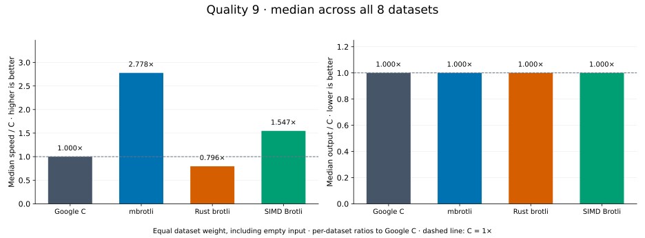
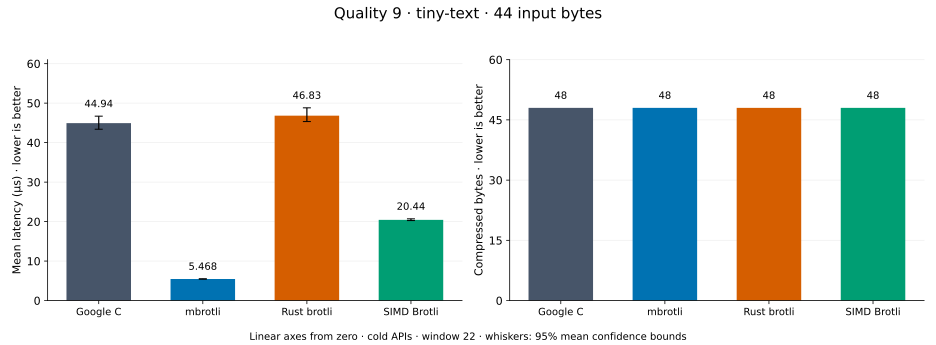
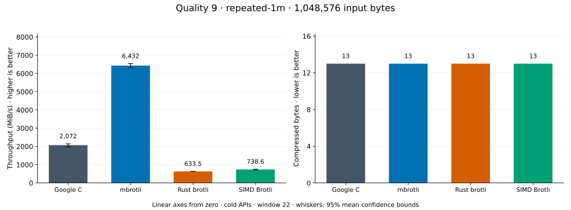
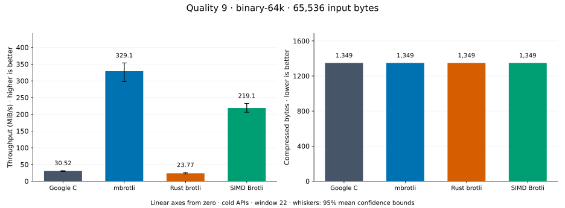
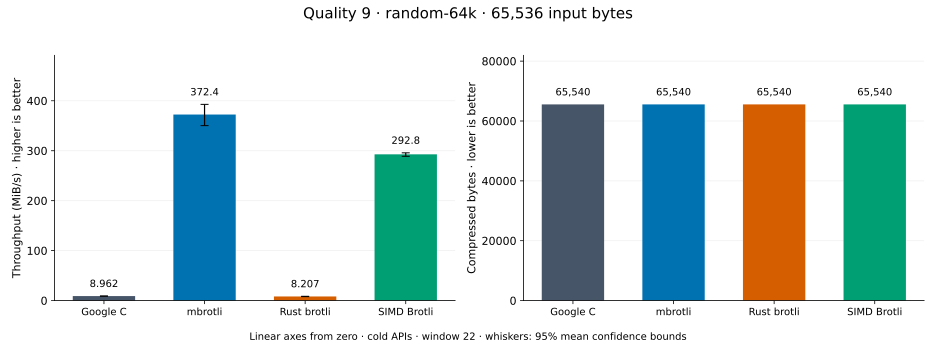
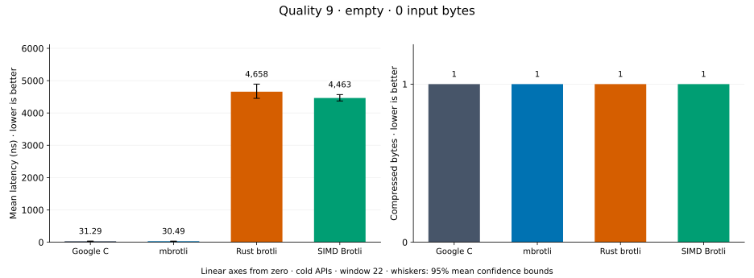
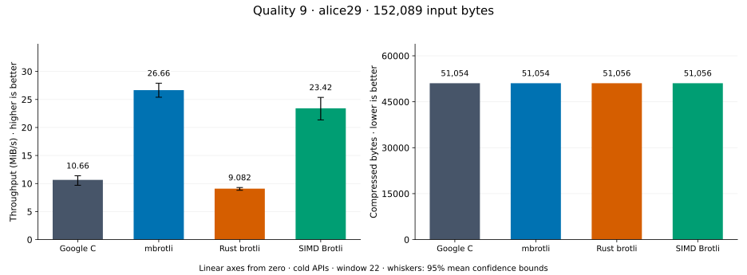
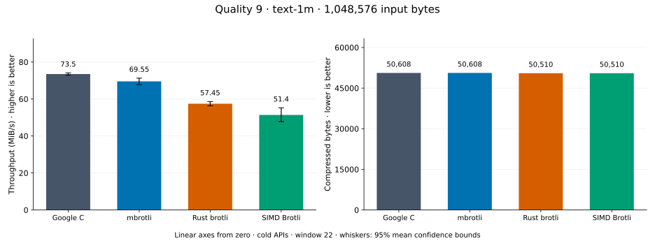
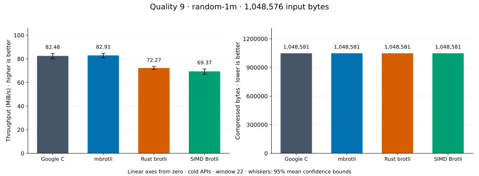

# Compression quality 9

[Benchmark index](../README.md) · [Median overview](README.md) · [← Quality 8](q8.md) · [Quality 10 →](q10.md)

Recorded run: **enc-2026-10-01** (2026-10-01).
[Raw results](../encoder-comparison.csv) · [Environment](../encoder-comparison-environment.json) · [Run analysis](../encoder-comparison.md).

## Median across all datasets

Each of the eight datasets has equal weight, including empty and tiny input.
Speed / C = C mean latency / implementation mean latency; output / C = implementation bytes / C bytes.
We take the median of these eight per-dataset ratios separately for speed and size.
1× matches C; higher speed and lower output are better. These are medians across datasets,
not median sample latencies, and do not imply equal compressed size or statistical significance.

| Implementation | Median speed / C ↑ | Median output / C ↓ | Datasets |
| --- | ---: | ---: | ---: |
| Google C | 1.000× | 1.000× | 8 |
| mbrotli | 2.778× | 1.000× | 8 |
| Rust brotli | 0.796× | 1.000× | 8 |
| SIMD Brotli | 1.547× | 1.000× | 8 |

Measurement setup and interpretation

Google C Brotli 1.2.0, mbrotli at the recorded optimized checkout, Rust brotli 9.0.0,
and SIMD Brotli 10.0.1 are compared at this quality.
**Burli supports only qualities 0–5; it has no results at this quality.**

These are cold native API measurements: construction, allocation, compression, and disposal.
Generic mode, window 22, known input size; 20 samples, 1 s warmup, at least 3 s measurement.
Host: 13th Gen Intel(R) Core(TM) i7-13700KF, Eight parallel single-threaded lanes pinned to logical CPUs 0,2,4,6,8,10,12,14 (distinct cores in the WSL2 topology), one Criterion process per lane: the encoder sweep sharded by corpus over CPUs 0,2,4,6 and the decoder sweep over CPUs 8,10,12,14, both at once.; unset; Cargo release defaults, runtime SIMD dispatch.
Rust brotli and SIMD Brotli include their native 4 KiB I/O adapters.

Chart whiskers and table intervals describe 95% confidence bounds on mean timing.
They do not capture all host or allocator variation. Throughput bounds are transformed latency bounds.
Output / input is compressed bytes divided by input bytes; smaller is better, and values above 100% mean expansion.
For empty input, throughput and output / input are undefined (—).
See the [run analysis](../encoder-comparison.md#final-measurements) for measurement limitations.

## Dataset details

Ordered by mbrotli speed / fastest competing implementation, highest first; all eight datasets are shown.
This order uses recorded mean latency, not statistical significance. Bars start at zero.

[tiny-text](#tiny-text) · [repeated-1m](#repeated-1m) · [binary-64k](#binary-64k) · [random-64k](#random-64k) · [empty](#empty) · [alice29](#alice29) · [text-1m](#text-1m) · [random-1m](#random-1m)

### tiny-text

44-byte quick-brown-fox sentence. **Input: 44 bytes.**

mbrotli speed / fastest peer (SIMD Brotli): **3.739×**; output: 48 / 48 bytes.

Exact measurements and confidence bounds

| Implementation | Mean, µs | 95% mean interval, µs | MiB/s | Output bytes | Output / input | Speed / C |
| --- | ---: | ---: | ---: | ---: | ---: | ---: |
| Google C | 44.94 | 43.39–46.7 | 0.93 | 48 | 109.091% | 1.000× |
| mbrotli | 5.468 | 5.437–5.506 | 7.67 | 48 | 109.091% | 8.220× |
| Rust brotli | 46.83 | 45.34–48.81 | 0.90 | 48 | 109.091% | 0.960× |
| SIMD Brotli | 20.44 | 20.26–20.7 | 2.05 | 48 | 109.091% | 2.199× |

### repeated-1m

1 MiB of repeated a bytes. **Input: 1,048,576 bytes.**

mbrotli speed / fastest peer (Google C): **3.049×**; output: 13 / 13 bytes.

Exact measurements and confidence bounds

| Implementation | Mean, µs | 95% mean interval, µs | MiB/s | Output bytes | Output / input | Speed / C |
| --- | ---: | ---: | ---: | ---: | ---: | ---: |
| Google C | 467 | 465.1–469 | 2,141.26 | 13 | 0.001% | 1.000× |
| mbrotli | 153.2 | 152.4–154 | 6,528.78 | 13 | 0.001% | 3.049× |
| Rust brotli | 1,462 | 1,446–1,480 | 683.80 | 13 | 0.001% | 0.319× |
| SIMD Brotli | 1,337 | 1,322–1,353 | 748.20 | 13 | 0.001% | 0.349× |

### binary-64k

64 KiB of structured binary bytes: ((i / 16) XOR i) modulo 256. **Input: 65,536 bytes.**

mbrotli speed / fastest peer (SIMD Brotli): **1.485×**; output: 1,349 / 1,349 bytes.

Exact measurements and confidence bounds

| Implementation | Mean, µs | 95% mean interval, µs | MiB/s | Output bytes | Output / input | Speed / C |
| --- | ---: | ---: | ---: | ---: | ---: | ---: |
| Google C | 1,971 | 1,912–2,037 | 31.72 | 1,349 | 2.058% | 1.000× |
| mbrotli | 172.9 | 168.4–178.8 | 361.47 | 1,349 | 2.058% | 11.397× |
| Rust brotli | 2,679 | 2,568–2,804 | 23.33 | 1,349 | 2.058% | 0.736× |
| SIMD Brotli | 256.7 | 250.5–263.8 | 243.49 | 1,349 | 2.058% | 7.677× |

### random-64k

64 KiB prefix of the deterministic pseudorandom corpus. **Input: 65,536 bytes.**

mbrotli speed / fastest peer (SIMD Brotli): **1.364×**; output: 65,540 / 65,540 bytes.

Exact measurements and confidence bounds

| Implementation | Mean, µs | 95% mean interval, µs | MiB/s | Output bytes | Output / input | Speed / C |
| --- | ---: | ---: | ---: | ---: | ---: | ---: |
| Google C | 7,787 | 7,640–7,911 | 8.03 | 65,540 | 100.006% | 1.000× |
| mbrotli | 154.7 | 153.9–155.6 | 403.93 | 65,540 | 100.006% | 50.324× |
| Rust brotli | 7,911 | 7,781–8,116 | 7.90 | 65,540 | 100.006% | 0.984× |
| SIMD Brotli | 211.1 | 210.4–211.8 | 296.03 | 65,540 | 100.006% | 36.881× |

### empty

Empty input; measures API overhead. **Input: 0 bytes.**

mbrotli speed / fastest peer (Google C): **1.166×**; output: 1 / 1 bytes.

Exact measurements and confidence bounds

| Implementation | Mean, ns | 95% mean interval, ns | MiB/s | Output bytes | Output / input | Speed / C |
| --- | ---: | ---: | ---: | ---: | ---: | ---: |
| Google C | 32.33 | 31.82–32.95 | — | 1 | — | 1.000× |
| mbrotli | 27.74 | 27.17–28.46 | — | 1 | — | 1.166× |
| Rust brotli | 4,828 | 4,727–4,957 | — | 1 | — | 0.007× |
| SIMD Brotli | 4,736 | 4,661–4,822 | — | 1 | — | 0.007× |

### alice29

Vendored Alice in Wonderland text. **Input: 152,089 bytes.**

mbrotli speed / fastest peer (SIMD Brotli): **1.133×**; output: 51,054 / 51,056 bytes.

Exact measurements and confidence bounds

| Implementation | Mean, µs | 95% mean interval, µs | MiB/s | Output bytes | Output / input | Speed / C |
| --- | ---: | ---: | ---: | ---: | ---: | ---: |
| Google C | 1.259e+04 | 1.24e+04–1.28e+04 | 11.52 | 51,054 | 33.569% | 1.000× |
| mbrotli | 5,022 | 4,959–5,097 | 28.88 | 51,054 | 33.569% | 2.507× |
| Rust brotli | 1.573e+04 | 1.529e+04–1.62e+04 | 9.22 | 51,056 | 33.570% | 0.800× |
| SIMD Brotli | 5,690 | 5,478–5,953 | 25.49 | 51,056 | 33.570% | 2.212× |

### text-1m

Alice text repeated cyclically to 1 MiB. **Input: 1,048,576 bytes.**

mbrotli speed / fastest peer (Google C): **0.973×**; output: 50,608 / 50,608 bytes.

Exact measurements and confidence bounds

| Implementation | Mean, µs | 95% mean interval, µs | MiB/s | Output bytes | Output / input | Speed / C |
| --- | ---: | ---: | ---: | ---: | ---: | ---: |
| Google C | 1.302e+04 | 1.289e+04–1.317e+04 | 76.78 | 50,608 | 4.826% | 1.000× |
| mbrotli | 1.339e+04 | 1.32e+04–1.361e+04 | 74.67 | 50,608 | 4.826% | 0.973× |
| Rust brotli | 1.646e+04 | 1.625e+04–1.667e+04 | 60.75 | 50,510 | 4.817% | 0.791× |
| SIMD Brotli | 1.534e+04 | 1.518e+04–1.548e+04 | 65.18 | 50,510 | 4.817% | 0.849× |

### random-1m

1 MiB of deterministic xorshift64 pseudorandom bytes. **Input: 1,048,576 bytes.**

mbrotli speed / fastest peer (Google C): **0.906×**; output: 1,048,581 / 1,048,581 bytes.

Exact measurements and confidence bounds

| Implementation | Mean, µs | 95% mean interval, µs | MiB/s | Output bytes | Output / input | Speed / C |
| --- | ---: | ---: | ---: | ---: | ---: | ---: |
| Google C | 1.28e+04 | 1.254e+04–1.31e+04 | 78.13 | 1,048,581 | 100.000% | 1.000× |
| mbrotli | 1.413e+04 | 1.369e+04–1.458e+04 | 70.76 | 1,048,581 | 100.000% | 0.906× |
| Rust brotli | 1.451e+04 | 1.422e+04–1.485e+04 | 68.91 | 1,048,581 | 100.000% | 0.882× |
| SIMD Brotli | 1.431e+04 | 1.404e+04–1.46e+04 | 69.90 | 1,048,581 | 100.000% | 0.895× |

